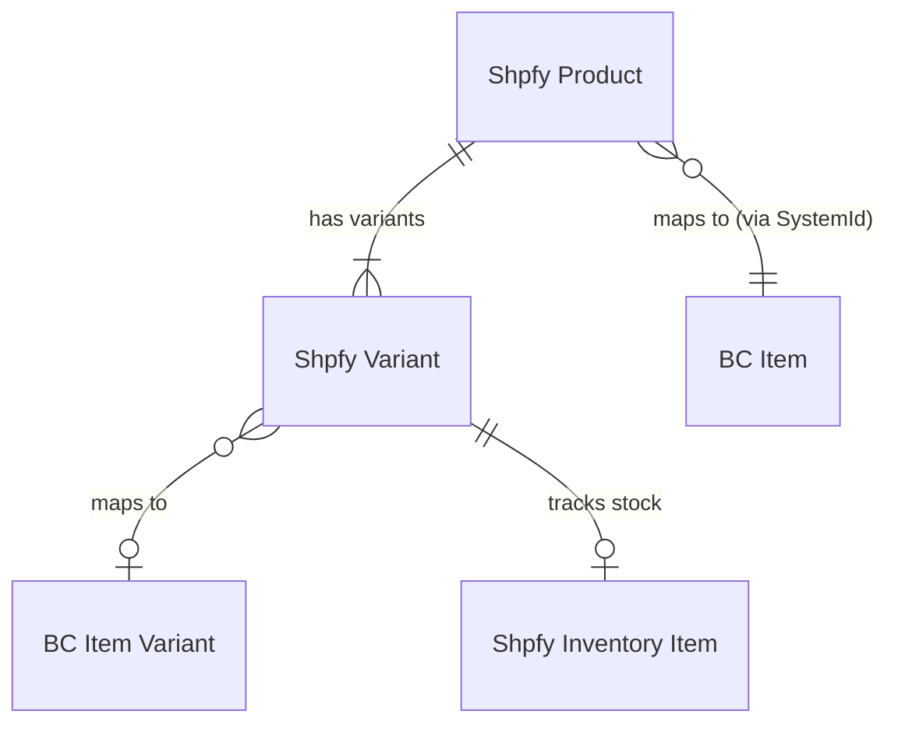
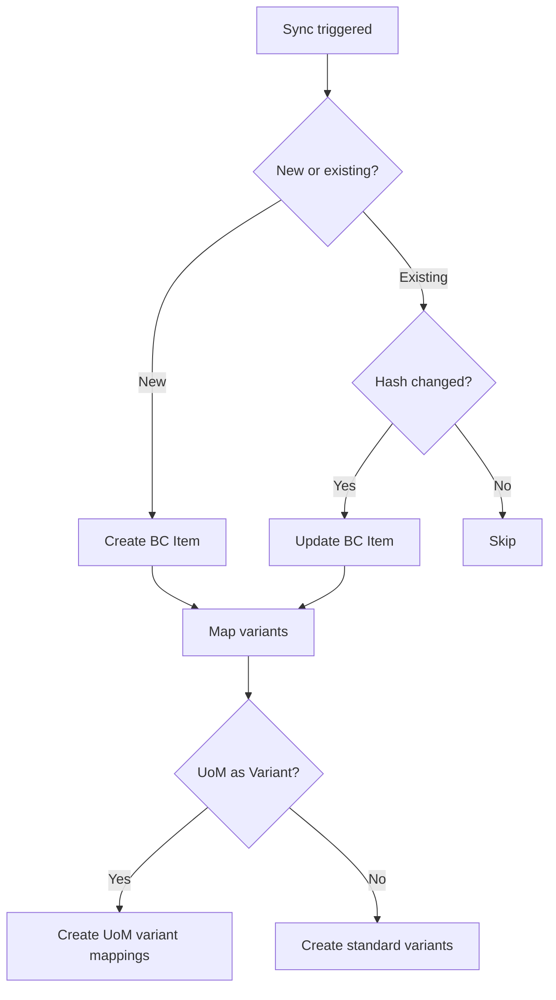

# AL Documentation Bootstrap

> **Usage**: Invoke to generate a complete documentation hierarchy for an AL codebase. Performs deep AL-specific analysis, presents a documentation map for approval, then generates all docs using parallel sub-agents.

## Prerequisites

**MANDATORY -- complete ALL steps before proceeding:**

- [ ] Determine the **target path** -- use the argument if provided, otherwise use the current working directory
- [ ] Verify the target contains `.al` files (search recursively)
- [ ] Check if target has `app.json` (determines if this is an app root or a subfolder)
- [ ] Enter plan mode (discovery and documentation map happen in plan mode)

**If the target contains no `.al` files, stop and inform the user.**

## Process overview

```
Phase 1: Discovery (parallel sub-agents, read-only)
    |
Phase 2: Documentation map (present to user for approval)
    |
Phase 3: Exit plan mode
    |
Phase 4: Generation (parallel sub-agents, write docs)
    |
Phase 5: Cross-referencing (final pass)
```

---

## Phase 1: Discovery

Launch **4 agents in parallel** using the Agent tool to analyze the AL codebase. Send all Agent tool calls in a single message. Agents 1-3 are Explore agents (read-only codebase analysis). Agent 4 is a general-purpose agent that queries Microsoft Learn via the MCP tools.

### Agent 1: App structure and metadata

Prompt the agent to:

1. **Check for `app.json`** at the target root. If found, extract:
   - App name, publisher, version
   - Runtime version and target platform
   - Dependencies (other apps this depends on)
   - Application and test application references
   - ID ranges
2. **Map the directory tree** (top 3-4 levels) to identify the project layout
3. **Count AL objects by type** -- for each `.al` file, read the first line to determine the object type:
   - Use grep for patterns: `^table `, `^tableextension `, `^page `, `^pageextension `, `^codeunit `, `^report `, `^enum `, `^enumextension `, `^interface `, `^query `, `^xmlport `, `^permissionset `
   - Count per type and per subfolder at all depths
4. **Identify all subfolders recursively** at any depth that contain `.al` files (e.g., `src/Sales/`, `src/Sales/Orders/`, `src/Inventory/`, feature folders and their nested subfolders)
5. **Catalog existing documentation** -- find any CLAUDE.md, README.md, docs/ directories, or markdown files already present
6. **Detect project type**: single app, app + test app, multi-app workspace, monorepo layer

### Agent 2: Data model analysis

Prompt the agent to:

1. **Read all table and tableextension objects** (the full `.al` files). Focus on understanding:
   - What real-world concept does each table represent? Why is it a separate table?
   - How do tables relate to each other? (Follow `TableRelation` properties)
   - What's non-obvious? Fields whose purpose isn't clear from the name, surprising cascade deletes, calculated fields with complex logic
   - What design decisions were made? (e.g., using SystemId linking instead of Code fields, dual-currency storage, hash-based change detection)
2. **Read enum objects** -- focus on enums that drive behavior (e.g., mapping strategies, sync directions) rather than simple value lists
3. **Map the conceptual data model** -- group tables by the real-world domain they model (e.g., "Order lifecycle", "Product catalog", "Customer management"). Focus on how groups of tables work together, not individual field inventories.
4. **Identify gotchas** -- things that would surprise a developer: unexpected relationships, fields that look similar but serve different purposes, tables that are tightly coupled in non-obvious ways
5. **Note table extensions** -- what base app functionality does this extend? What's the integration surface?
6. **Capture cardinalities** -- for each `TableRelation`, note the cardinality (1:1, 1:N, N:1, N:M). This is needed for the mermaid ER diagram. Group by conceptual area.

**Important**: Do NOT catalog field names and types. An LLM reads those from the source. Focus on relationships, intent, design decisions, and non-obvious behavior.

### Agent 3: Business logic, extensibility, patterns, and module scoring

Prompt the agent to:

1. **Understand the key business processes** by reading codeunit objects. Focus on:
   - What are the main operations this app performs? (e.g., sync, import, export, post)
   - What triggers each operation? (user action, schedule, event)
   - What are the key decision points? (when does it create vs update vs skip?)
   - What can go wrong and how are errors handled?
2. **Map processing flows** -- follow the call chain for key operations. Focus on the narrative: what happens, why, and what's non-obvious. Don't just list procedure names.
3. **Catalog extension points** -- find all `[IntegrationEvent]`, `[BusinessEvent]`, `[EventSubscriber]` attributes and interface implementations. Group them by what a developer would want to customize, not by codeunit. Identify which events are genuinely useful vs. which are just plumbing.
4. **Identify patterns worth documenting** -- only patterns that are non-obvious or used in interesting ways in this specific codebase. Skip standard AL patterns that any developer already knows.
5. **Flag legacy patterns** -- identify patterns that exist in the codebase (often for historical reasons) but should NOT be followed in new code. Examples: direct SQL access, hardcoded IDs, global variables where a parameter would suffice, overly large codeunits that should be refactored, deprecated APIs still in use. These will be documented in the "Legacy patterns" section of patterns.md as guidance for future developers.
6. **Score all subfolders recursively at any depth** for documentation need using the scoring criteria in `skills/al-docs/references/al-scoring.md`. Read that file for the full scoring table. A subfolder can have subfolders that are big enough to need their own documentation. Classify each subfolder as MUST_DOCUMENT (7+), SHOULD_DOCUMENT (4-6), or OPTIONAL (1-3)

**Important**: Do NOT create inventories of every codeunit with its procedures. Focus on understanding the flows, decision points, and gotchas. The docs should capture knowledge a developer would only learn after spending time in the code.

### Agent 4: Microsoft Learn documentation research

Use the Microsoft Learn MCP tools to research the feature area being documented. This agent provides external context that enriches the generated documentation.

Prompt the agent to:

1. **Search Microsoft Learn** using `microsoft_docs_search` for the app's feature area (e.g., "Business Central Shopify connector", "Business Central bank reconciliation"). Look for:
   - Official feature overviews and how-to guides
   - Intended behavior and supported scenarios
   - Known limitations and prerequisites
   - Official terminology and naming conventions
2. **Fetch key pages** using `microsoft_docs_fetch` for the most relevant results -- typically the feature overview page and any setup/configuration guide
3. **Search for code samples** using `microsoft_code_sample_search` if the feature involves APIs, integrations, or extension patterns that Microsoft documents with examples
4. **Summarize findings** relevant to documentation:
   - What is the official description of this feature?
   - What scenarios does Microsoft say it supports?
   - What terminology does the official documentation use?
   - Any documented limitations, prerequisites, or known issues?
5. **Flag potential discrepancies** -- note anything the docs describe that might differ from the code (these will be verified against source code later)

**Important**: Microsoft docs may be outdated or describe planned behavior that differs from the actual implementation. **Source code is always the source of truth.** This agent provides context and intent -- the other agents provide the ground truth from code. When conflicts arise during generation, document what the code does, not what the docs say.

---

## Phase 2: Documentation map

After all discovery agents complete, synthesize findings into a **documentation map**.

**IMPORTANT**: Include ALL subfolders at any depth scored MUST_DOCUMENT or SHOULD_DOCUMENT. A subfolder can contain nested subfolders that each need their own documentation. Only OPTIONAL subfolders may be excluded.

### Format

Present the documentation map to the user:

```markdown
## Documentation map

### Discovery summary

- **App name**: [from app.json or folder name]
- **Runtime**: [version]
- **Dependencies**: [list]
- **AL objects found**: [count by type]
- **Subfolders with substance**: [count by score category]
- **Existing docs found**: [count, locations]

### Files to generate

#### App level
| File | Action | Purpose |
|------|--------|---------|
| `/CLAUDE.md` | CREATE | App overview, dependencies, structure, key objects |
| `/docs/data-model.md` | CREATE | Conceptual data model, table relationships, key fields |
| `/docs/business-logic.md` | CREATE | Key codeunits, processing flows |
| `/docs/extensibility.md` | CREATE | Extension points, events, interfaces for customization |
| `/docs/patterns.md` | CREATE | Locally applied patterns (including legacy patterns to avoid) |

#### Subfolder: [path] (SHOULD_DOCUMENT)
| File | Action | Purpose |
|------|--------|---------|
| `/[path]/docs/CLAUDE.md` | CREATE | Subfolder overview |

SHOULD_DOCUMENT subfolders only get a CLAUDE.md -- nothing more.

#### Subfolder: [path] (MUST_DOCUMENT)
| File | Action | Purpose |
|------|--------|---------|
| `/[path]/docs/CLAUDE.md` | CREATE | Subfolder overview and key objects |
| `/[path]/docs/[additional].md` | CREATE | See selection criteria below |

MUST_DOCUMENT subfolders always get a CLAUDE.md. Additionally, select
supplementary docs where there is genuine knowledge to capture, or a specific design that needs to be captured in documentation. The test for each:

| Supplementary doc | Add when a developer would otherwise have to **discover by reading the code** that... |
|-------------------|---|
| `data-model.md` | A non trivial data model exists, indirect linking patterns, non-obvious field purposes, or design tradeoffs a newcomer would miss |
| `business-logic.md` | Processing flows have hidden decision points, non-obvious error handling, or sequencing that only makes sense with context |
| `extensibility.md` | The subfolder has intentionally designed extensibility -- interfaces, strategy patterns, or event pairs that form a deliberate customization surface. |
| `patterns.md` | The subfolder uses patterns that differ from the app-level norms or has legacy approaches a developer might accidentally copy |

If the knowledge fits in a few bullets in CLAUDE.md's "Things to know"
section, it doesn't need its own file. A supplementary doc earns its
existence by capturing enough intent and gotchas that CLAUDE.md alone
would be insufficient.

### Existing docs to migrate
| Current location | Target location | Action |
|------------------|-----------------|--------|
| `/README.md` | `/CLAUDE.md` | MIGRATE content |
```

### User approval

After presenting the map:

1. Ask: "Does this documentation map look correct? Add or remove any entries?"
2. Wait for confirmation before proceeding
3. If the user modifies the map, update accordingly

---

## Phase 3: Exit plan mode

Once the documentation map is approved, exit plan mode to enable file writes.

---

## Phase 4: Generation

Generate all documentation files using **parallel sub-agents grouped by scope**. Launch all agents in a single message.

### Sub-agent strategy

- **Agent A -- App level**: Generates `/CLAUDE.md` and all `/docs/*.md` files
- **Agents B, C, D... -- Subfolder level** (one per subfolder or group of nearby subfolders): Generates local docs

### What each agent receives

Every generation agent must receive in its prompt:

1. **The documentation map entries** for its scope
2. **Discovery findings** relevant to its scope
3. **The templates** (below) for each doc type
4. **Existing documentation content** to preserve or migrate
5. **Cross-reference instructions**: how to reference docs at other levels

### Documentation philosophy

The purpose of documentation is to capture **knowledge that isn't obvious from reading the code**. An LLM can already read every field in a table and every procedure in a codeunit. Documentation should explain:

- **Why** things are designed the way they are
- **Relationships** between concepts (not just foreign keys)
- **Gotchas** -- non-obvious behavior, edge cases, things you'd only learn after debugging
- **Intent** -- what a table or codeunit is *for*, not what fields it has
- **Decision context** -- when does path A happen vs path B?

### What NOT to write

**Do not list things an LLM can read from the source code.** This means:

- Do NOT list field names, types, and IDs from tables -- an LLM reads those directly
- Do NOT enumerate every procedure in a codeunit
- Do NOT create tables listing every AL object with type/name/purpose
- Do NOT list every enum value
- Do NOT repeat the directory structure that `ls` shows
- Do NOT dump parameter signatures

**BAD example** (mechanical listing -- adds no value):

```markdown
### Shpfy Product (30127)
Stores Shopify product data.

- `Id` (BigInteger) -- Shopify product ID, primary key
- `Title` (Text[100]) -- Product title
- `Description` (Text[250]) -- Plain text description
- `Shop Code` (Code[20]) -- Link to Shpfy Shop
- `Item SystemId` (Guid) -- Link to BC Item
- `Image Hash` (Integer) -- Change tracking hash

**Relationships:**
- 1:N with Shpfy Variant (via Product Id)
- N:1 with Item (via Item SystemId)
```

**GOOD example** (explains intent, relationships, and gotchas):

```markdown
### Products and variants

A Shopify product maps to a BC Item, but the mapping is indirect. The
`Shpfy Product` table stores the Shopify-side data and links to BC via
`Item SystemId` (a Guid, not the Item No.). This means renumbering items
doesn't break the link.

Each product has one or more **variants** (`Shpfy Variant`). A variant
is the actual sellable unit -- it carries the price, SKU, and inventory.
The tricky part: a single-variant product still has one variant record,
but `Has Variants` is false on the product. This flag controls whether
the connector creates BC Item Variants or maps the variant directly to
the Item.

When `UoM as Variant` is enabled on the shop, one of the variant option
slots (Option 1/2/3) represents a unit of measure instead of a product
attribute. The `UoM Option Id` field on the variant indicates which slot.
This means stock calculations must convert between the variant's UoM and
the item's base UoM.

**Change detection**: The connector avoids unnecessary API calls by
hashing product descriptions, tags, and images. Only when a hash changes
does it push an update to Shopify. The `Last Updated by BC` timestamp
prevents circular updates -- if BC just updated the product, an incoming
Shopify webhook for that same product is ignored.
```

### Templates

#### CLAUDE.md (app level)

```markdown
# [App Name]

[2-3 sentences: what this app does, what problem it solves, and how it
integrates with BC. Not a feature list -- a mental model.]

## Quick reference

- **ID range**: [range]
- **Dependencies**: [only if non-obvious]

## How it works

[3-5 paragraphs giving someone a mental model of the app. Cover:
- The core sync loop and what triggers it
- Key design decisions (e.g., why SystemId linking, why GraphQL)
- What the app does NOT do (boundaries)
]

## Structure

[One line per subfolder, but only folders that need explanation.
Skip obvious ones. Focus on which folders you'd look in for what.]

## Documentation

- [docs/data-model.md](docs/data-model.md) -- How the data fits together
- [docs/business-logic.md](docs/business-logic.md) -- Processing flows and gotchas
- [docs/extensibility.md](docs/extensibility.md) -- Extension points and how to customize
- [docs/patterns.md](docs/patterns.md) -- Recurring code patterns (and legacy ones to avoid)

## Things to know

[5-10 bullet points of non-obvious knowledge. Things like:
- "Orders are imported but never exported -- sync is one-directional"
- "The Shop table is the god object -- almost every setting lives there"
- "All API calls go through one codeunit (CommunicationMgt) which handles rate limiting"
- "Products use hash-based change detection, not timestamps"
]
```

#### CLAUDE.md (subfolder level)

```markdown
# [Subfolder Name]

[2-3 sentences: what this area handles and why it exists as a separate
module. What's the boundary between this and adjacent modules?]

## How it works

[1-3 paragraphs explaining the core logic. Not a procedure list --
explain the flow a developer needs to understand to work here.]

## Things to know

[3-7 bullets of non-obvious knowledge specific to this area. Gotchas,
edge cases, design decisions, things that surprised you in the code.]
```

Do NOT include an "AL objects" table. The developer can see those with
`ls` or glob. Instead, mention specific objects inline where relevant
(e.g., "the mapping logic lives in `ShpfyProductMapping.Codeunit.al`").

#### data-model.md

```markdown
# Data model

## Overview

[Explain the conceptual model in plain language. What real-world things
are being represented? How do they relate to each other? Draw the big
picture before diving into specifics.]

## [Conceptual area] (e.g., "Product catalog")

[MANDATORY -- each conceptual area section MUST include its own mermaid
ER diagram showing the entities in that area. Use `erDiagram` syntax.
Maximum 5 entities per diagram -- this keeps them readable on GitHub.
Show only relationship lines and cardinality, never field listings.
Include a brief label on each relationship line.

Example:



If a conceptual area has more than 5 entities, split into sub-diagrams
or move peripheral entities to their own section.]

[Explain how this group of tables works together. Focus on:
- What concept each table represents and WHY it's a separate table
- The relationships and what they mean in business terms
- Non-obvious fields -- fields whose purpose isn't clear from the name
- Design decisions -- why is it structured this way?
- Gotchas -- surprising behavior, cascade deletes, calculated fields
  that aren't obvious]

## [Next conceptual area]

...

## Cross-cutting concerns

[Things that affect the whole data model:
- How BC records are linked (SystemId pattern and why)
- How change detection works (hashing, timestamps)
- How currencies are handled (dual-currency pattern)
- How polymorphic relationships work (Tags, Metafields)
]
```

Do NOT list field names and types -- an LLM reads those from the table
definition. Only mention fields when explaining something non-obvious
about them.

**GOOD data-model section example:**

```markdown
## Order processing

An order flows through three stages, each with its own table:

1. **Orders to Import** (`Shpfy Orders to Import`) -- a queue. When the
   connector discovers new Shopify orders, it creates records here. The
   `Import Action` enum determines whether to create or update.

2. **Order Header/Line** -- the main order data. The header stores both
   the shop currency amounts and the presentment (customer-facing)
   currency amounts in parallel fields. This dual-currency design means
   you always have the amount in the currency the customer paid in, even
   if the shop operates in a different currency.

3. **Sales Order** (BC base) -- the connector creates a standard BC
   sales order from the Shopify order. The `Shpfy Order Id` field
   (added via table extension on Sales Header) links back.

Important: the Order Header stores denormalized customer address data
(ship-to, bill-to, sell-to all copied from the Shopify order). This
means the address on the order is a snapshot -- it won't change if the
customer updates their address later.

The `Processed` flag on the order header is critical for the sync loop.
Once set, the order won't be re-imported. But if you need to re-process,
clearing this flag and the Sales Order No. will cause re-import on the
next sync.
```

#### business-logic.md

```markdown
# Business logic

## Overview

[2-3 paragraphs: what are the key business processes? What triggers
them? What's the happy path vs error handling?]

## [Process name] (e.g., "Product synchronization")

[Explain the process as a narrative, not a numbered list of steps.
Focus on:
- What triggers it and what controls it (shop settings)
- The key decision points -- when does it create vs update vs skip?
- What can go wrong and how errors are handled
- Non-obvious behavior -- things the code does that you wouldn't expect]

[If the process has a clear multi-step flow with decision points,
include a mermaid flowchart to visualize it. Use `flowchart TD` syntax.
This is NOT required for every section -- only include a diagram when
the process has enough steps and branching that a visual would genuinely
help. Simple linear processes don't need a diagram.

Example:



Focus the diagram on decision points and branching -- that's where the
real value is. Don't diagram obvious linear sequences.]

Mention specific codeunits and procedures inline where relevant, but
don't create a "key codeunits" section that lists every codeunit.

## [Next process]

...
```

Do NOT include extension points here -- those belong in `extensibility.md`.
Business logic should focus on what the code does, not how to extend it.

#### extensibility.md

```markdown
# Extensibility

## Overview

[1-2 paragraphs: what is the extension surface of this app? What
can a partner or ISV customize without modifying the core code?
What's the intended customization model?]

## [Customization goal] (e.g., "Customize order creation")

[Group extension points by what a developer would want to DO, not
by which codeunit publishes the event. For each goal:
- Which events to subscribe to and what they give you
- Which interfaces to implement and how to register them
- Concrete example of the interfaces/subscription signature]

## [Next customization goal]

...
```

The key principle: organize by **developer intent**, not by codeunit.
A developer asks "how do I customize X?" not "what events does
codeunit Y publish?". Do NOT create exhaustive tables of every event
-- focus on the ones that are genuinely useful. Mention the event
codeunit file inline (e.g., "subscribe to `OnBeforeCreateSalesHeader`
in `ShpfyOrderEvents.Codeunit.al`").

At the subfolder level, extensibility.md is only generated for
MUST_DOCUMENT subfolders that have **intentionally designed
extensibility** -- interfaces, strategy patterns, or event pairs
that form a deliberate customization surface. Standard lifecycle
events (`OnAfterInsert`, `OnBeforePost`, etc.) don't qualify;
those are plumbing, not a design philosophy worth documenting.

#### patterns.md

```markdown
# Patterns

[For each pattern: explain what problem it solves, show one concrete
example from this codebase with a file reference, and note any
variations or gotchas. Skip patterns that are standard AL -- only
document patterns that are specific to this app or used in a
non-obvious way.]

## [Pattern name]

[2-3 sentences: what problem does this solve in THIS app?]

**Example**: In `[specific file]`, [describe the concrete usage and
why it matters here].

**Gotcha**: [Any non-obvious aspect of how this pattern is used here]

## Legacy patterns

[Document patterns that exist in the codebase but should NOT be
followed in new code. These exist for historical reasons -- the
codebase has been around for a long time and not everything has been
modernized. Be factual and specific, not judgmental.]

### [Legacy pattern name]

**What it is**: [Describe what the pattern does]

**Where it appears**: [Specific files or areas]

**Why it exists**: [Historical context -- when was this written,
what constraints existed at the time?]

**What to do instead**: [The modern/preferred approach for new code]
```

Do NOT list every pattern used in AL. Only document patterns that
are interesting or non-obvious in this specific codebase. For legacy
patterns, be constructive -- explain the historical context and the
preferred alternative. The tone should be "here's what you'll see and
why, here's what to do instead" not "this code is bad".

### Generation rules

1. **Write for a developer who can already read AL code** -- they don't need field lists or procedure signatures. They need the "why", the relationships, and the gotchas.
2. **Capture knowledge, not structure** -- if an LLM could generate it from `ls` and `grep`, it's not worth writing.
3. **Explain in prose, not tables** -- tables are for genuinely tabular data (e.g., mapping a Shopify concept to a BC concept). Use prose to explain relationships and flows.
4. **Be opinionated** -- say "the Shop table is the god object" or "this design is unusual because...". Neutral descriptions of obvious things add no value.
5. **Mention specific files inline** -- reference `ShpfyProductMapping.Codeunit.al` in the prose where relevant, don't create separate "file reference" sections.
6. **Focus on non-obvious things** -- if something is surprising, fragile, or requires context to understand, document it. If it's self-evident from the code, skip it.
7. **Sentence case headers** -- no em dashes (use `--`), blank line before lists.
8. **Keep it concise** -- shorter docs that capture real knowledge are better than long docs that list everything. A good subfolder CLAUDE.md might be 20-40 lines, not 80+.
9. **Mermaid diagrams for visual clarity** -- `data-model.md` MUST include `erDiagram` diagrams, one per conceptual area section (not one giant diagram). Maximum 5 entities per diagram -- never list fields inside entities, only show relationship lines. `business-logic.md` SHOULD include `flowchart TD` diagrams for processes with meaningful branching. Keep flowcharts focused on key decision nodes.

---

## Phase 5: Cross-referencing

After all generation agents complete, do a final pass:

1. **Verify CLAUDE.md references** -- each CLAUDE.md should list only docs that actually exist at its level
2. **Add cross-level references** -- app-level docs should reference subfolder docs for details; subfolder docs should reference app-level docs for context
3. **Check for orphans** -- no references to files that don't exist
4. **Verify doc consistency** -- table names and codeunit names should be consistent across all docs
5. **Write `.docs-updated` marker** in the target root so `/al-docs update` knows the baseline:
   ```
   # Documentation last updated
   commit: [current HEAD commit hash]
   date: [current date]
   scope: full
   ```

---

## Output

After completion, present a summary:

```markdown
## AL documentation bootstrap complete

### Files created
- [count] files across [count] directories

### By level
- App: [list of files]
- Subfolder [path]: [list of files]

### Next steps
- Run `/al-docs audit` to verify coverage
- Run `/al-docs update` after making code changes to keep docs current
```

---

## Critical rules

1. **Plan mode for discovery** -- Phases 1-2 must happen in plan mode (read-only)
2. **User approves the map** -- never write docs without approval
3. **Based on real analysis** -- every statement must trace to actual AL code read during discovery
4. **Preserve existing content** -- incorporate existing docs, don't overwrite
5. **Complete coverage** -- ALL MUST_DOCUMENT and SHOULD_DOCUMENT subfolders must be documented
6. **No mechanical listings** -- never list fields, procedures, or objects that an LLM can read from code. Document intent, relationships, gotchas, and design decisions.
7. **Prose over tables** -- use narrative explanations. Tables are only for genuinely tabular data.
8. **Concise over comprehensive** -- a 30-line doc that captures real knowledge beats a 200-line doc that lists everything
