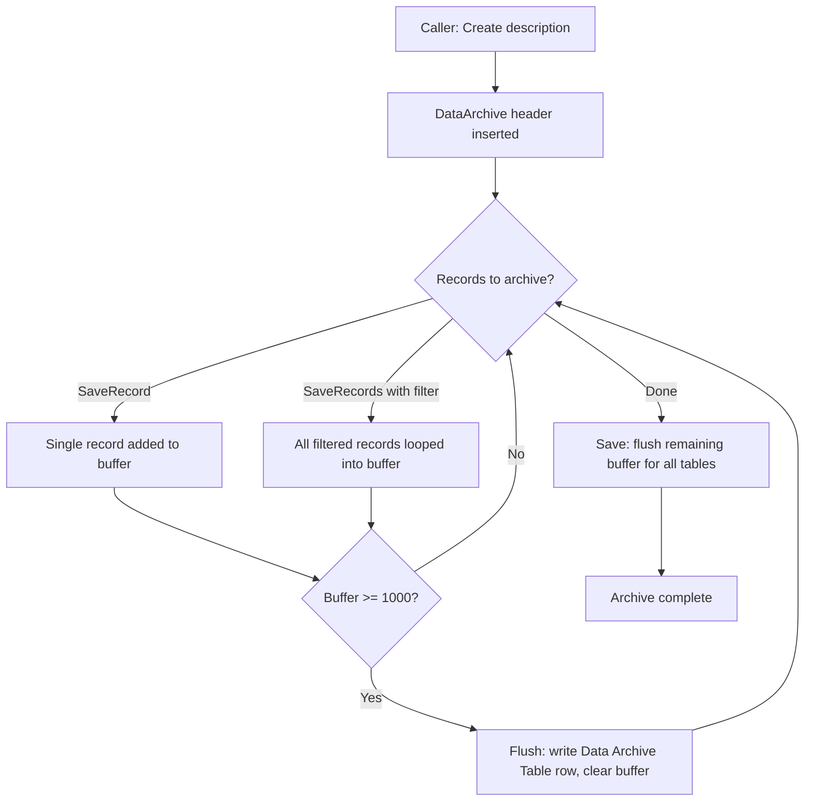
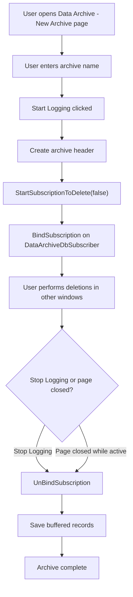

# Business logic

## Two archiving modes

### Programmatic API (date compression and other batch jobs)

Callers use the System App facade (codeunit 600 "Data Archive"). The typical pattern in date compression is:

1. Call `Create()` with a description
2. Call `SaveRecords()` with a RecordRef filtered to the entries about to be deleted
3. Call `Save()` to flush any remaining buffered records

`SaveRecord` accepts a single record (as Variant or RecordRef). `SaveRecords` accepts a RecordRef with filters and iterates all matching records. Both feed into the same buffer, and both trigger the 1,000-record flush when the threshold is hit.

Records from the three archive tables themselves (600, 601, 602) are silently skipped to prevent infinite recursion. This check is in `SaveRecordsToBuffer` in `DataArchiveProvider.Codeunit.al`.

### Manual recording (UI-driven)

The "Data Archive - New Archive" page (page 633) drives this flow. When the user clicks Start Logging, the page calls `StartSubscriptionToDelete(false)` -- passing `false` for `ResetSession` to avoid resetting the user's session. This binds `DataArchiveDbSubscriber` (codeunit 603) to the global `OnDatabaseDelete` trigger for the current session only.

Once bound, every non-temporary record deleted in any table (except the archive tables) is captured via `SaveRecordOnDatabaseDelete`. The subscriber checks `DataArchiveProviderIsSet` and `RecRef.IsTemporary()` before archiving.

The page's `OnClosePage` trigger also calls Stop + Save if the user closes the page without explicitly stopping, so data is not silently lost.

## The database subscriber binding mechanism

`DataArchiveDbSubscriber` is declared with `EventSubscriberInstance = Manual`. This is the key design choice: unlike static event subscribers that fire globally for every session, this codeunit's subscriptions only activate when explicitly bound via `BindSubscription`. This means the `GetDatabaseTableTriggerSetup` and `OnDatabaseDelete` handlers have zero overhead when archiving is not active.

The binding flow:

1. `DataArchiveProvider.StartSubscriptionToDelete()` sets the provider interface on the subscriber via `SetDataArchiveProvider`
2. Then calls `BindSubscription(DataArchiveDbSubscriber)`
3. The subscriber's `GetDatabaseTableTriggerSetup` enables `OnDatabaseDelete` for all tables except the three archive tables
4. On delete, `SaveRecordOnDatabaseDelete` delegates to the provider's `SaveRecord`

The parameterless `StartSubscriptionToDelete()` overload calls `SessionSettings.RequestSessionUpdate(false)` before binding. This resets the session, which can be necessary if records were already deleted in the session before archiving started (the trigger setup needs a fresh state). But it is disruptive -- the New Archive page avoids it by explicitly passing `ResetSession = false`.

## JSON serialization

Field serialization in `GetRecordJsonFromRecRef` handles types differently:

- **Option, Text, Code** -- `format(value)` with default formatting
- **Blob** -- binary content exported to a `Data Archive Media Field` record; JSON stores the media field's entry number
- **Media** -- same as Blob, using `ItemPictureBuffer` as a carrier to extract the stream
- **MediaSet** -- extracts only the first media item from the set, stores it as a media field record
- **All other types** -- `format(value, 0, 9)` (XML/invariant culture format)

The field list is built from `Field` metadata, filtered to `Class = Normal` and `ObsoleteState <> Removed`. FlowFields, FlowFilters, and removed fields are excluded.

## Export to Excel

`DataArchiveExportToExcel` (codeunit 608) creates one worksheet per `Data Archive Table` row. The first row contains field names from the schema JSON; subsequent rows contain data with type-aware cell formatting (Number for Integer/Decimal, Date for Date/DateTime, Time for Time). Blob and Media values are resolved by looking up the `Data Archive Media Field` record.

Tables where the user lacks read permission are silently skipped, with a warning message shown after export if any were skipped.

## Export to CSV

`DataArchiveExportToCSV` (codeunit 609) produces a ZIP file containing one CSV per archive table row. The CSV separator is locale-aware: semicolon when the user's locale uses comma as a decimal separator (e.g., most European locales), comma otherwise. This detection is done by formatting `1.1` and checking whether the result contains a comma.

Text and Code fields are quoted; other types are unquoted. Filename sanitization strips `/` and `\` from the description. If only one CSV file is produced, the ZIP filename uses the table description; otherwise it uses the archive header description.

Both exporters share the same permission-filtering behavior: check `HasReadPermission()`, skip unauthorized tables, and warn the user afterward.
