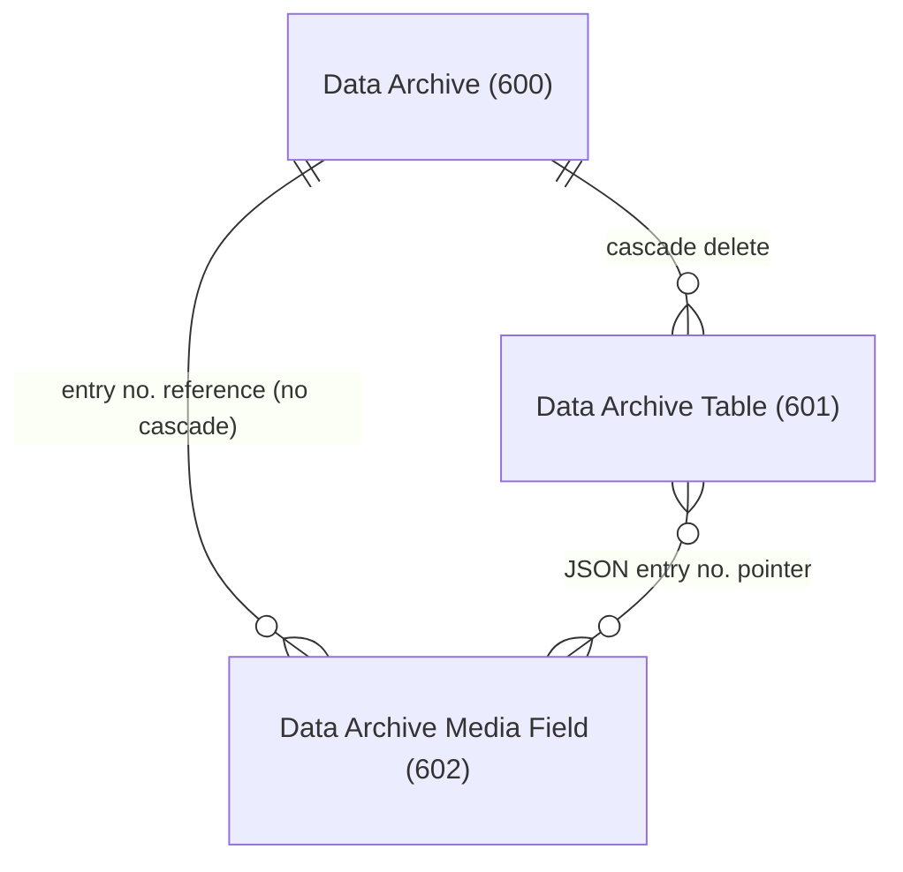

# Data model

## Table hierarchy

Three tables form a header-detail hierarchy. `Data Archive` is the top-level batch record -- one per archiving session or programmatic Create() call. `Data Archive Table` holds the actual archived data, one row per source table per 1,000-record chunk. `Data Archive Media Field` stores extracted binary content (Blob, Media, MediaSet fields) that cannot be serialized inline as JSON text.

## How data is stored

Each `Data Archive Table` row contains two Media fields holding JSON:

- **Table Fields (json)** -- a schema snapshot: an array of objects with `FieldNumber`, `FieldName`, `DataType`, and `DataLength`. This captures the table schema at archive time, so the data remains readable even if the source table's schema changes later.

- **Table Data (json)** -- the actual records: an array of arrays. Each inner array represents one record as a sequence of `{fieldNo: value}` objects. Values are formatted with `format(value, 0, 9)` (XML/invariant format) for most types, but Option/Text/Code use the default format.

For Blob, Media, and MediaSet fields, the JSON value is not the binary content itself but the `Entry No.` of a `Data Archive Media Field` record. The exporter resolves these references at read time.

## Chunking

The buffer inside `DataArchiveProvider` (a `Dictionary of [Integer, JsonArray]`) accumulates records in memory. When a JsonArray reaches 1,000 entries, it flushes to a new `Data Archive Table` row and resets the buffer. This means a single source table (e.g., G/L Entry) can produce many `Data Archive Table` rows within one archive. The `No. of Records` field on each row tells you how many records that chunk contains, and the FlowField on the header sums them.

Note: Microsoft documentation states a 10,000-record threshold. The code in `DataArchiveProvider.Codeunit.al` checks `TableJson.Count() >= 1000`. The code is authoritative.

## Cascade delete gap

The `OnDelete` trigger on `Data Archive` (table 600) explicitly deletes child `Data Archive Table` records with `DeleteAll()`. However, it does not delete `Data Archive Media Field` records. Those records reference the archive entry number and table number but have no table relation that would trigger a cascading delete. Deleting an archive header will orphan any associated media field records. This is a known gap in the current design.

## Key structure

`Data Archive Table` uses a composite primary key: `(Data Archive Entry No., Table No., Entry No.)`. The `Entry No.` component disambiguates multiple chunks from the same source table. The table now uses `AutoIncrement = true` on this field.

`Data Archive Media Field` has a simple `Entry No.` auto-increment primary key, plus a secondary key on `(Data Archive Entry No., Table No.)` for efficient lookup during export.

## FlowFields on the header

The `Data Archive` header has three FlowFields -- `No. of Tables`, `No. of Records`, and `Created by User` -- all computed from child records. These are not stored values, so they always reflect the current state. `No. of Records` sums `Data Archive Table."No. of Records"` across all chunks, giving the true total even when a table is split across multiple rows.

## Permission model

All three tables are `Access = Public` and `Extensible = true`. The `Data Archive Table` record includes a `HasReadPermission()` method that checks whether the current user can read the original source table. This is used by the export codeunits but not enforced during archiving itself -- the archive captures everything, and permission filtering happens only at export time.
