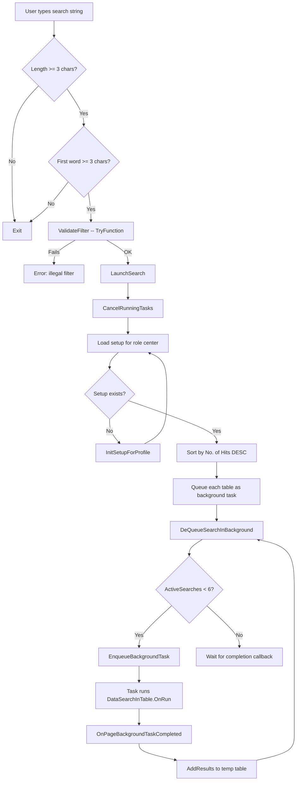
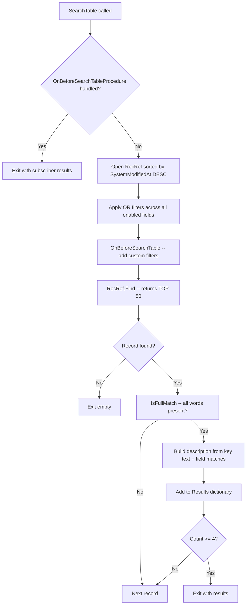

# Business logic

## Search launch and background execution

The search lifecycle is orchestrated by `DataSearch.page.al`. When the user validates the search field, the page strips whitespace, checks that the cleaned input is at least 3 characters (and that the first word alone is at least 3), then calls `ValidateFilter` (a TryFunction that sets a filter on a temp record to confirm legality) before calling `LaunchSearch`.

`LaunchSearch` first cancels any still-running background tasks from a previous search by iterating `ActiveSearches` and calling `CurrPage.CancelBackgroundTask`. It then loads all `Data Search Setup (Table)` rows for the user's role center, sorted descending by `No. of Hits` so popular tables are searched first.

Each table is added to `QueuedSearches` (a `List of [Integer]` of `Table/Type ID` values). The `DeQueueSearchInBackground` procedure pops items from this queue and calls `CurrPage.EnqueueBackgroundTask` up to the parallel limit (6, set in `OnInit`). The `ActiveSearches` dictionary maps `TaskID` to `TableTypeID` so completions can be correlated back.

When `EnqueueBackgroundTask` returns false (which happens when the platform refuses to start more tasks), the task stays in the queue and will be retried when the next completion frees a slot.

## Background search logic

`DataSearchInTable.codeunit.al` (codeunit 2680) runs in the background task context. Its `OnRun` trigger retrieves parameters (`TableTypeID` and `SearchString`) from `Page.GetBackgroundParameters`, looks up the setup table row to find the actual `Table No.` and `Table Subtype`, then does an early-exit check: if the user lacks read permission on the table or if the table is empty, it bails immediately.

The `FindInTable` procedure validates the table through `TableMetadata` -- rejecting external data tables, non-Normal table types, and obsolete-removed tables. It then splits the search string into individual words, loads the field list from `Data Search Setup (Field)`, and calls `SearchTable`.

The filter application is the most subtle part. `SetListedFieldFiltersOnRecRef` enters filter group -1 (the OR group), then for each enabled field sets a filter. The filter pattern depends on the field characteristics:

- Full-text-indexed fields (`IsOptimizedForTextSearch`): `&&term*` -- prefix matching that leverages the SQL full-text index
- Regular text fields: `@*term*` -- case-insensitive wildcard (the `@` prefix tells the server to do case-insensitive matching)
- Code fields: `*UPPERCASE(term)*` -- no `@` needed since Code is always uppercase
- Leading wildcard override: if the search string starts with `*`, the full-text index path is skipped and all fields use wildcard matching

After the SQL-level filter returns candidates, `IsFullMatch` re-checks each record in AL. It iterates all search words and for each word checks if *any* enabled field contains that word (using `StrPos` on the uppercased formatted value). This AND-across-words check catches false positives from the OR filter group.

Results are capped at 4 per table. The result dictionary maps `SystemId` (as text) to a description string built from the record's data caption fields (or PK fields) plus the first matching field caption and value for each search word.

## Result display and navigation

`DataSearchLines.page.al` receives results via `AddResults`, which builds the hierarchical temporary record set. For each background task that returns results:

1. A **Header** row is created (or found if already exists) with `Entry No. = 0` and `Line Type = Header`.
2. The first 3 results become **Data** rows with `Line Type = Data`.
3. If there is a 4th result, a **MoreHeader** row is inserted with caption "Show all results" before the 4th Data row (which gets `Line Type = MoreData`).

The default view filters to show only Header, Data, and MoreHeader lines -- MoreData rows are hidden. The view sorts by `No. of Hits` (which is inverted), then `Table No.`, `Table Subtype`, `Entry No.`.

When a user clicks a result row (drill-down on the Description field), `ShowRecord` in the result table dispatches by line type:

- **Header**: opens the list page for that table/subtype
- **Data**: fetches the original record by `SystemId` (stored in `Parent ID`), then calls `ShowPage` which runs `MapLinesRecToHeaderRec` to convert lines to headers before opening the card
- **MoreHeader**: opens a dedicated `Data Search Result Records` page showing all results for that table

After any drill-down, `LogUserHit` increments `No. of Hits` on the setup table row with a `LockTable` + `Modify` + `Commit` pattern.

## Delta search

When a user modifies the search setup while results are displayed, the app avoids a full re-search. `DataSearchSetupChanges.codeunit.al` is a manually-bound event subscriber that tracks which `Table/Type ID` values were inserted or deleted in `Data Search Setup (Table)` and `Data Search Setup (Field)` during the setup page modal.

After the modal closes, if changes were detected, the lines page sends a notification ("You have made changes to the setup. Please select the Start search action for the new settings to take effect."). When the user clicks "Start search", `LaunchDeltaSearch` checks for the notification, retrieves the modified table list, removes old results for those tables, then re-queues only the modified tables for background search.

## Setup initialization

`DataSearchDefaults.Codeunit.al` handles first-time setup. `InitSetupForProfile` matches the role center ID against 11 hardcoded cases (using `Page::"Order Processor Role Center"`, `Page::"Accountant Role Center"`, etc.) and builds a table list. Unrecognized role centers get the default list (Customer, Vendor, Contact, Sales Header/Line, Purchase Header/Line, ledger entries, posted document headers/lines -- about 20 tables).

For each table, `InitSetupForTable` creates the `Data Search Setup (Table)` row and calls `InsertRec(true)`, which cascades to create sub-table rows (e.g., Sales Line when Sales Header is added) and subtype rows for each enum value of the document type field.

Field defaults use a three-tier strategy in `AddDefaultFields`:

1. **Full-text-indexed fields** (`OptimizeForTextSearch = true`). If any exist, this tier is used exclusively and the other tiers are skipped.
2. **All text-type normal fields** -- every field with `Type = Text` and `Class = Normal`.
3. **Indexed code/text fields** -- fields that appear in any key, are text or code type, and whose table relation target is not in the exclusion list (about 25 setup/posting group tables like Dimension Value, No. Series, Payment Terms, etc.).

After these tiers, the `OnAfterGetFieldListForTable` event fires to allow custom additions.

## Line-to-header resolution

When a user clicks a search result that came from a line table (e.g., Sales Invoice Line), the app needs to open the parent header's card page. `MapLinesRecToHeaderRec` in `DataSearchObjectMapping.Codeunit.al` handles this with a 30+ entry case statement.

Each mapping procedure follows the same pattern: `RecRef.SetTable(LineRecord)` to get the typed line record, then `HeaderRecord.Get(...)` using the line's key fields to find the parent, then `RecRef.GetTable(HeaderRecord)` to replace the RecordRef. The result is that the RecordRef now points to the header record, and the standard page resolution can open the appropriate card.

For tables not in the hardcoded list, the `OnMapLineRecToHeaderRec` event fires. The event passes the RecordRef as both `LineRecRef` and `HeaderRecRef` (same variable) -- a subscriber replaces it with the header record in-place. The procedure detects whether mapping happened by comparing `RecRef.Number` before and after the event.
