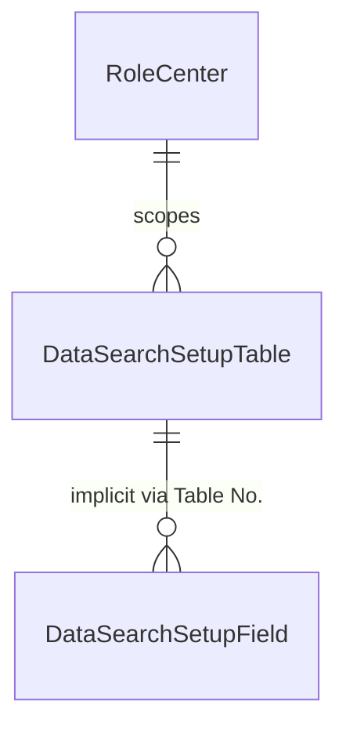
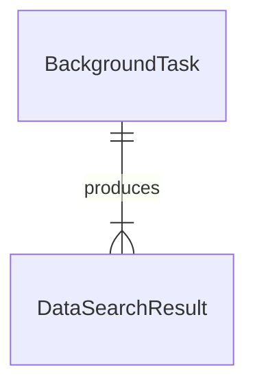
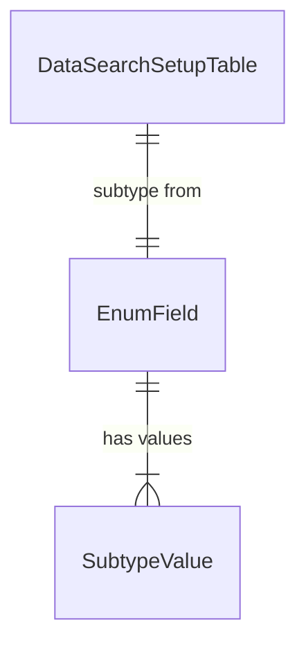

# Data model

## Search configuration

The configuration model has two persistent tables and no formal foreign key between them.

**Data Search Setup (Table)** (table 2681) is the primary registry of searchable tables. Its composite primary key is `(Role Center ID, Table No., Table Subtype)`, which means the same physical table can appear multiple times -- once per document subtype. For example, Sales Header (table 36) might have six rows for the same role center: one each for Quote, Order, Invoice, Credit Memo, Blanket Order, and Return Order. The `Table/Type ID` field is an auto-increment surrogate used to identify individual setup rows in background task parameters and delta-change tracking.

The `No. of Hits` field tracks how often users click into results from that table. This is the sort key for search priority -- tables with more clicks are searched earlier and displayed higher. The `OnInsert` trigger on this table calls `DataSearchDefaults.AddDefaultFields`, which auto-populates the field-level setup when a new table is registered.

**Data Search Setup (Field)** (table 2682) controls which fields are searched for a given table. Its PK is simply `(Table No., Field No.)` with an `Enable Search` boolean. Notably, there is no `Role Center ID` in this table -- field configuration is shared across all role centers that search the same table. If role center A enables Customer table and role center B also enables Customer table, they search the same fields.

## Search results

**Data Search Result** (table 2680) is declared `TableType = Temporary` -- it exists only in the page's session memory and is never persisted to the database. Each row represents one display line in the results list, and the `Line Type` option field determines its visual role:

- **Header** -- bold table name line (e.g., "Sales Orders"). One per table that has results. `Entry No.` is always 0.
- **Data** -- individual matching record, indented under its header. The `Parent ID` (Guid) stores the `SystemId` of the source record so it can be opened on drill-down. Only the first 3 results per table get this type.
- **MoreHeader** -- "Show all results" link for tables with 4+ matches. Also styled distinctively (`AttentionAccent`).
- **MoreData** -- result rows beyond the first 3, hidden from default view by the page's `SetFilter` on `Line Type`.

The `No. of Hits` field on the result record stores the *inverted* hit count from the setup table (`2000000000 - actualHits`), so that sorting by ascending `No. of Hits` key actually puts the most-clicked tables at the top.

## The subtype pattern

Document tables in Business Central often use a "Document Type" enum field to distinguish between orders, invoices, quotes, and so on. Data Search models this by creating separate setup rows per subtype value in `Data Search Setup (Table)`.

The subtype discovery in `DataSearchObjectMapping.GetSubtypes` uses RecordRef to open the table, get the field reference for the document type field, then iterates `FldRef.EnumValueCount()` and `FldRef.GetEnumValueOrdinal(i)` to dynamically enumerate all possible subtype values. This means extending a document type enum automatically adds new subtype rows on next initialization.

Which field is the "document type" field is determined by `GetTypeNoField` -- a case statement for known tables (field 1 for Sales Header, Purchase Header, Service Header, Gen. Journal Line; field 2 for Service Contract Header; field 43 for Service Item Line) plus the `OnGetFieldNoForTableType` event for custom tables.

## Role center scoping

Each role center gets its own set of registered tables in `Data Search Setup (Table)`. The role center ID comes from the user's profile, resolved at runtime through `GetRoleCenterID()` which reads the `All Profile` table filtered by the user's current `Profile ID`.

Initialization happens lazily -- the first time a user searches with an un-configured role center, `DataSearchDefaults.InitSetupForProfile` runs and populates both `Data Search Setup (Table)` and `Data Search Setup (Field)`. The defaults codeunit has 11 hardcoded role center cases (Order Processor, Accountant, Business Manager, Service Dispatcher/Manager, Production Planner, Project Manager, Sales & Relationship Manager, Security Admin, Whse. Basic, Whse. WMS, Whse. Worker WMS, Team Member) plus a general default that applies to any unrecognized role center.

## Header/line relationships

There is no explicit relationship table for header-to-line mapping. Instead, `DataSearchObjectMapping` contains two parallel hardcoded case statements -- `GetParentTableNo` (given a line table, return the header table) and `GetSubTableNos` (given a header table, return its line tables). These mappings drive two distinct behaviors:

1. **Setup cascading** -- when a user adds Sales Header to their search setup, `InsertRec(true)` automatically also adds Sales Line as a sub-table, and creates subtype rows for both.
2. **Result navigation** -- when a user clicks a Sales Line result, `MapLinesRecToHeaderRec` converts the line RecordRef into a header RecordRef before opening the card page.

Both case statements have 30+ entries covering Sales, Purchase, Service, Warehouse, Manufacturing, Assembly, Transfer, Reminder, Archive, and Job document families. Custom header/line pairs can be added via the `OnGetParentTable` and `OnGetSubTable` events.
