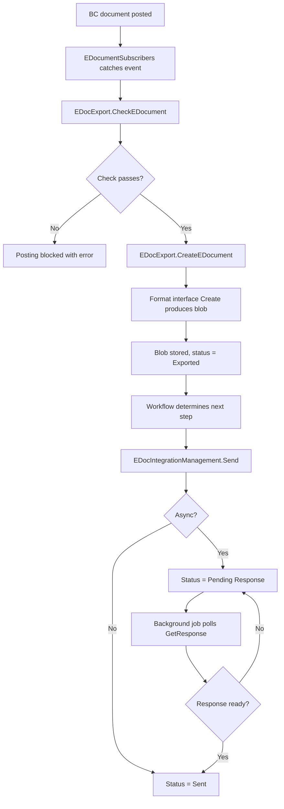
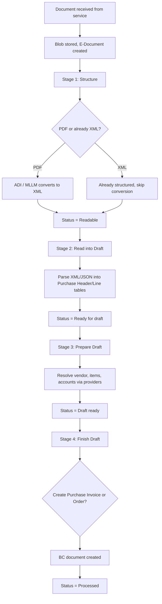

# Business logic

## Outbound flow (export and send)

The outbound pipeline begins when a BC document is posted. `EDocumentSubscribers.Codeunit.al` subscribes to posting events across sales, service, reminders, finance charge memos, shipments, and transfer documents. On each posting event, it calls `EDocExport.CheckEDocument` for pre-validation, then `EDocExport.CreateEDocument` to produce the E-Document record and its exported blob.

The check phase resolves the Document Sending Profile for the source document, finds the associated Workflow, and iterates over all E-Document Services linked to that workflow. For each service, it calls the format interface's `Check` method (from the `E-Document` interface in `EDocument.Interface.al`), which validates that all required fields exist for the target format. If any check fails, posting is blocked.

The create phase follows a similar pattern but writes data. It inserts the `E-Document` record, populates it from the source document header, then calls the format interface's `Create` method to produce the blob. The blob is stored in `E-Doc. Data Storage` and logged with status "Exported". After export, the workflow engine determines the next step -- typically sending.

Sending is handled by `EDocIntegrationManagement.Send` in `EDocIntegrationManagement.Codeunit.al`. It retrieves the exported blob from the log, wraps it in a `SendContext` (which provides access to the blob, HTTP message state, and status control), and calls the integration interface's `Send` method. If the sender returns asynchronously, the status is set to "Pending Response" and a background job polls `IDocumentResponseHandler.GetResponse` until the service confirms receipt.

### Batch sending

Batch mode is controlled by `Use Batch Processing` and `Batch Mode` on the E-Document Service. Three modes exist:

- **Threshold**: Documents accumulate until a configurable count is reached, then all are sent in one call via `IDocumentSender.Send` with a filtered record set.
- **Recurrent**: A job queue entry periodically sweeps all unsent documents and sends them as a batch. Managed by `EDocRecurrentBatchSend.Codeunit.al`.
- **Custom**: Fires the `OnBatchSendWithCustomBatchMode` event so extensions can implement their own accumulation/trigger logic.

### Email sending

The workflow can include email steps. `EDocumentWorkFlowProcessing.SendEDocFromEmail` resolves the correct report usage and customer/vendor, then delegates to `EDocumentEmailing` which handles attachment type selection (PDF, E-Document blob, or both) based on the Document Sending Profile configuration.

## Inbound flow (receive and import)

### Receiving documents

`EDocIntegrationManagement.ReceiveDocuments` (the V2 path) calls `IDocumentReceiver.ReceiveDocuments` which returns a metadata list as `Temp Blob List` -- each blob contains service-specific metadata about an available document. For each entry, it calls `DownloadDocument` to fetch the actual content, stores the blob in `E-Doc. Data Storage`, creates the `E-Document` record with status "Imported", and optionally calls `IReceivedDocumentMarker.MarkFetched` to acknowledge receipt with the external service.

### V2 import pipeline

The four-stage pipeline lives in `ImportEDocumentProcess.Codeunit.al`. Each stage runs as a `Codeunit.Run()` call (enabling try-catch via the error boundary pattern), and each stage can be independently undone.

**Stage 1 -- Structure received data**: Takes the unstructured blob (typically PDF) and converts it to structured XML/JSON. The `IStructureReceivedEDocument` interface selects the conversion strategy -- `EDocumentADIHandler` uses Azure Document Intelligence, `EDocumentMLLMHandler` uses a multimodal LLM via Copilot, and `EDocumentPEPPOLHandler` handles already-structured PEPPOL XML. The output is stored as a new `E-Doc. Data Storage` entry, and the E-Document's `Structured Data Entry No.` is updated. Status moves to "Readable".

**Stage 2 -- Read into draft**: The `IStructuredFormatReader` interface parses the structured blob and populates `E-Document Purchase Header` and `E-Document Purchase Line` tables with raw external data. The implementation is selected based on the structured format (PEPPOL XML reader, ADI JSON reader, etc.). Status moves to "Ready for draft".

**Stage 3 -- Prepare draft**: The `IProcessStructuredData` interface resolves Business Central values. It calls provider interfaces (`IVendorProvider`, `IItemProvider`, `IUnitOfMeasureProvider`, `IPurchaseLineAccountProvider`) to match external identifiers to BC records, populating the `[BC]`-prefixed fields on the draft tables. Vendor resolution triggers the `OnFoundVendorNo` event. Status moves to "Draft ready".

**Stage 4 -- Finish draft**: The `IEDocumentFinishDraft` interface creates the actual BC document. `ApplyDraftToBC` returns the `RecordId` of the newly created Purchase Invoice or Purchase Order, which is stored in `E-Document.Document Record ID`. `RevertDraftActions` handles undo. Status moves to "Processed".

### V1 import (legacy)

V1 import collapses all four stages into a single "Finish draft" step. It calls `EDocImport.V1_ProcessEDocument` which uses the format interface's `GetBasicInfo` and `GetCompleteInfo` methods to directly populate a purchase document or journal line. The `E-Document Import Process` enum on the service determines whether V1 or V2 runs -- V1 is "Version 1.0", V2 is "Version 2.0".

## Status transitions

Status management is split across three concerns in `EDocumentProcessing.Codeunit.al`:

- **Document-level status** (`ModifyEDocumentStatus`): Scans all service status records. Uses the `IEDocumentStatus` interface implemented per service status enum value (`EDocErrorStatus`, `EDocInProgressStatus`, `EDocProcessedStatus`) to map service statuses to document statuses. Any error wins, then any in-progress, otherwise processed.
- **Service-level status** (`ModifyServiceStatus`): Directly sets the `E-Document Service Status.Status` enum value and fires `OnAfterModifyServiceStatus`.
- **Import processing status** (`ModifyEDocumentProcessingStatus`): Sets the `Import Processing Status` on the service status record, which auto-triggers a `Status` update via the field's OnValidate trigger.

## Error handling

The codebase uses a consistent try-commit-run pattern for calling interface implementations. Before calling an external interface (format or integration), the system commits the current transaction. The interface call runs via `Codeunit.Run()`, which creates an implicit try-catch boundary. If the call fails, `GetLastErrorText()` captures the error message, which is logged to both `E-Document Log` and the error message list via `EDocumentErrorHelper`. The E-Document's status is then set to the appropriate error state.

This pattern is critical because interface implementations are third-party code. Without the commit-before-call pattern, a runtime error in a connector would roll back the E-Document record itself, losing the audit trail. The explicit commit ensures the E-Document and its logs survive even when the external call fails.

Errors are surfaced through BC's standard error message framework and through `E-Document Notification` records that appear in the user's notification center.

## Background processing

`EDocumentBackgroundJobs.Codeunit.al` manages job queue entries for asynchronous operations:

- **Recurrent batch send**: Periodically sweeps unsent documents and sends them as a batch
- **Get response**: Polls for async send confirmations on documents in "Pending Response" state
- **Import**: Runs the receive-and-import cycle for configured services

These jobs are automatically created/removed when service configuration changes (enabling/disabling batch processing, for example).
