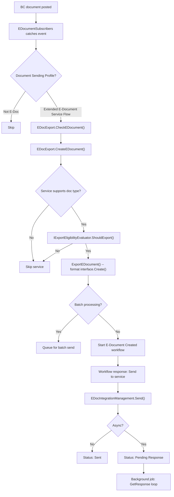
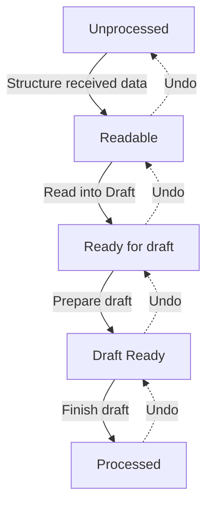
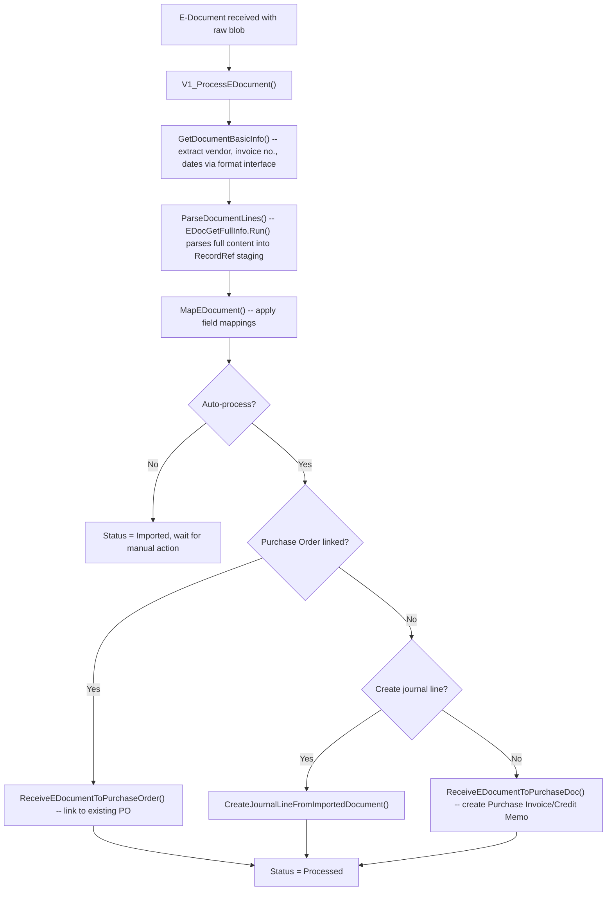

# Business logic

This document covers the main processing flows in E-Document Core, the decision points, and non-obvious behavior. For how the data fits together, see [data-model.md](data-model.md). For extension points, see [extensibility.md](extensibility.md).

## Outbound flow

### Trigger: posting a BC document

`EDocumentSubscribers.Codeunit.al` subscribes to posting events across Sales-Post, Purch.-Post, Service-Post, and Gen. Jnl.-Post Line. When a sales invoice is posted, for example, `OnAfterPostSalesDoc` fires. The subscriber also hooks into release events (`OnBeforeReleaseSalesDoc`, etc.) to run pre-flight checks before the user commits to posting.

The subscriber resolves the Document Sending Profile for the document and, if it specifies `"Extended E-Document Service Flow"`, delegates to `EDocExport.Codeunit.al`.

### Check, create, export, send

The outbound process has four distinct phases, orchestrated by `EDocExport` and the workflow engine:

**CheckEDocument** runs during release (not posting). It finds the workflow, iterates over the E-Document Services in the workflow, and for each service that supports the document type, calls `interface "E-Document".Check()` on the format implementation. This lets format implementations validate that required fields are present before the user posts.

**CreateEDocument** runs during posting. It creates the E-Document record, populates it from the source document header via `PopulateEDocument()` (which uses RecordRef field reads -- it works generically across Sales, Purchase, Service, Finance Charge, Reminder, and Transfer Shipment headers), then creates service status records for each supported service.

**ExportEDocument** invokes the format interface's `Create()` method (wrapped in `EDocumentCreate.Codeunit.al` for error trapping). The exported blob is stored via `EDocumentLog.InsertLog()` which creates an `"E-Doc. Data Storage"` entry. Before calling the format, field mappings from `"E-Doc. Mapping"` are applied via `MapEDocument()`, producing mapped RecordRefs.

**Send** happens when the workflow fires the "Send E-Document" response. `EDocIntegrationManagement.Send()` retrieves the exported blob from the log, wraps it in a `SendContext`, and calls `IDocumentSender.Send()` through the `SendRunner` codeunit (error-trapping wrapper). The implementation sets `IsAsync` to true if the service is asynchronous. For async services, the status becomes `"Pending Response"` and a background job polls `IDocumentResponseHandler.GetResponse()` until it returns true.

### Batch processing

When `"Use Batch Processing"` is enabled on the service, documents are not sent immediately. Instead they accumulate with status `"Pending Batch"`. A recurrent Job Queue Entry (configured via `"Batch Start Time"` / `"Batch Minutes between runs"`) collects pending documents and calls `ExportEDocumentBatch()` / `SendBatch()`. The batch mode can be threshold-based (send when N documents accumulate) or time-based.

### Error handling

Errors during export or send do not crash the posting transaction. Every interface call is wrapped in a "if codeunit.run" pattern: the framework commits before calling the interface implementation, runs it inside a codeunit, and catches runtime errors via `GetLastErrorText()`. Errors are recorded in `"E-Document Error Helper"` as error messages on the E-Document record, and the service status is set to the appropriate error state (`Export Error`, `Sending Error`, etc.). The user can then fix the issue and retry from the E-Document card.

## Inbound flow (V2.0 pipeline)

### Receive

`EDocImport.ReceiveAndProcessAutomatically()` is the entry point, typically triggered by a recurrent import Job Queue Entry (configured via `"Auto Import"` on the service). It calls `EDocIntegrationManagement.ReceiveDocuments()`, which invokes `IDocumentReceiver.ReceiveDocuments()` to get a list of document metadata blobs, then for each document calls `DownloadDocument()` to fetch the actual content. If the receiver also implements `IReceivedDocumentMarker`, the framework calls `MarkFetched()` after download so the service knows the document was consumed.

Each successfully downloaded document gets an E-Document record (Direction = Incoming, Status = Imported), with the raw content stored in `"E-Doc. Data Storage"` and linked via `"Unstructured Data Entry No."`.

### Import pipeline stages

After receiving, each document goes through the V2.0 pipeline managed by `ImportEDocumentProcess.Codeunit.al`. The pipeline uses `EDocImport.GetEDocumentToDesiredStatus()` to advance or revert the document to a target state. This is a bidirectional state machine -- it can undo steps to go backward.

**Structure received data** (`ImportEDocumentProcess.StructureReceivedData()`): Converts the raw blob into a structured format. The implementation is determined by `"Structure Data Impl."` on the E-Document, which defaults to the preferred implementation for the file format (e.g., PDFs default to Azure Document Intelligence processing). The `IStructureReceivedEDocument` interface returns an `IStructuredDataType` that contains the structured content and specifies how to read it. For already-structured documents (XML), this is a passthrough -- the structured entry number just points to the same storage as the unstructured one.

**Read into Draft** (`ImportEDocumentProcess.ReadIntoDraft()`): The `IStructuredFormatReader.ReadIntoDraft()` method parses the structured data and populates the E-Document Purchase Header/Line staging tables. It returns the `"E-Doc. Process Draft"` enum value that determines which `IProcessStructuredData` implementation runs next.

**Prepare draft** (`ImportEDocumentProcess.PrepareDraft()`): `IProcessStructuredData.PrepareDraft()` resolves BC entities from the parsed data -- finding the vendor, matching items, resolving units of measure, assigning GL accounts. This uses a chain of provider interfaces (`IVendorProvider`, `IItemProvider`, `IUnitOfMeasureProvider`, `IPurchaseLineProvider`, `IPurchaseOrderProvider`). The result is a draft with BC-specific field values filled in.

**Finish draft** (`ImportEDocumentProcess.FinishDraft()`): `IEDocumentFinishDraft.ApplyDraftToBC()` creates the actual BC document (Purchase Invoice, Purchase Credit Memo, etc.) from the staging tables. It returns the RecordId of the created document, which is stored in `"Document Record ID"` on the E-Document.

### Reversibility

Each step can be undone via `UndoProcessingStep()`. Undoing "Finish draft" calls `IEDocumentFinishDraft.RevertDraftActions()`, which de-links the BC document from the E-Document (clears the `"E-Document Link"` field), transfers PO matches and attachments back to the E-Document, but does **not** delete the BC document itself -- it must be handled separately. Undoing "Prepare draft" clears the BC-resolved fields and resets the document type. Undoing "Structure received data" clears the structured data reference. This lets users go back to an earlier stage, correct data, and re-process.

### Automatic vs. manual processing

The `"Automatic Import Processing"` field on the service controls whether received documents are automatically processed through the full pipeline or stop at the `Unprocessed` state for manual review. The `GetDefaultImportParameters()` method on the service table produces the appropriate parameters.

## Clearance model

The clearance model handles tax authority pre-approval workflows. After an outbound document is sent and approved, some jurisdictions require a clearance step where the tax authority returns a QR code to embed on the printed invoice. The clearance status is tracked via `"E-Document Service Status"` values `"Not Cleared"` and `"Cleared"`, and QR code data is managed by `EDocumentQRCodeManagement.Codeunit.al`. Report extensions on posted sales/service invoices and credit memos render the QR code.

## Actions framework

Beyond send and receive, the framework supports arbitrary actions on documents via `EDocIntegrationManagement.InvokeAction()`. The `"Integration Action Type"` enum (extensible) dispatches to `IDocumentAction.InvokeAction()` implementations. Built-in action types are `"Sent Document Approval"` and `"Sent Document Cancellation"`, which delegate to `ISentDocumentActions.GetApprovalStatus()` and `GetCancellationStatus()` on the service integration. Connector apps can add custom action types.

## Gotchas

- **Commit before interface calls**: The framework commits before every interface call (format Create, service Send, receiver ReceiveDocuments, etc.) to support error trapping. This means if the interface fails, the E-Document record and logs are already persisted. The trade-off is that you cannot roll back the E-Document creation if the format export fails.
- **Re-reading after interface calls**: After every interface call, the framework re-reads the E-Document and service records from the database (`EDocument.Get(EDocument."Entry No")`). This is because interface implementations may modify these records, and the framework needs the latest values. Note: this defensive re-read is most important when the interface parameter is **not** passed by `var`. The original intent of non-`var` parameters was to prevent implementations from modifying records through the parameter, but since AL code can always call `.Modify()` directly on any record, the protection is incomplete. When adding new interface methods, only apply this re-read pattern to procedures where the record is not passed by `var` -- if the signature already uses `var`, the caller expects modifications and re-reading is redundant.
- **E-Document Status is derived**: The overall `E-Document Status` is derived from the service statuses. `EDocumentProcessing.ModifyEDocumentStatus()` computes it after every service status change using the `IEDocumentStatus` interface on the enum values.
- **Import Processing Status is a FlowField**: On the E-Document table, `"Import Processing Status"` is a FlowField that reads from `"E-Document Service Status"`. You must call `CalcFields` before reading it.
- **V1.0 and V2.0 coexistence**: The `"Import Process"` field on the service determines which path runs. V1.0 collapses everything into a single "Finish draft" step that calls the old `V1_ProcessEDocument` logic. The pipeline state machine still runs, but only the last step does anything for V1.0 documents.

## Inbound flow (V1.0 pipeline)

The V1.0 import path is the original single-pass process. It is still active when a service has `"Import Process" = "Version 1.0"`. The main logic lives in `EDocImport.Codeunit.al` (codeunit 6140).

### Flow

### Key methods

- **`GetDocumentBasicInfo()`** -- calls the format interface's `GetBasicInfoFromReceivedDocument()` to extract vendor, invoice number, dates, and currency from the raw blob.
- **`ParseDocumentLines()`** -- runs `EDocGetFullInfo` (a runner codeunit that calls the format interface's `GetCompleteInfoFromReceivedDocument()`) to parse the full document into Purchase Header/Line RecordRef staging tables, then applies field mappings.
- **`ReceiveEDocumentToPurchaseDoc()`** -- calls `CreatePurchaseDocumentFromImportedDocument()`, which resolves items, units of measure, and G/L accounts, then creates a Purchase Invoice or Credit Memo via `EDocumentCreatePurchase`.
- **`CreateJournalLineFromImportedDocument()`** -- alternative path that creates a Gen. Journal Line instead of a purchase document, controlled by the `CreateJournalLineV1` import parameter.

### Why V1.0 is deprecated

V1.0 has no staging tables, no user review step, and no reversibility. Format implementations must know how to produce complete purchase documents, violating separation of concerns. The V2.0 pipeline splits this into discrete, undoable stages with provider interfaces for entity resolution.
- **Duplicate detection**: `E-Document.IsDuplicate()` checks for matching `"Incoming E-Document No."`, `"Bill-to/Pay-to No."`, and `"Document Date"`. Duplicates can be deleted without confirmation; unique documents require explicit user confirmation.
