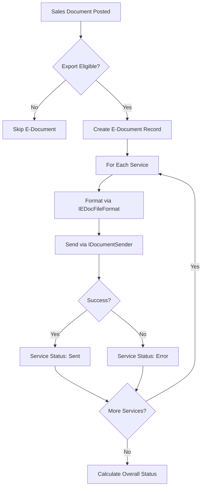
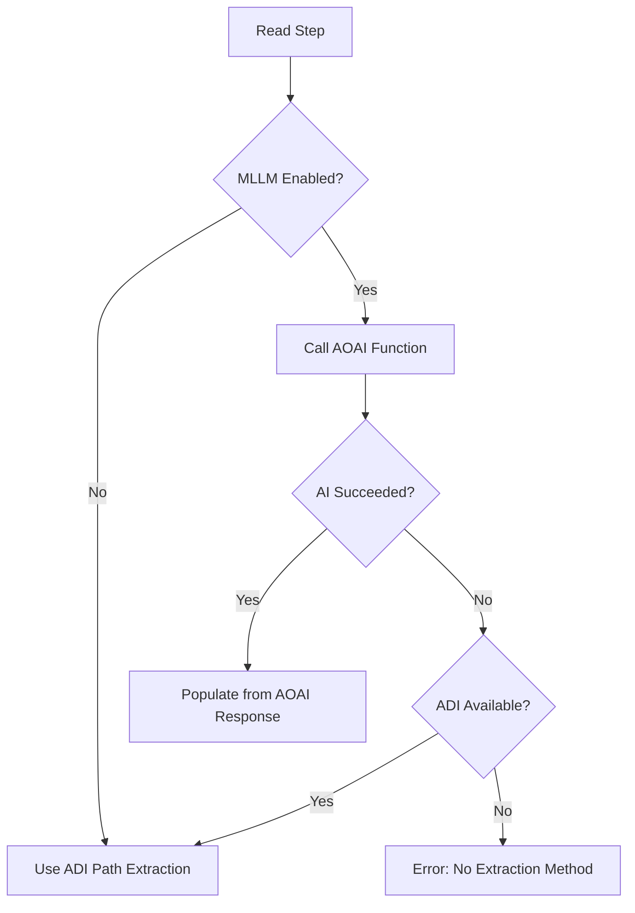
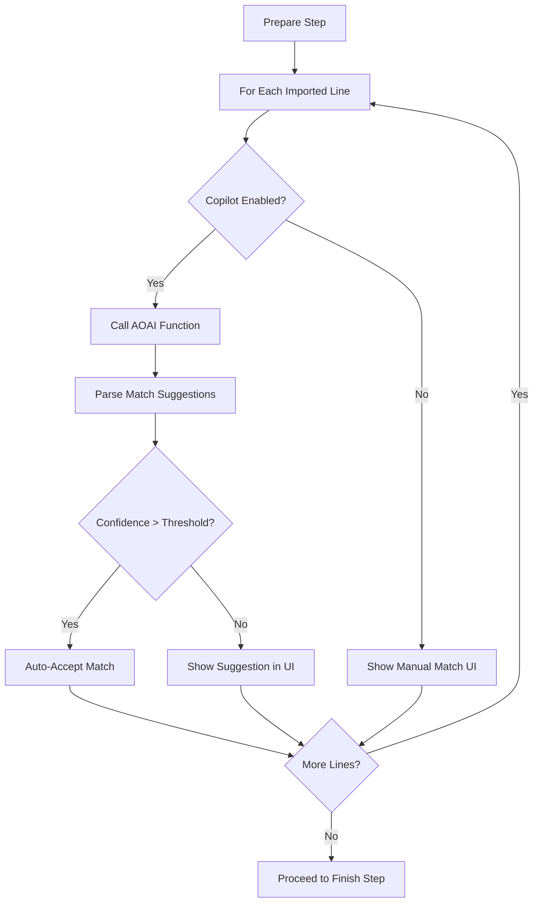

# Business logic

E-Document Core implements four key business processes: outbound export (sales documents to e-invoice format), inbound import (received documents to purchase drafts), order matching (intelligent line-level purchase order matching), and generic mapping (RecordRef-based field transformation). Each process is designed for extensibility through interface implementations.

## Outbound export

The outbound flow transforms posted sales documents into e-invoice formats and sends them to configured services. The process starts when a sales document is posted and Document Sending Profile triggers e-document creation.

**EDocExport codeunit** validates export eligibility using IExportEligibilityEvaluator interfaces, checks service configuration, and creates an E-Document record with "In Progress" status. For each configured service, the system:

1. **Format** -- Calls IEDocFileFormat.CreateDocument to generate the output format (UBL, PEPPOL, proprietary XML/JSON). The interface receives source document references and returns a TempBlob with formatted content.

2. **Send** -- Calls IDocumentSender.Send with a SendContext (TempBlob + HTTP client + status callback). The sender uploads to the service API and returns success/failure status.

3. **Status update** -- Creates an E-Document Service Status record with the result. On success, status becomes "Sent". On failure, status becomes "Error" and logs are created.

**Batch vs immediate:** Documents can be processed immediately on posting or accumulated in a batch job. Batch mode queries all "In Progress" documents and processes them sequentially, useful for rate-limited APIs.

**Sync vs async:** Some services return immediate confirmation (sync), others provide a tracking ID and require polling (async). IDocumentResponseHandler interfaces implement service-specific response parsing.

## Inbound import

The inbound flow is a 4-step state machine that transforms received documents into purchase drafts. Each step sets a completion flag on the E-Document record, and steps can be undone (resetting subsequent steps).

**ImportEDocumentProcess codeunit** orchestrates the state machine:

**Step 1: Structure** -- Receives raw blob (email attachment, API payload) via IDocumentReceiver. Calls IStructureReceivedEDocument to parse format and identify document type. Sets `Structure Done` flag.

**Step 2: Read** -- Extracts data from structured format. Tries MLLM first (AOAI Function via IEDocAISystem), falls back to ADI (XML path extraction via IStructuredFormatReader). Populates E-Doc. Imported Line records. Sets `Read Done` flag.

**Step 3: Prepare** -- Runs order matching logic via **PreparePurchaseEDocDraft** codeunit. Analyzes imported lines and suggests matches to existing purchase orders using **EDocLineMatching**. If Copilot is enabled, calls AOAI Function with line descriptions and available PO lines, receiving match suggestions scored by confidence. Sets `Prepare Done` flag.

**Step 4: Finish** -- Creates draft Purchase Header and Purchase Line records. Calls IEDocumentFinishDraft interfaces for customization. Links purchase records back to E-Document via SystemId. Sets `Finish Done` flag and overall status to "Processed".

**MLLM→ADI fallback logic:**

**Undo mechanism:** Users can click "Undo Prepare" to reset Prepare Done and Finish Done flags, allowing re-matching with different parameters. Similarly, "Undo Read" resets Read/Prepare/Finish and re-extracts data.

## Order matching

Order matching links imported document lines to existing purchase orders, enabling faster processing and reducing manual data entry. The **EDocLineMatching** codeunit provides both manual and AI-powered matching.

**Manual matching:** Users open the Order Match page, select an imported line, and choose from a list of candidate purchase order lines filtered by vendor, item, and date range. Clicking "Accept Match" creates an E-Doc. Order Match record linking the imported line to the PO line.

**Copilot matching:** When enabled, the system calls AOAI Function with a structured prompt:
- System prompt: "You are a purchase order matching assistant. Match imported invoice lines to existing PO lines based on item description, quantity, and unit price."
- Function tools: GetCandidatePOLines (returns filtered PO lines), CreateMatch (records a match suggestion)
- Input: Imported line description, quantity, unit price
- Output: JSON array of match suggestions with confidence scores

**Match validation:** Before applying matches, the system validates that quantities don't exceed PO remaining quantities, unit prices are within tolerance, and the PO is not fully invoiced. Invalid matches are flagged for user review.

## Generic mapping

The mapping engine transforms data between external formats and Business Central tables using RecordRef, avoiding hardcoded field references. The **EDocMapping** codeunit implements a 3-pass algorithm.

**Pass 1: Direct field mapping** -- For each mapping rule, reads source field value from external RecordRef and writes to target field on Business Central RecordRef. Handles type conversions (text to decimal, date formats).

**Pass 2: Formula evaluation** -- Processes mapping rules with formulas (e.g., `Quantity * Unit Price`). Evaluates formulas using the AL formula engine and writes results to target fields.

**Pass 3: Transformation rules** -- Applies Transformation Rule references for complex mappings (e.g., external UOM codes to Business Central UOM codes, external account numbers to G/L Account No.). Transformation rules can call codeunits for custom logic.

**Context preservation:** Mapping operates on temporary records first. Only after all mappings succeed does the system insert real records, ensuring atomicity.

**E-Doc. Mapping Log** records each mapping decision for audit: which source field mapped to which target field, what transformation was applied, and the before/after values. This is critical for troubleshooting inbound data issues.
