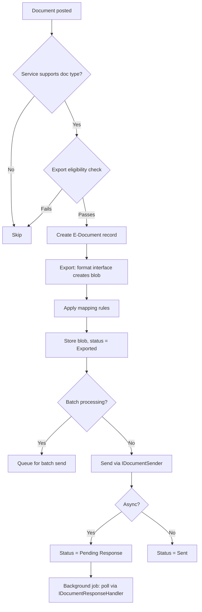
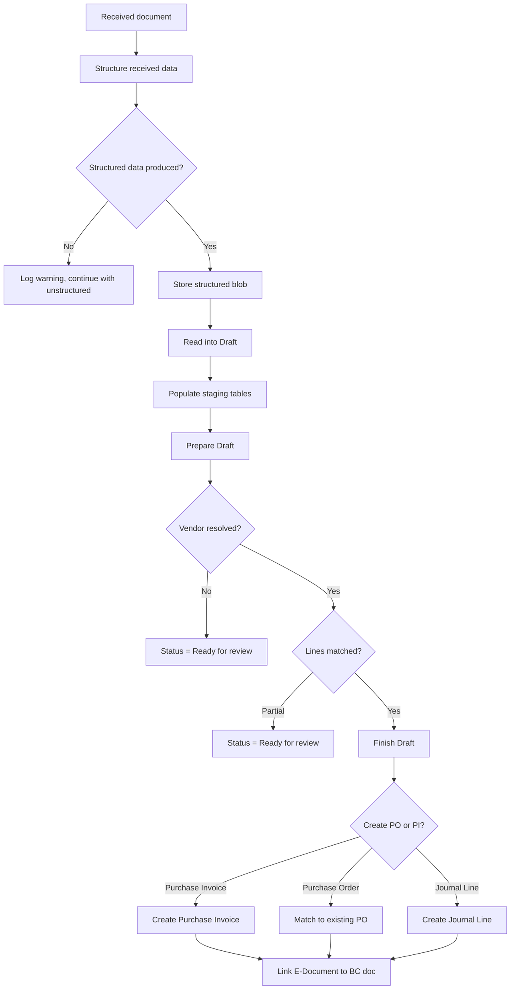

# Business logic

## Overview

All e-document processing is driven by two flows: outbound (BC document to external service) and inbound (external service to BC document). Both flows are orchestrated through `EDocumentProcessing` (codeunit 6108), which manages status transitions and delegates to format interfaces and service connectors. Workflow integration is optional -- `EDocumentWorkFlowProcessing` hooks into BC's workflow engine to allow approval steps.

The framework processes documents per-service. A single BC document can be sent to multiple services, and each service tracks its own status independently. Batch processing is supported for both send and receive, controlled by service configuration flags.

## Outbound: export and send

Outbound starts when a sales/service document is posted. `EDocumentSubscribers` (codeunit 6103) subscribes to posting events across sales invoices, credit memos, service invoices, service credit memos, finance charge memos, reminders, transfer shipments, and more. On post, for each active service that supports the document type and passes export eligibility evaluation, it creates an E-Document record and triggers export.

Export is handled by `EDocExport` (in `src/Processing/EDocExport.Codeunit.al`). It resolves the document format -- either a code-based implementation of the "E-Document" interface or a Data Exchange Definition -- serializes the BC document to a blob, applies any mapping rules configured on the service, and stores the result in a log entry with status Exported.

After export, `EDocIntegrationManagement` (codeunit 6134) orchestrates the send. It retrieves the exported blob from the log, sets up a SendContext with the blob and default status (Sent), and calls the IDocumentSender implementation. The connector does its HTTP work using the context object. If the connector supports batch sending (`Use Batch Processing` on the service), multiple exported documents are sent together.

For async services, the IDocumentResponseHandler interface handles polling. A background job periodically calls `GetResponse` for documents in "Pending Response" status. The connector checks the external service and updates status via the context object.

Post-send actions (approval, cancellation) are handled by `ISentDocumentActions`. These are separate from the send flow -- they use `ActionContext` and the `IDocumentAction` interface for custom operations. The built-in implementations in `src/Integration/Actions/Implementations/` provide approval and cancellation workflows.

## Inbound: receive

Receiving is triggered by a background job or manual action. `EDocIntegrationManagement.ReceiveDocuments` calls the IDocumentReceiver implementation, which returns a list of document metadata blobs (one per document found on the external service). For each document, the framework calls `DownloadDocument` to get the actual content, creates an E-Document record with Direction = Incoming, stores the blob in data storage, and sets the service status to Imported.

The V2 receive path in `EDocIntegrationManagement` handles both single and batch receives. After receiving, the `IReceivedDocumentMarker` interface (if implemented by the connector) can mark documents as downloaded on the external service to prevent re-downloading.

## Inbound: import pipeline (V2)

The V2 import pipeline is the core of inbound processing. It runs in `ImportEDocumentProcess` (codeunit 6104) and consists of four sequential stages. Each stage can be run independently and can be undone (reversed), enabling the user to go back and re-process with different settings.

**Stage 1: Structure received data.** `ImportEDocumentProcess.StructureReceivedData` takes the unstructured blob (e.g., PDF) and converts it to structured data (e.g., JSON). The implementation is selected by the `Structure Data Impl.` field on the E-Document. If unspecified, the file format's `PreferredStructureDataImplementation` is used. For PDFs, this typically means calling Azure Document Intelligence (ADI) or an MLLM. For XML, the "Already Structured" implementation passes through unchanged. The output determines which Read into Draft implementation to use next.

**Stage 2: Read into Draft.** `ImportEDocumentProcess.ReadIntoDraft` takes the structured blob and populates the staging tables (`E-Document Purchase Header`, `E-Document Purchase Line`). The implementation is selected by `Read into Draft Impl.` -- which may have been set by the Structure stage. The built-in PEPPOL reader (`EDocumentPEPPOLHandler`) parses PEPPOL BIS 3.0 XML. The output sets the Process Draft implementation for the next stage.

**Stage 3: Prepare Draft.** `ImportEDocumentProcess.PrepareDraft` calls `IProcessStructuredData.PrepareDraft`, which resolves the draft against BC master data. The default implementation (`PreparePurchaseEDocDraft` in `src/Processing/Import/PrepareDraft/`) uses provider interfaces (IVendorProvider, IItemProvider, IUnitOfMeasureProvider, etc.) to resolve each entity. It queries historical learning tables for auto-matching, applies user override mappings, and uses Copilot matching if enabled. After preparation, the user can review and edit the draft on the Purchase Draft page.

**Stage 4: Finish Draft.** `ImportEDocumentProcess.FinishDraft` calls `IEDocumentFinishDraft.ApplyDraftToBC`, which reads the prepared staging tables and creates the actual BC document (Purchase Invoice, Purchase Order match, or Journal Line). The resulting document's RecordId is stored on the E-Document as `Document Record ID`. Staging tables are cleaned up afterward.

Each stage runs inside a Commit-Run-Log pattern: the framework commits before calling the interface implementation via `Codeunit.Run()`, catches any runtime error, and logs it. This means a failure at any stage is recoverable -- the user can fix data, undo the step, and re-run.

## Order matching

When the vendor's `Receive E-Document To` setting is "Purchase Order", the import pipeline takes a different path at Finish Draft. Instead of creating a new purchase invoice, it matches the incoming lines against existing purchase order lines.

Three matching modes exist:

- **Manual:** The user opens the Order Line Matching page (`EDocOrderLineMatching` in `src/Processing/OrderMatching/`), sees imported lines alongside PO lines, and manually creates matches.
- **Automatic:** `EDocLineMatching` (codeunit in `src/Processing/OrderMatching/`) runs rule-based matching using item references, descriptions, quantities, and prices. Tolerances are configured in `E-Doc. PO Matching Setup`.
- **Copilot:** `EDocPOCopilotMatching` (in `src/Processing/OrderMatching/Copilot/`) uses AI function calling to propose matches. It leverages the historical matching data and fuzzy description matching via `EDocSimilarDescriptions` and `EDocHistoricalMatching` AI tools.

After matching, `EDocPOMatching` (in `src/Processing/Import/Purchase/PurchaseOrderMatching/`) creates `E-Doc. Purchase Line PO Match` records that link imported lines to PO lines and receipt lines. The Finish Draft step then uses these to create purchase invoice lines against the matched receipts.

## Clearance model workflow

The clearance model supports countries where outbound invoices must be pre-approved by a tax authority before reaching the customer. After sending a document, the framework sets `Clearance Date` and `Last Clearance Request Time` on the E-Document. The service connector polls the authority for approval status. On approval, the framework generates a QR code (via `EDocumentQRCodeManagement` in `src/ClearanceModel/`) and attaches it to the posted document via table extensions on posted sales/service invoices and credit memos.

The clearance model is framework infrastructure only -- the actual authority interaction is implemented by country extensions (e.g., FacturaE for Spain).

## Error handling patterns

The framework uses a consistent error handling approach across all processing.

**Commit-Run-Log.** Before calling any interface implementation, the framework calls `Commit()` to persist the current state. Then it runs the implementation via `Codeunit.Run()` (which creates an implicit transaction). If the run fails, the error is caught and logged against the E-Document using `EDocumentErrorHelper`. This pattern is used in `EDocIntegrationManagement` for send/receive and in `ImportEDocumentProcess` for all V2 import stages.

**Per-document error tracking in batches.** When processing multiple documents, the framework tracks error counts before and after processing each document (via `EDocumentErrorHelper.ErrorMessageCount`). This allows batch processing to continue when individual documents fail, rather than rolling back the entire batch.

**Error Message table integration.** Errors are stored in the standard BC Error Message table, linked to the E-Document. `EDocumentErrorHelper` (in `src/Helpers/`) provides typed methods for logging simple errors, field-level errors, and warnings. New code should always use this helper rather than manipulating Error Message records directly.

**Step undo/redo.** V2 import stages can be undone and re-run. When undoing, the `Step Undone` flag is set on the relevant log entry, and the processing status is rolled back. This allows users to fix data issues and re-process without starting from scratch.
