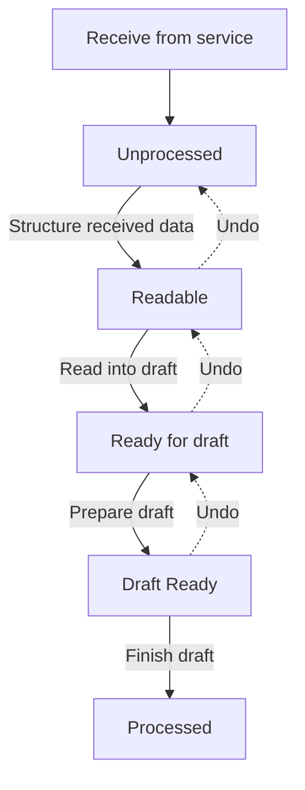

# Business logic

This document covers the main processing flows in E-Document Core, explaining what happens at each stage and why. Read alongside the source files referenced inline.

## Outbound flow

The outbound flow converts posted BC documents into e-documents and sends them to external services. The entry point is `EDocExport.Codeunit.al`.

**1. Check eligibility.** When a document is about to be posted, `CheckEDocument` runs the format interface's `Check` method for each service in the workflow. The `IExportEligibilityEvaluator` interface (from `Export Eligibility Evaluator` on the service) filters documents that should not be exported -- for example, excluding documents from certain locations.

**2. Create the E-Document.** After posting, `CreateEDocument` in `EDocExport.Codeunit.al` fires. It resolves the Document Sending Profile, finds the workflow, determines which services support the document type (via `E-Doc. Service Supported Type`), creates a single `E-Document` record linked to the posted document via `Document Record ID`, and inserts service status records for each service. The `OnBeforeCreateEDocument` and `OnAfterCreateEDocument` events fire here.

**3. Export to format.** For each non-batch service, `ExportEDocument` runs: it gets the source document RecordRef, applies any `E-Doc. Mapping` rules, then calls the format interface's `Create` method (or `CreateBatch` for batch services) via the `E-Document Create` runner codeunit. The output blob is stored in `E-Doc. Data Storage` via an `E-Document Log` entry with status Exported. If export fails, the service status becomes "Export Error".

**4. Send to service.** The workflow triggers `E-Doc. Integration Management.Send()`. This reads the exported blob from the log, sets up a `SendContext` with the blob and a default status of Sent, then calls `RunSend` -- which commits, creates a `Send Runner`, calls `Runner.Run()`, and catches any error. The runner dispatches to `IDocumentSender.Send()` on the service's `Service Integration V2` enum value. If the sender also implements `IDocumentResponseHandler`, the framework marks the document as async (Pending Response) and schedules a background job.

**5. Async response polling.** `EDocumentGetResponse.Codeunit.al` runs as a job queue entry. It finds all service statuses in "Pending Response", calls `IDocumentResponseHandler.GetResponse()` via a `GetResponseRunner`, and sets the status to Sent (if response received) or keeps it at Pending Response (if not yet ready). Errors set "Sending Error".

**6. Workflow-driven multi-service.** When the Document Sending Profile uses an "Extended E-Document Service Flow", the workflow can route the same e-document through multiple services sequentially. After each service completes, the workflow evaluates the next step.

**Batch processing** works similarly but collects multiple E-Documents into a single blob and sends them together. The `E-Document Service` controls batch mode (threshold-based or time-based via `Batch Mode` enum), and `EDocRecurrentBatchSend.Codeunit.al` handles the recurrent job.

## Inbound flow

The inbound flow receives documents from external services and creates purchase documents. There are two process versions, controlled by `Import Process` on the service.

### V2 import pipeline

The V2 pipeline (default for new setups) processes documents through five states with a step between each. This is managed by `ImportEDocumentProcess.Codeunit.al`.

**Receive from service.** `E-Doc. Integration Management.ReceiveDocuments()` calls `IDocumentReceiver.ReceiveDocuments()` to get a list of document metadata blobs, then for each one calls `DownloadDocument()` to fetch the actual content. If the receiver implements `IReceivedDocumentMarker`, the framework also calls `MarkFetched()` to tell the service the document was successfully downloaded. Each received document becomes an E-Document with status Imported and processing status Unprocessed.

**Step 1 -- Structure received data.** Converts unstructured input (e.g. a PDF) into structured data (e.g. XML). The `IStructureReceivedEDocument` interface does this -- for PDFs, this might call Azure Document Intelligence. The result is an `IStructuredDataType` that provides the content blob, file format, and preferred `Read into Draft` implementation. If the input is already structured (XML), this step is a no-op and `Structured Data Entry No.` equals `Unstructured Data Entry No.`. The original file is attached as a document attachment.

**Step 2 -- Read into draft.** The `IStructuredFormatReader` interface reads the structured data into E-Document draft tables (`E-Document Purchase Header`, `E-Document Purchase Line`). Returns an `E-Doc. Process Draft` enum value that determines which `IProcessStructuredData` implementation handles the next steps.

**Step 3 -- Prepare draft.** The `IProcessStructuredData.PrepareDraft()` method resolves BC entities -- vendor matching (via `IVendorProvider`), item matching (via `IItemProvider`), unit of measure resolution (via `IUnitOfMeasureProvider`), and account assignment (via `IPurchaseLineProvider`). This is where the `[BC]` prefixed fields on draft tables get populated. The vendor is written to `E-Document Header Mapping`, and line mappings to `E-Document Line Mapping`. The user can review and adjust these in the draft page before proceeding.

**Step 4 -- Finish draft.** The `IEDocumentFinishDraft.ApplyDraftToBC()` method creates the real BC document (Purchase Invoice, Purchase Credit Memo, etc.) from the draft tables. It returns the `RecordId` of the created document, which gets stored in `E-Document."Document Record ID"`. Links are recorded in `E-Doc. Record Link`. This step also supports revert via `RevertDraftActions()`.

**Undo support.** Each step can be undone, moving the document back one state. `UndoProcessingStep` in `ImportEDocumentProcess.Codeunit.al` handles cleanup: Finish draft undo reverts draft actions and clears `Document Record ID`; Prepare draft undo clears mappings and vendor assignment; Structure undo clears the structured data reference.

**Automatic processing.** If `Automatic Import Processing` is set to Yes on the service, received documents run through all steps automatically. Otherwise they stop at Unprocessed, and the user processes them manually.

### V1 import pipeline

The V1 pipeline (legacy, for `Import Process` = "Version 1.0") uses a simpler path. The format interface's `GetBasicInfoFromReceivedDocument` and `GetCompleteInfoFromReceivedDocument` methods extract data directly, and the framework creates purchase documents or journal lines based on service settings. V1 does not use draft tables or the stepped processing model. V1 is wrapped in `ProcessEDocumentV1()` in `ImportEDocumentProcess.Codeunit.al` and only responds to the "Finish draft" step -- earlier steps are skipped.

## Error handling

**Error message framework.** `EDocumentErrorHelper.Codeunit.al` provides `LogSimpleErrorMessage` and `LogWarningMessage` to record errors against an E-Document without stopping execution. Error counting (`ErrorMessageCount`) is used extensively to detect whether an interface call produced errors: the pattern is `ErrorCount := ErrorMessageCount(EDoc); RunInterface(); Success := ErrorMessageCount(EDoc) = ErrorCount`.

**Commit-before-interface-call.** Every external interface invocation follows this pattern (visible in `EDocIntegrationManagement.Codeunit.al`):

1. `Commit()` to persist everything so far
2. `Runner.Run()` wrapped in `if not ... then LogError(GetLastErrorText())`
3. Re-read the E-Document and Service records (`EDocument.Get(...)`) since the interface call may have modified them

This ensures that runtime errors in external code are caught without rolling back the E-Document's prior state.

**Service status isolation.** Each service has its own `E-Document Service Status` record. An error in one service does not affect others. The document-level status is derived: if any service is in error, the document is in error; if all are processed, the document is processed; otherwise it's in progress.

**Status transitions on error.** Each error service status value (Sending Error, Export Error, Cancel Error, Approval Error, Imported Document Processing Error) implements `IEDocumentStatus` to return `E-Document Status::Error`. The non-error in-progress statuses (Created, Pending Response, Imported, etc.) use the default implementation returning In Progress.

## Background processing

**Job queue integration.** Several processes run via job queue entries:

- **Auto-import** (`EDocumentImportJob.Codeunit.al`): Scheduled per-service based on `Auto Import`, `Import Start Time`, and `Import Minutes between runs`. Calls `ReceiveDocuments()`.
- **Get response** (`EDocumentGetResponse.Codeunit.al`): Polls for async send responses. Reschedules itself if any documents remain in Pending Response.
- **Recurrent batch send** (`EDocRecurrentBatchSend.Codeunit.al`): Collects pending batch documents and sends them on a schedule.

Job queue entry IDs are stored on the service (`Import Recurrent Job Id`, `Batch Recurrent Job Id`) and managed by `EDocumentBackgroundJobs.Codeunit.al`.

**Workflow integration.** E-Document creation triggers BC Workflow events. The workflow engine determines which services to use and when to send, enabling multi-step approval flows. The workflow step instance ID is tracked on the E-Document for correlation.
