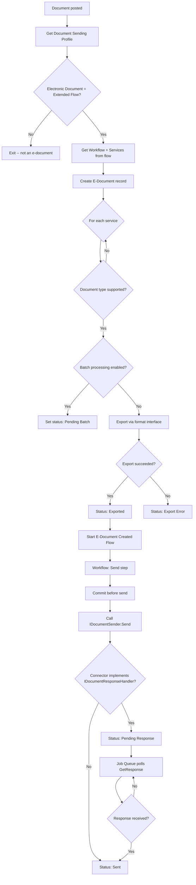
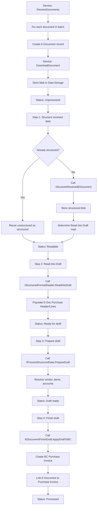

# Business logic

This document covers how documents flow through the E-Document Core framework -- the actual processing sequences, decision points, and error handling. Read [data-model.md](data-model.md) first for table relationships.

## Outbound flow

When a sales invoice (or credit memo, service invoice, reminder, etc.) is posted, the BC posting engine fires events that `EDocumentSubscribers` handles. The subscriber reads the Document Sending Profile for the customer, and if it's configured for "Extended E-Document Service Flow," the export pipeline kicks in.

The key codeunits involved:

- **`EDocExport.CreateEDocument`** (in `EDocExport.Codeunit.al`) -- Creates the E-Document record, populates it from the source document header via RecordRef field reads, inserts service status records for each supporting service, then exports non-batch documents immediately.
- **`EDocExport.ExportEDocument`** -- Applies field mappings, then calls `EDocumentCreate.Run()` (which invokes the format interface's `Create` method inside a `Codeunit.Run` error boundary). The exported blob is logged.
- **`EDocIntegrationManagement.Send`** -- Retrieves the exported blob from the log, sets up `SendContext` with a default status of "Sent," then runs `SendRunner` inside a `Codeunit.Run` error boundary. After send, it logs the HTTP request/response and updates the service status.
- **`EDocumentGetResponse`** -- A job queue handler that polls `IDocumentResponseHandler.GetResponse`. Returns `true` when the service confirms receipt; `false` keeps polling.

The workflow engine (`EDocumentWorkFlowProcessing`) routes the E-Document through configured workflow steps. Each step can target a different service (stored in `Workflow Step Argument."E-Document Service"`). The framework supports email sending steps too, where the exported document is attached to an email.

### Batch sending

When `Use Batch Processing` is enabled on a service, individual E-Documents are exported but not immediately sent. Instead:

1. **Threshold mode**: When the count of pending-batch documents reaches `Batch Threshold`, `EDocRecurrentBatchSend` fires and calls `ExportEDocumentBatch` to create a single combined blob, then sends it.
2. **Recurrent mode**: A job queue entry runs on a schedule (`Batch Start Time` + `Batch Minutes between runs`), sending whatever is pending.

The format interface's `CreateBatch` method receives all E-Documents and their mapped source records at once, producing a single `TempBlob`.

## Inbound V2 flow

V2 import processing is a four-step pipeline where each step transitions the E-Document to a new `Import Processing Status`. Every step is individually undoable, allowing users to fix data and re-run.

The import processing statuses form an ordered sequence:

| Status | After step | Meaning |
|--------|-----------|---------|
| Unprocessed | (initial) | Document received, blob stored |
| Readable | Structure received data | Structured content available |
| Ready for draft | Read into Draft | Draft purchase header/lines populated |
| Draft ready | Prepare draft | Vendor, items, accounts resolved |
| Processed | Finish draft | BC document created and linked |

**`ImportEDocumentProcess`** (codeunit 6104) is the orchestrator. It's a `Codeunit.Run` target configured with a step to execute and an optional undo flag. The `ConfigureImportRun` method sets the step, and then `OnRun` dispatches to the appropriate local procedure.

### Receiving

The receive path starts in `EDocIntegrationManagement`. For V2:

1. `IDocumentReceiver.ReceiveDocuments` is called, populating a `Temp Blob List` with metadata for each available document.
2. For each metadata blob, a new E-Document record is created (direction = Incoming, status = Created).
3. `IDocumentReceiver.DownloadDocument` fetches the actual content, storing it in `ReceiveContext.GetTempBlob()`.
4. The blob is saved to `E-Doc. Data Storage` and linked as the E-Document's `Unstructured Data Entry No.`.
5. If the service has `Automatic Import Processing` enabled, the pipeline starts immediately.

### Undo behavior

Each step can be undone, which reverts the E-Document to the previous status:

- **Undo Finish Draft**: calls `IEDocumentFinishDraft.RevertDraftActions` (deletes the created BC document), clears `Document Record ID`.
- **Undo Prepare Draft**: deletes header mappings, clears vendor assignment, resets `Document Type` to None.
- **Undo Structure**: clears `Structured Data Entry No.`.
- **Undo Read into Draft**: handled by re-running -- the draft tables are overwritten.

The `E-Document Log` entry for an undone step gets its `Step Undone` flag set to `true`.

### V1 legacy path

V1 documents (where `Import Process = "Version 1.0"`) bypass the four-step pipeline entirely. When `ImportEDocumentProcess` detects V1, it only responds to the "Finish Draft" step, delegating to `EDocImport.V1_ProcessEDocument`. This calls the old format interface methods (`GetBasicInfoFromReceivedDocument` and `GetCompleteInfoFromReceivedDocument`) in sequence. There is no undo capability in V1.

## Error recovery

Errors are handled at two levels:

1. **Runtime errors** in format/connector code are caught by the `Codeunit.Run` pattern. The framework calls `Commit()` before running the interface code, so if it throws, the E-Document and its state survive. The error text is captured via `GetLastErrorText()` and logged through `EDocumentErrorHelper.LogSimpleErrorMessage`.

2. **Business errors** are logged by connectors calling `EDocumentErrorHelper` directly. These don't throw runtime errors but still transition the service status to an error state.

Error statuses include: `Export Error`, `Sending Error`, `Cancel Error`, `Imported Document Processing Error`, `Approval Error`. Each maps to the aggregate `E-Document Status::Error` via the `E-Doc Error Status` implementation of `IEDocumentStatus`.

Recovery paths:

- **Re-export**: Call `EDocExport.Recreate` to re-run the export step.
- **Re-send**: The workflow can be restarted, or the send step can be retried.
- **Re-import**: Use the undo mechanism to revert to an earlier step, fix data, and re-run forward.

## Order matching

For incoming invoices that reference a purchase order, the PO matching feature resolves draft purchase lines against existing PO lines or receipt lines.

The matching can be manual (user selects PO lines on `EDocSelectPOLines` page) or AI-assisted (Copilot). The Copilot path (`EDocPOCopilotMatching`) uses Azure OpenAI function calling to propose matches based on descriptions, quantities, and amounts.

Configuration lives in `E-Doc. PO Matching Setup` (table in `PurchaseOrderMatching/`). It defines whether to match against PO lines, receipt lines, or both, and the tolerance levels for amount/quantity differences.

Matches are stored in `E-Doc. Purchase Line PO Match` as a junction between draft lines, PO lines, and receipt lines (all via SystemId). When `Finish Draft` runs, these matches determine whether to update an existing PO or create a new purchase invoice.

## Batch import processing

Auto-import is configured per service via `Auto Import`, `Import Start Time`, and `Import Minutes between runs`. The `EDocumentBackgroundJobs` codeunit manages the job queue entries:

- `HandleRecurrentImportJob` creates or updates a recurring job queue entry.
- `HandleRecurrentBatchJob` does the same for batch sending.
- Job queue entry IDs are stored on the service record and cleaned up on service deletion.

When auto-import fires, it calls the receive flow, then optionally processes documents through the pipeline based on `Automatic Import Processing` and the service's `GetDefaultImportParameters` configuration.
