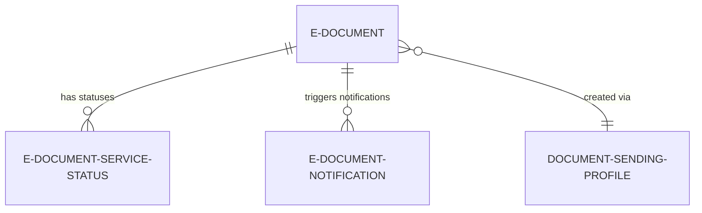
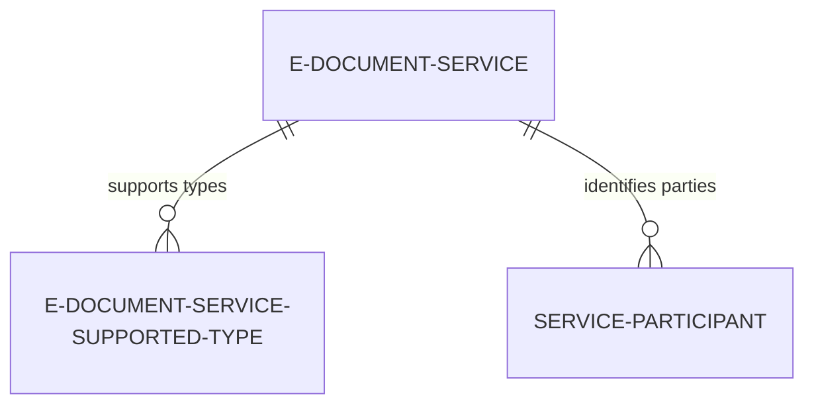
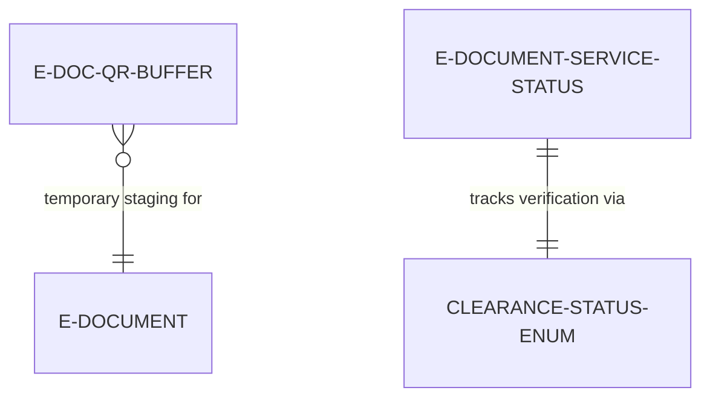
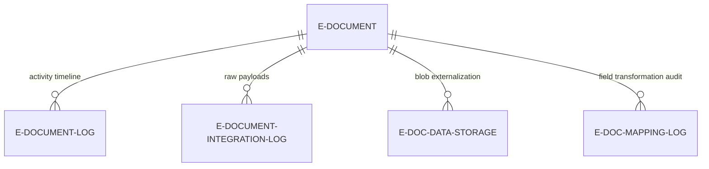
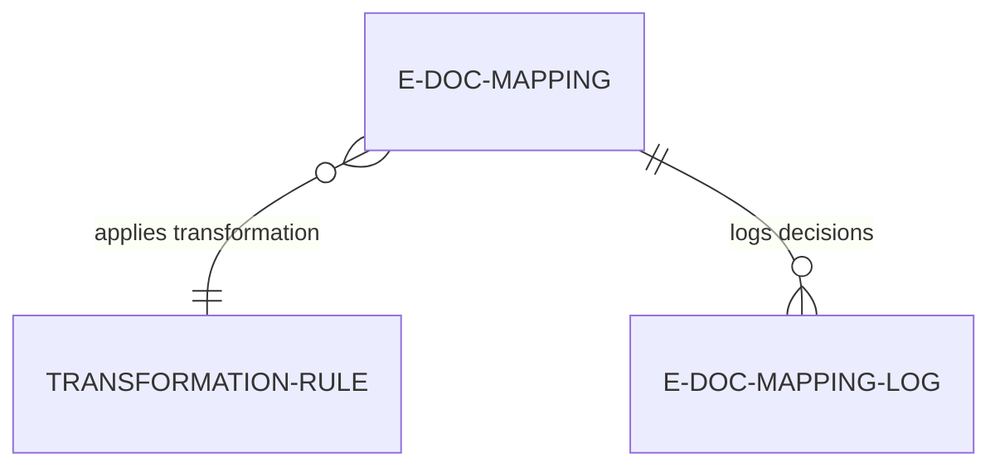
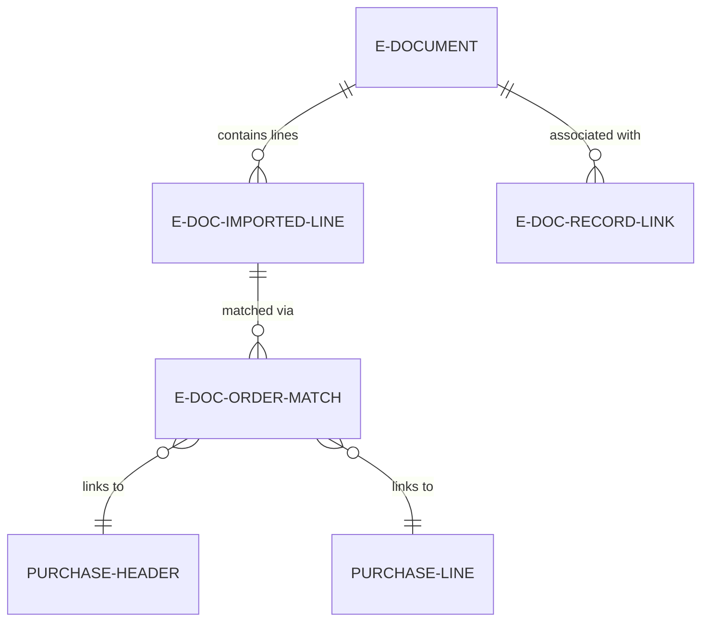
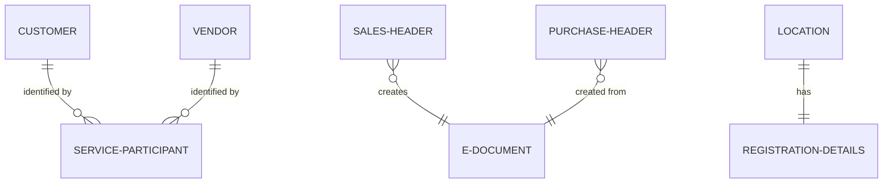

# Data model

E-Document Core organizes data into 7 conceptual areas: document lifecycle (the aggregate root and its status timeline), service configuration (reusable service definitions), clearance/QR (temporary validation buffers), logging and audit (immutable history), mapping and transformation (generic field mapping), order matching (intelligent purchase draft creation), and extensions (integration points to standard Business Central tables).

The model prioritizes immutability and auditability. E-Document records are never updated in place; state transitions append new Service Status records. SystemId references replace traditional surrogate keys, enabling cross-table lookups without rigid foreign key constraints. Blob storage is externalized to Data Storage records, keeping the main tables lightweight.

## Document lifecycle

E-Document is the aggregate root representing a single business document (invoice, credit memo, order). It stores metadata (document type, direction, participant names) but delegates processing state to child Service Status records. The relationship is 1:N composite: one document can be processed by multiple services simultaneously, each with independent status tracking.

E-Document Notification provides user alerts when documents require attention (errors, approvals, matches). Document Sending Profile links Business Central posting routines to e-document services, triggering automatic export when sales documents are posted.

## Service configuration

E-Document Service defines connection settings, authentication, and capabilities for a single e-invoice provider (PEPPOL, government portal, clearance service). Supported Types maps document types (Sales Invoice, Purchase Invoice) to service capabilities, controlling which documents can be processed by which services.

Service Participant stores sender/receiver identifiers (GLN, tax IDs, email) used during export and validation. These are linked to customers, vendors, and company information.

## Clearance and QR codes

E-Doc QR Buffer is a temporary table used during QR code generation and validation. It holds structured data extracted from QR payloads before mapping to E-Document fields. Records are deleted after processing.

Clearance status is tracked via an enum field on E-Document Service Status (Not Verified, Verified, Failed, In Process). When a document is sent to a clearance service, the service can update the status in real time, triggering notifications if verification fails.

## Logging and audit

E-Document Log provides a human-readable activity timeline: export started, formatted, sent, received, error occurred. E-Document Integration Log captures raw HTTP requests/responses and service payloads for debugging. E-Doc. Data Storage externalizes blob content (XML, JSON, PDF) to reduce table bloat.

E-Doc. Mapping Log records field transformation decisions during inbound mapping, showing which source fields mapped to which target fields and what transformation rules were applied.

## Mapping and transformation

E-Doc. Mapping defines RecordRef-based field transformations for generic inbound data mapping. Each mapping rule specifies a source field (from external format), target field (Business Central table), and optional transformation (via Transformation Rule references). The mapping engine evaluates rules in 3 passes: direct field copies, formula evaluation, and transformation rule application.

## Order matching

E-Doc. Imported Line represents a single line from an inbound purchase document before it's matched to a purchase order. E-Doc. Order Match stores user or AI suggestions linking imported lines to existing purchase orders. E-Doc. Record Link provides a generic association between E-Documents and any Business Central record (not just purchase orders).

When users accept a match, the system creates Purchase Header and Purchase Line records, linking them back to the E-Document via SystemId references.

## Extensions

E-Document Core extends 38 standard Business Central tables to integrate e-document functionality. Key extensions include:

- **Customer/Vendor tables:** Add Service Participant references and e-document preferences
- **Sales/Purchase Header/Line:** Add SystemId back-references to originating E-Document records
- **Location table:** Add company registration details (tax ID, GLN) for multi-location scenarios
- **Document Attachment table:** Link attachments to E-Document records

These extensions are minimal (1-3 fields each) to avoid polluting standard tables. The E-Doc. Attachment extension page aggregates attachments across multiple source tables into a unified view.

## Cross-cutting concerns

**SystemId linking** -- E-Document stores `Source Record ID SystemId` instead of traditional foreign keys. This allows flexible references to any table (Sales Header, Purchase Header, Service Header) without polymorphic key constraints.

**Immutable aggregates** -- E-Document and Service Status records are never updated after creation. Status transitions append new Service Status records. The current status is calculated on read, not stored.

**Dual-currency amounts** -- Inbound documents store both document currency amounts and LCY amounts, calculated at import time using the exchange rate from the document.

**Blob externalization** -- Large payloads (XML, JSON, PDF) are stored in E-Doc. Data Storage with a GUID reference, keeping E-Document records lightweight and enabling incremental loading.
