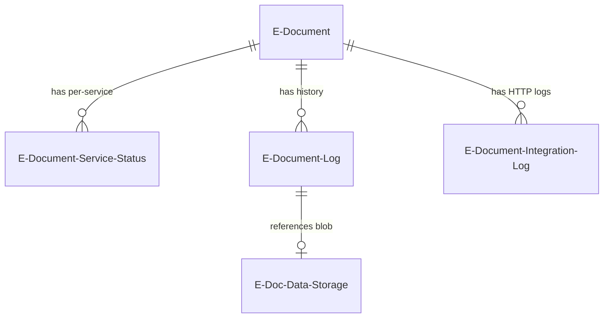
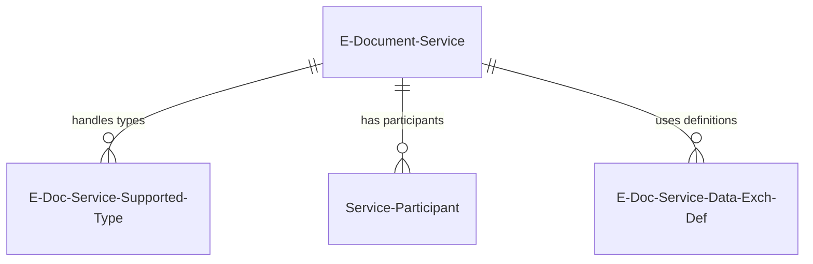
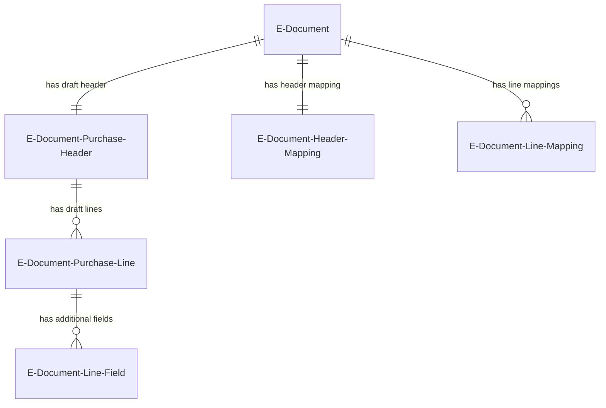
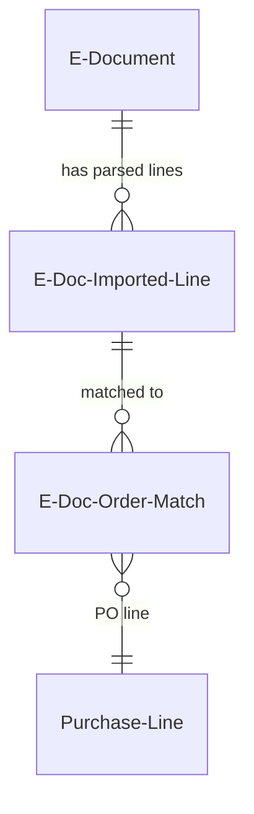
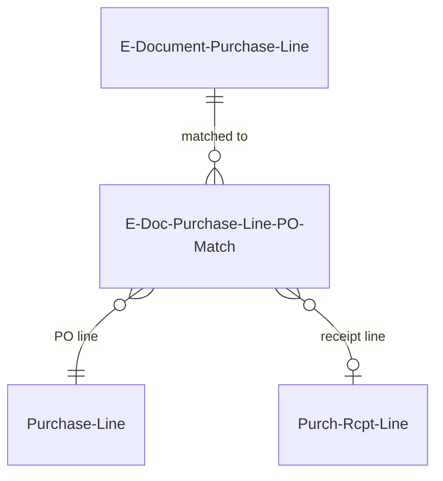
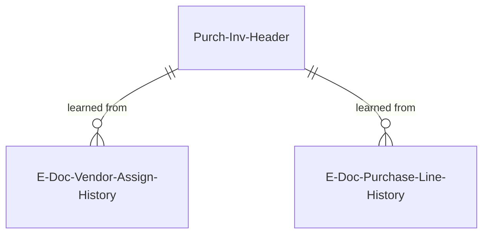
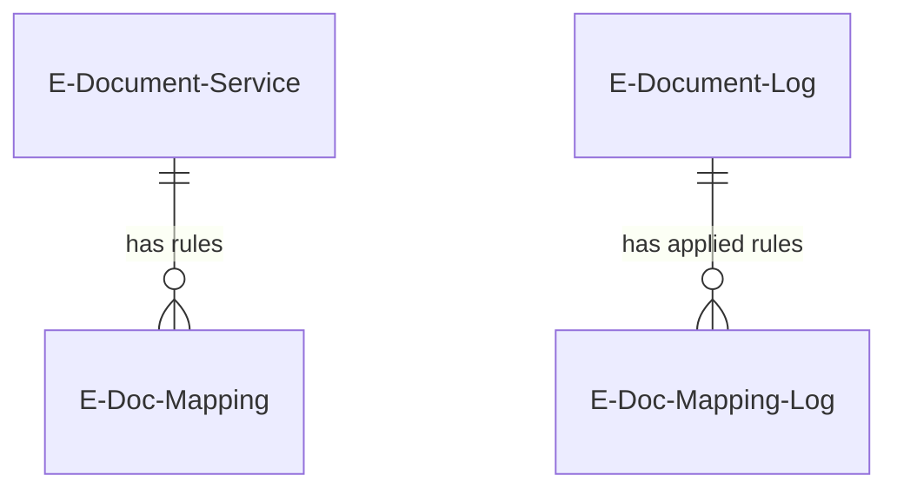

# Data model

This document covers the key entity relationships in E-Document Core. Each section focuses on a conceptual area with an ER diagram showing how tables relate. Field listings are intentionally omitted -- read the `.Table.al` source files for details.

## Document lifecycle

The central entity is `E-Document` (table 6121). It links to any BC source document via a polymorphic `Document Record ID` (RecordId) field. For each service that processes the document, an `E-Document Service Status` record tracks per-service progress. `E-Document Log` entries record every status transition, and each log entry can reference an `E-Doc. Data Storage` blob containing the actual document content (XML, PDF, etc.). HTTP communication is captured separately in `E-Document Integration Log`.

Status exists at three levels:

- **Document-level** (`E-Document Status` enum 6108): In Progress, Processed, Error. Derived from the service statuses below using the `IEDocumentStatus` interface -- each service status value knows which document status it maps to.
- **Service-level** (`E-Document Service Status` enum 6106): Created, Exported, Sent, Pending Response, Approved, Rejected, Canceled, Imported, Imported Document Created, and several error states. Each value implements `IEDocumentStatus` to declare whether it means the document is in progress, processed, or in error.
- **Import processing** (`Import E-Doc. Proc. Status` enum 6100): Unprocessed, Readable, Ready for draft, Draft Ready, Processed. This lives on `E-Document Service Status` as a field and tracks V2 import pipeline progress.

The `E-Document` table carries two blob references directly: `Unstructured Data Entry No.` (the original received file, e.g. a PDF) and `Structured Data Entry No.` (the structured version, e.g. XML extracted from the PDF). Both point to `E-Doc. Data Storage`.

## Service configuration

Each `E-Document Service` defines a format (`Document Format` enum), a service integration (`Service Integration V2` enum), import process version, batch settings, and auto-import scheduling. `E-Doc. Service Supported Type` controls which document types (Sales Invoice, Purchase Credit Memo, etc.) the service handles. `Service Participant` links customers and vendors to services with external identifiers (e.g. PEPPOL participant IDs). `E-Doc. Service Data Exch. Def.` connects services to Data Exchange Definitions for the legacy Data Exchange format implementation.

The `Service Integration V2` enum (enum 6151) is the key polymorphic point. It implements `IDocumentSender`, `IDocumentReceiver`, and `IConsentManager`. Extensions add values to this enum to plug in new service connectors. The default value "No Integration" routes to a no-op implementation (`E-Document No Integration`).

## Draft processing (V2 import)

When an inbound document is received and processed through the V2 import pipeline, its data is staged in draft tables before creating real BC documents. `E-Document Purchase Header` holds header-level data (vendor name, addresses, dates, totals) and `E-Document Purchase Line` holds line-level data (product codes, quantities, prices). These tables use a dual-namespace convention: raw external fields (e.g. `Vendor Company Name`, `Product Code`) and validated BC fields prefixed with `[BC]` (e.g. `[BC] Vendor No.`, `[BC] No.`).

`E-Document Header Mapping` stores the user's vendor and purchase order selection for the document. `E-Document Line Mapping` stores the resolved purchase line type and account number for each line. `E-Document Line - Field` (`E-Document Line Field` table 6109) holds configurable additional field values per line, driven by `E-Doc. Purchase Line Field Setup`.

## Order matching (V1)

The V1 order matching system (in `src/Processing/OrderMatching/`) links imported e-document lines to existing purchase order lines. `E-Doc. Imported Line` holds the parsed line data. `E-Doc. Order Match` is the many-to-many junction table that records which imported line matches which PO line, with quantity and unit cost for partial matching.

## Purchase order matching (V2 import)

The V2 import pipeline has its own PO matching via `E-Doc. Purchase Line PO Match` (table 6114), which links draft `E-Document Purchase Line` records to `Purchase Line` and optionally `Purch. Rcpt. Line` records using SystemId references. Configuration is stored in `E-Doc. PO Matching Setup`.

## Historical learning

After a purchase invoice created from an e-document is posted, the framework writes history records for future AI/Copilot suggestions. `E-Doc. Vendor Assign. History` stores the raw vendor identifiers (company name, address, VAT ID, GLN) alongside the posted `Purch. Inv. Header` SystemId, so future documents with similar vendor data can be auto-matched. `E-Doc. Purchase Line History` captures what line-level mappings were used, keyed by vendor and description, for suggesting account assignments on future documents.

## Mapping and transformation

`E-Doc. Mapping` (table 6118) defines per-service field transformation rules -- find/replace values and transformation rules applied to source document fields before export (or after import). Each mapping targets a specific table/field combination. When mappings are applied during export, the results are recorded in `E-Doc. Mapping Log` (table 6123) linked to the corresponding `E-Document Log` entry, creating an audit trail of what was transformed.

## Cross-cutting concerns

**Polymorphic document linking**: The `Document Record ID` (RecordId) on `E-Document` can point to any table -- Sales Invoice Header, Purchase Header, Service Cr.Memo Header, etc. The `Table ID` field stores the table number for display. This means you cannot use a traditional foreign key; code must use `RecordRef` to navigate to the source document.

**Three ways to link to purchase documents**: (1) `Document Record ID` on `E-Document` -- set when finish draft creates the real BC document. (2) `E-Document Link` (Guid) on the `Purchase Header` table extension -- the V1 approach, obsolete in 27.0. (3) `E-Doc. Record Link` table -- the V2 approach using SystemId pairs to link draft records to real BC records, used during the draft-to-BC-document lifecycle.

**Reference-counted blob storage**: `E-Doc. Data Storage` records are created by log entries. Deleting a log entry cascades to delete its data storage (see `OnDelete` in `EDocumentLog.Table.al`). The E-Document itself references data storage entries for structured and unstructured content, but these are managed through the log lifecycle.

**`[BC]` prefix field naming convention**: In the draft purchase tables (`E-Document Purchase Header`, `E-Document Purchase Line`), fields that hold validated Business Central values are prefixed with `[BC]` (e.g. `[BC] Vendor No.`, `[BC] No.`, `[BC] Unit of Measure`). Fields without the prefix hold raw data from the incoming e-document. This dual-namespace pattern lets users compare external data against resolved BC entities.
