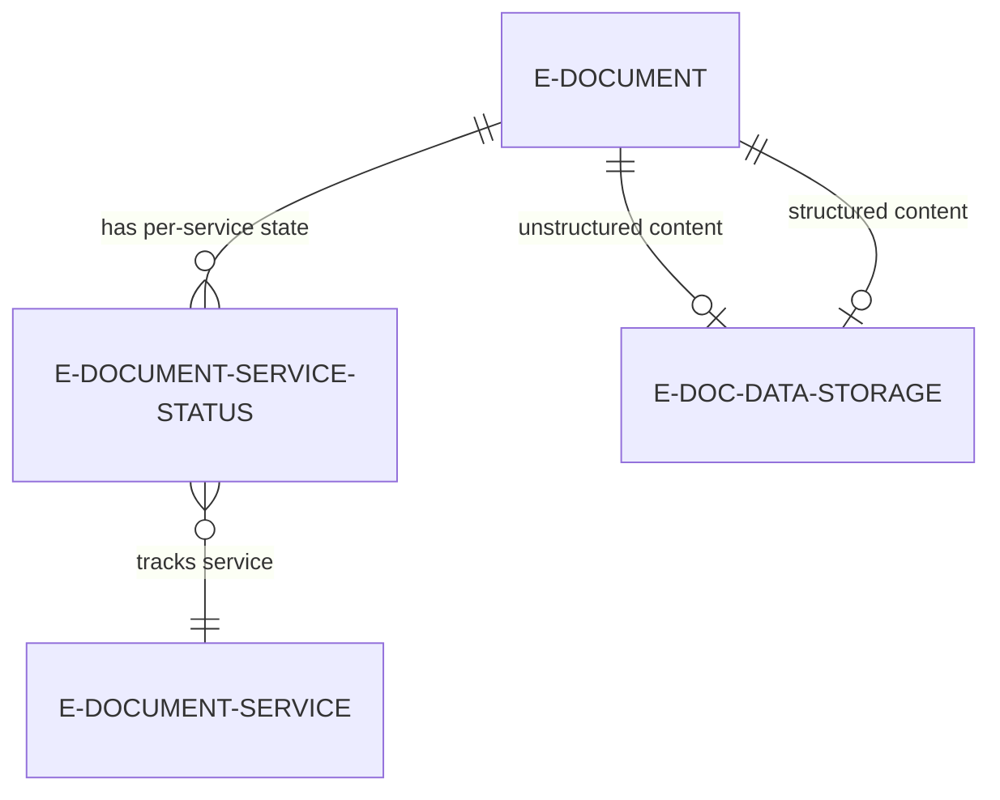
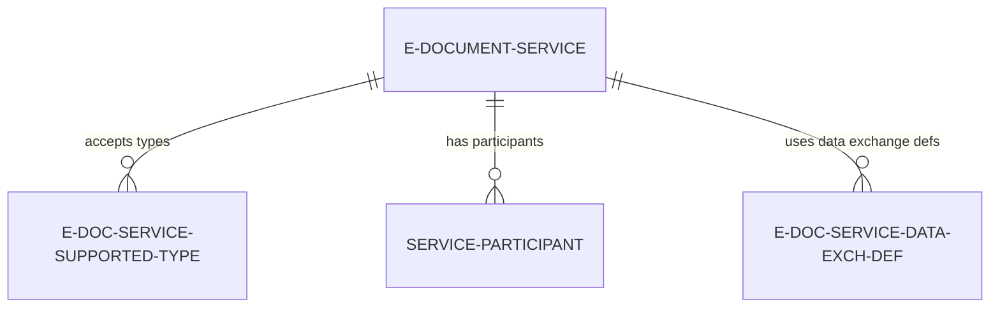
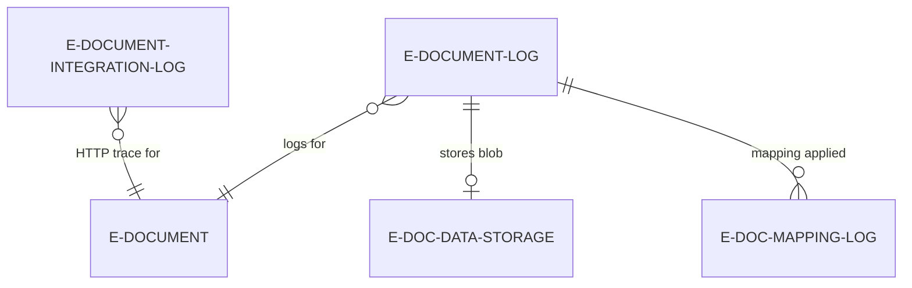
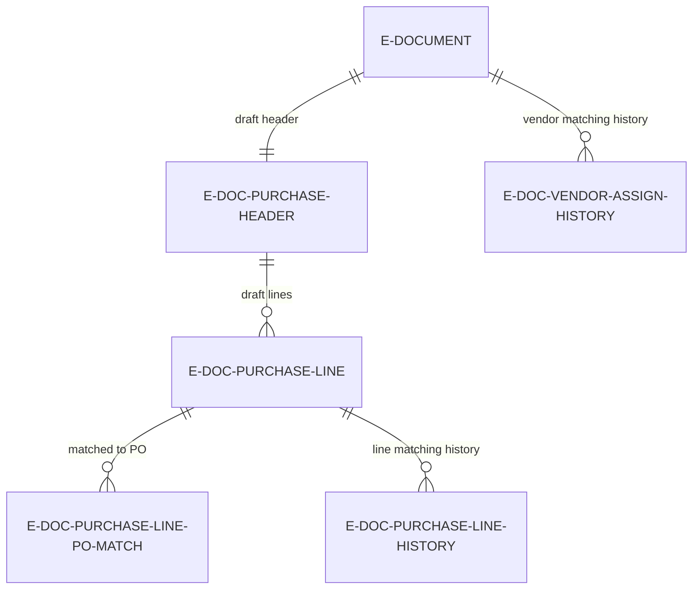
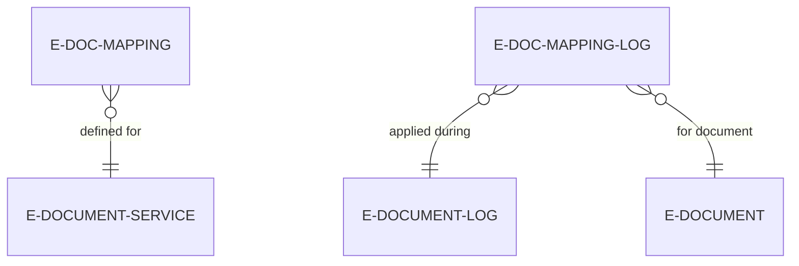

# Data model

This document covers how the E-Document Core tables relate to each other and why they exist. Tables are grouped by conceptual area. The goal is to help you understand what to query and where relationships live -- not to list every field.

## E-Document lifecycle

The central record is `E-Document` (table 6121). Every electronic document -- inbound or outbound -- gets exactly one row here. It tracks the document's identity (vendor/customer, amounts, dates), its relationship to the BC source document (`Document Record ID`), and its aggregate processing state (`Status`).

Each E-Document is processed by one or more services. The `E-Document Service Status` (table 6138) tracks the granular state of each E-Document-to-Service pair. The composite key is `(E-Document Entry No, E-Document Service Code)`. The aggregate `E-Document.Status` is derived by iterating all related service status records and checking their `IEDocumentStatus` implementation.

`E-Doc. Data Storage` (table 6125) is a blob store. The E-Document references it via two foreign keys: `Unstructured Data Entry No.` (original received file -- PDF, image, etc.) and `Structured Data Entry No.` (parsed structured content -- XML, JSON). Outbound documents typically only have a structured entry. Inbound unstructured documents get both after the "Structure" step produces a structured version.

Key non-obvious details:

- `E-Document.Service` is a denormalized copy of the service code, set at creation time for inbound documents. For outbound documents with multiple services (via workflow), the per-service tracking lives entirely in `E-Document Service Status`.
- `E-Document.Document Record ID` is a RecordId pointing to the BC source/target document (e.g., Sales Invoice Header, Purchase Header). This is set during creation for outbound docs, and during "Finish Draft" for inbound docs.
- Deleting an E-Document cascades: the `OnDelete` trigger removes all related log entries, integration logs, service statuses, document attachments, mapping logs, and imported lines.

## Service configuration

`E-Document Service` (table 6103) is the configuration hub for each electronic document service. It defines which format to use (`Document Format` enum), which connector to use (`Service Integration V2` enum), batch processing settings, auto-import scheduling, and import processing options.

`E-Doc. Service Supported Type` (table 6122) is a simple junction table listing which `E-Document Type` values a service accepts. The key is `(E-Document Service Code, Source Document Type)`. If a document type isn't listed here, the service won't process that document.

`Service Participant` (table 6104) maps BC entities (customers or vendors) to their external identifiers on a per-service basis. For example, a customer's PEPPOL participant ID for a specific access point. The key is `(Service, Participant Type, Participant)`.

`E-Doc. Service Data Exch. Def.` (table 6139) links a service's format to Data Exchange Definitions, separately for import and export, per document type.

Key non-obvious details:

- The `E-Document Service` table has two integration enum fields. `Service Integration` (old, field 4) is obsolete and behind `CLEANSCHEMA29` guards. `Service Integration V2` (field 27) is the active one. Code referencing the old field will be removed.
- Batch processing configuration (`Use Batch Processing`, `Batch Mode`, `Batch Threshold`, `Batch Start Time`, etc.) is all on the service record. The service also holds two job queue entry GUIDs (`Batch Recurrent Job Id`, `Import Recurrent Job Id`) for its background jobs.
- `Import Process` field distinguishes V1 vs V2 processing. `Automatic Import Processing` controls whether imported documents are automatically pushed through the full pipeline.

## Logging and audit

Every significant state transition creates an `E-Document Log` (table 6124) entry. The log captures the service code, the service status at that point, and optionally a reference to a `E-Doc. Data Storage` entry containing the document blob at that stage. This gives you a full audit trail of what was exported, sent, received, etc.

`E-Document Integration Log` (table 6127) stores HTTP communication details: the request blob, response blob, response status code, HTTP method, and URL. One integration log entry per API call. This is your debugging tool when a connector fails.

`E-Doc. Mapping Log` (table 6123) records which field mappings were applied during a specific export or import. It links to the E-Document Log entry and the E-Document, capturing the table ID, field ID, original value, and replacement value.

Key non-obvious details:

- The `E-Document Log` has a `Step Undone` boolean field. When a V2 import step is undone, the log entry is marked rather than deleted. This preserves the audit trail.
- `E-Document Log.Status` is an `E-Document Service Status` enum value, not the aggregate `E-Document Status`. This means log entries record the granular service-level state.
- Integration logs store request and response as BLOBs, not text. They can be exported to files via `ExportRequestMessage` / `ExportResponseMessage`.

## Import processing (V2)

The V2 import pipeline uses its own set of tables to hold the draft document state between steps.

`E-Document Purchase Header` and `E-Document Purchase Line` (tables in the `Processing.Import.Purchase` namespace) are the draft tables. They mirror purchase header/line structures but with both "external" fields (from the received document -- product code, description, unit price as received) and "BC" fields (resolved vendor no., item no., GL account, etc.). The purchase line table key is `(E-Document Entry No., Line No.)`.

`E-Doc. Purchase Line History` (table 6140) records what draft line values were used when a purchase invoice was ultimately posted. This feeds into the historical matching AI -- when a new e-document arrives from the same vendor with similar line descriptions, the system can suggest the same item/account assignments.

`E-Doc. Vendor Assign. History` (table 6108) stores the external vendor identifiers (company name, address, VAT ID, GLN) alongside the BC vendor number that was assigned. This powers vendor auto-matching for future documents.

`E-Doc. Purchase Line PO Match` (table 6114) is a junction table linking draft purchase lines to existing Purchase Order lines and/or Purchase Receipt lines. This is used by the PO matching feature where an incoming invoice is matched against an existing order.

`E-Doc. Import Parameters` (table 6106) is a **temporary table** that configures how a single import run behaves: which step to run, whether to target a specific status, V1 vs V2 behavior flags, and an optional existing document RecordId to link to instead of creating new.

Key non-obvious details:

- The `E-Doc. Purchase Line PO Match` table uses SystemId GUIDs as foreign keys to both `E-Document Purchase Line` and `Purchase Line`, not integer IDs. This is because purchase lines can be renumbered.
- `E-Doc. Import Parameters` is temporary (in-memory only). It's constructed fresh for each import run and never persisted. The "Step to Run / Desired Status" option field determines whether processing is step-driven or status-driven.
- `E-Document Header Mapping` and `E-Document Line Mapping` tables (in the Import folder) handle the mapping between external field names and BC field references during import.

## Mapping

`E-Doc. Mapping` (table 6118) defines find/replace rules that transform field values during export or import. Each mapping rule targets a specific table + field + service, with a "Find Value" and "Replace Value". The `For Import` boolean distinguishes export-time from import-time mappings. Rules can use BC's `Transformation Rule` system for complex transforms.

`E-Doc. Mapping Log` (table 6123) records which mappings were actually applied, linking back to the E-Document Log entry.

Key non-obvious details:

- Mapping operates at the RecordRef/FieldRef level. The `EDocMapping.MapRecord` codeunit copies a source RecordRef into a temporary mapped RecordRef, applying transformations. The original record is never modified -- the mapped copy is what gets passed to the format interface.
- The `Used` boolean on `E-Doc. Mapping` is reset to `false` before each export/import run, then set to `true` for rules that matched. This lets you see which rules are actually being used.

## Cross-cutting concerns

**SystemId linking**: Several relationships use `SystemId` (GUID) rather than primary key integers. The `E-Document.SystemId` is used in the purchase header's `E-Document Link` field (V1 legacy). The PO match table uses SystemId GUIDs for all three parties. This makes relationships stable across renumbering but harder to query manually.

**Blob storage pattern**: Binary content is never stored on the E-Document record itself. It always goes through `E-Doc. Data Storage`, which is referenced by integer `Entry No.` from both the E-Document (for unstructured/structured content) and the E-Document Log (for point-in-time snapshots). Deleting a log entry cascades to its data storage entry.

**Change detection**: The `E-Document Notification` table (table in `Document/Notification/`) tracks notification state for role center cue tiles. It uses a simple enum-based type system to track things like "new inbound documents available."
