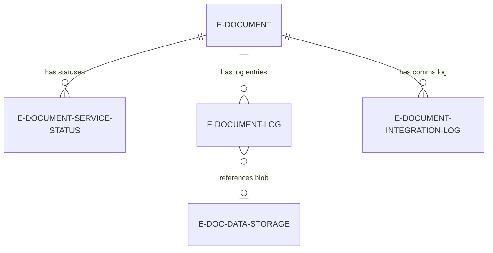
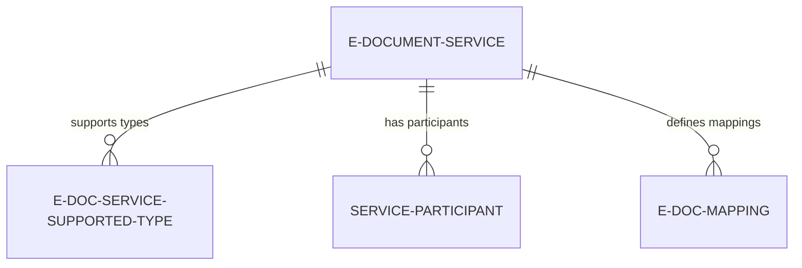
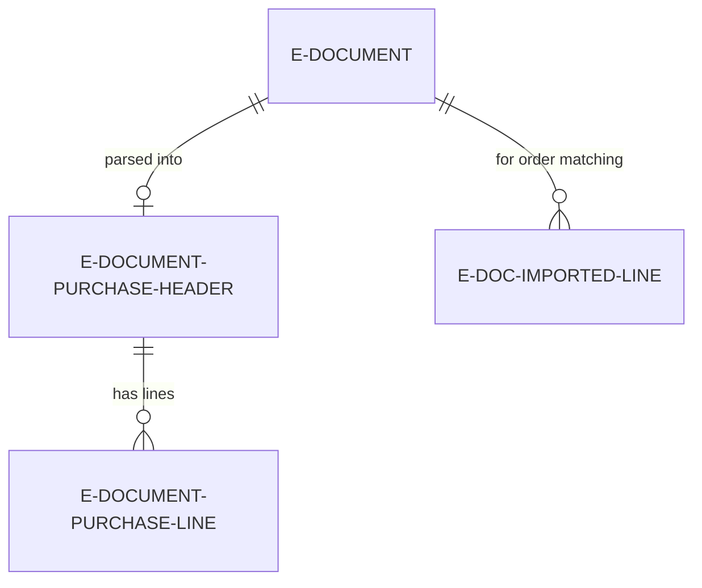

# Data model

This document covers how the E-Document Core data model is organized, what the key relationships mean, and design decisions worth knowing about. For interface contracts and code examples, see [README.md](../README.md). For processing flows, see [business-logic.md](business-logic.md).

## Core document lifecycle

The central entity is the **E-Document** table (`table 6121 "E-Document"`). Every electronic document -- inbound or outbound -- gets exactly one E-Document record. It stores header-level data extracted from the source BC document (amounts, dates, customer/vendor info) plus metadata about how the document was processed.

An E-Document is always associated with at least one **E-Document Service Status** record (`table 6138`), which tracks the per-service state. The composite key is `(E-Document Entry No, E-Document Service Code)`. In practice, most documents have exactly one service status record, but the model supports multiple services per document (e.g., send via PEPPOL and also via email through different workflow steps).

Every state transition produces an **E-Document Log** entry (`table 6124`), which captures the service status at that moment and optionally links to a **E-Doc. Data Storage** record (`table 6125`) containing the document blob. The separation between log and storage is intentional: multiple log entries can reference the same storage entry (for batch imports where many documents share one downloaded blob).

The **E-Document Integration Log** (`table 6126`, in the Logging folder) stores HTTP request/response pairs from service communication. It links to both the E-Document and the service, providing a full communication audit trail.

## Service configuration

An **E-Document Service** (`table 6103`) defines a processing endpoint. It combines a Document Format (the `"E-Document Format"` enum, which implements the `"E-Document"` interface for serialization) with a Service Integration (the `"Service Integration"` enum, which implements `IDocumentSender` and `IDocumentReceiver`). Both are extensible enums that connector apps extend.

The service also holds import pipeline configuration: `"Import Process"` (Version 1.0 or 2.0), `"Read into Draft Impl."` (how to parse structured data), and a set of boolean flags that control import behavior (Validate Receiving Company, Resolve Unit Of Measure, Lookup Item Reference, Lookup Item GTIN, Lookup Account Mapping, etc.).

**E-Doc. Service Supported Type** links services to the document types they handle. This is a simple junction table keyed by `(Service Code, E-Document Type)`. A service that handles Sales Invoices and Sales Credit Memos has two records here.

**Service Participant** links a service to specific business partners (customers or vendors), identified by participant identifiers and schemes. This is used for participant-based routing -- knowing which electronic identifier to use for a given trading partner on a given service.

**E-Doc. Mapping** (`table 6119`) provides field-level transformations: renaming field values on export or import per service. For example, mapping a BC field value to a PEPPOL code. **E-Doc. Mapping Log** records which mappings were applied to each document.

## Inbound staging tables (V2.0 import pipeline)

V2.0 inbound processing uses dedicated staging tables to hold parsed document data before creating actual BC purchase documents. This three-layer approach (raw blob -> staging tables -> BC documents) isolates parsing from business logic and allows users to review and correct data before committing.

**E-Document Purchase Header** (`table 6100`) and **E-Document Purchase Line** (`table 6101`, in `Processing/Import/Purchase/`) hold the parsed invoice data in a vendor-neutral format. The purchase header has two kinds of fields: external data (fields 2-100, prefixed with vendor/customer names, addresses, amounts as raw text) and BC-resolved fields (fields 101+, prefixed with `[BC]`, containing resolved vendor numbers, posting groups, etc.). The purchase line follows the same pattern. Both are keyed by E-Document Entry No.

**E-Document Header Mapping** and **E-Document Line Mapping** (`Processing/Import/`) track how staging table fields were mapped to BC entities during the "Prepare draft" step.

For order matching scenarios (linking inbound invoices to existing purchase orders), the **E-Doc. Imported Line** table (`Processing/OrderMatching/`) stores lines from the imported document alongside references to matched purchase order lines.

## Dual data storage

Every inbound E-Document can have two blob references: `"Unstructured Data Entry No."` and `"Structured Data Entry No."`, both pointing to `"E-Doc. Data Storage"` records. The unstructured slot holds the original file as received (e.g., a PDF). The structured slot holds the machine-readable version (e.g., XML extracted by Azure Document Intelligence, or the original XML if the document was already structured).

When a PDF is received and processed through the "Structure received data" step, the original PDF is moved to a Document Attachment for reference, and the structured output replaces the working data. If the received document is already structured (XML), both slots point to the same storage entry.

Each `"E-Doc. Data Storage"` record has a `"File Format"` enum field that implements `IEDocFileFormat` and `IBlobType` interfaces. These determine how to preview the content and what structuring methods are available.

## Linking to BC documents

Outbound E-Documents link to their source BC document via `"Document Record ID"` (a RecordId). This is a BC runtime reference, not a traditional foreign key, which means it works across any source table (Sales Invoice Header, Service Cr.Memo Header, etc.) without explicit table relations.

Inbound E-Documents, once the import pipeline completes, store the created BC document's RecordId in the same `"Document Record ID"` field. The E-Document table's `OnDelete` trigger prevents deletion of linked or processed documents.

Extensions on BC tables add E-Document awareness: `"E-Document Link"` (a Guid) on `Purchase Header` links back to the E-Document's SystemId for V1.0 processing (marked for removal in CLEAN27). Page extensions on Posted Sales Invoice, Posted Purchase Invoice, etc. add factboxes showing E-Document status.

## Status model

The E-Document has three independent status dimensions. The **E-Document Status** enum (`enum 6108`) is the coarsest: `In Progress`, `Processed`, or `Error`. The **E-Document Service Status** enum (`enum 6106`) is the granular per-service status with values like `Created`, `Exported`, `Sent`, `Pending Response`, `Approved`, `Rejected`, `Imported`, `Imported Document Created`, `Not Cleared`, `Cleared`, and various error states. Notably, this enum implements `IEDocumentStatus` -- each value is bound to one of three status codeunits (`EDocInProgressStatus`, `EDocProcessedStatus`, `EDocErrorStatus`) that know how to derive the overall E-Document Status.

The **Import E-Doc. Proc. Status** enum (`enum 6100`) tracks the V2.0 import pipeline position: `Unprocessed` -> `Readable` -> `Ready for draft` -> `Draft Ready` -> `Processed`. This is stored on the E-Document Service Status table (field 4) and exposed as a FlowField on the E-Document table. Transitions between these states are defined by the `"Import E-Document Steps"` enum.
