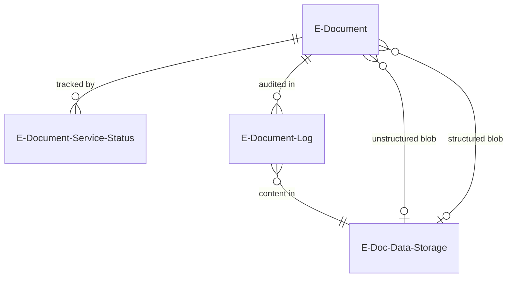
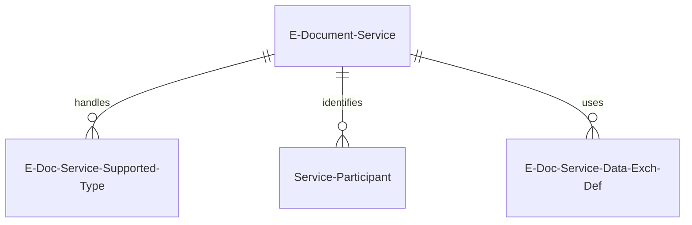
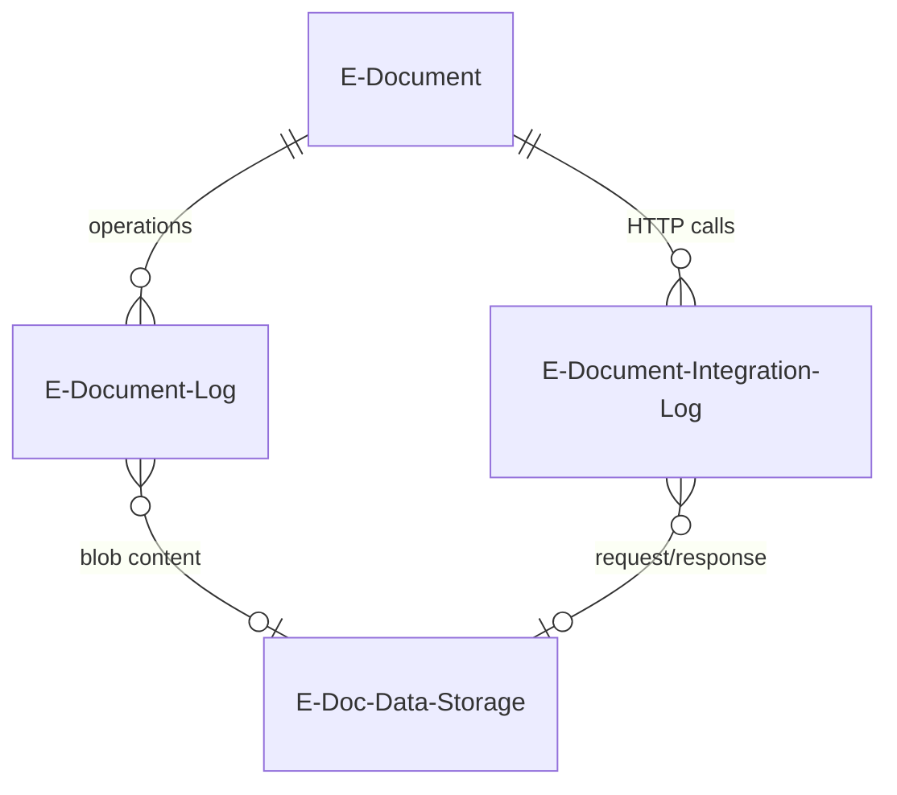
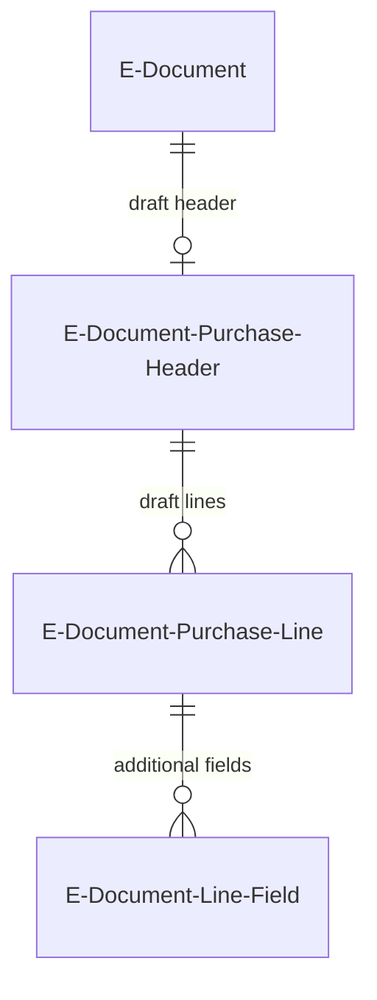
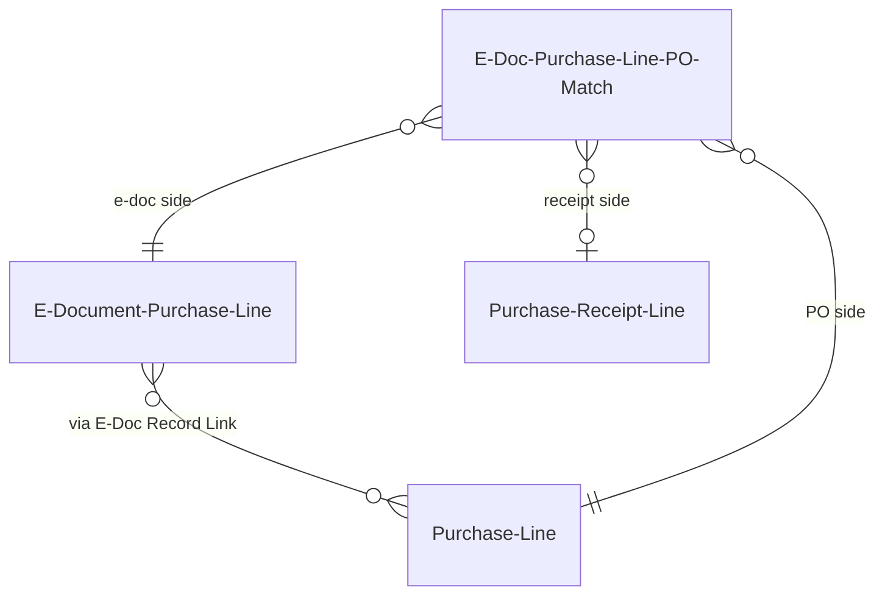

# Data model

## E-Document lifecycle (core)

The `E-Document` table (6121) is the central record. It links to its source BC document via a `Document Record ID` field (a RecordId, not a foreign key), which means it can point at any posted document type -- sales invoices, credit memos, service invoices, reminders, shipments, or transfer documents -- without schema coupling. For incoming documents, the same field gets populated when the import pipeline creates the BC purchase document at the "Finish draft" stage.

Each E-Document tracks two content blobs by reference: `Unstructured Data Entry No.` (typically a PDF) and `Structured Data Entry No.` (XML or JSON after conversion). These point into `E-Doc. Data Storage`, a shared blob table. The E-Document itself stays slim -- all binary content lives in storage.

The `E-Document Service Status` table (6138) is the workhorse of status tracking. It creates a 1:N relationship between an E-Document and the services processing it, keyed on (E-Document Entry No, Service Code). The `Status` field tracks the outbound/inbound service-level state (Exported, Sent, Pending Response, Sending Error, Imported, etc.), while `Import Processing Status` tracks the V2 import pipeline progression. The trigger on `Import Processing Status` auto-updates `Status` -- when processing reaches "Processed", the service status flips to "Imported Document Created".

The document-level `E-Document.Status` is derived, not stored independently. `EDocumentProcessing.ModifyEDocumentStatus` scans all service status records: any error means Error, any in-progress means In Progress, otherwise Processed.

## Service configuration

`E-Document Service` (6103) is where the plugin model lives. The `Document Format` enum selects the format interface (how to serialize/deserialize), and the `Service Integration V2` enum selects the integration interface (how to transmit). This separation means a PEPPOL format can be paired with any HTTP connector. The table also carries processing flags like `Validate Receiving Company`, `Lookup Account Mapping`, and `Apply Invoice Discount` that control import behavior.

`E-Doc. Service Supported Type` (6122) is a simple N:M join between services and document types. If a document type is not listed for a service, the service silently skips it during export.

`Service Participant` (6104) maps BC Customers and Vendors to their external identifiers within a specific service. This is how the system knows that BC Vendor 10000 is "IT12345678" in the Peppol network.

## Data storage and logging

`E-Doc. Data Storage` (6125) is a generic blob store. Each entry has a `Data Storage` blob field, a `Name`, and a `File Format` enum (XML, JSON, PDF, etc.). Multiple log entries can reference the same storage entry -- this is intentional to avoid duplicating large blobs.

`E-Document Log` (6124) is the per-operation audit trail. Each entry records what happened (exported, sent, received, error) with a reference to the associated data storage entry. `E-Document Integration Log` (6127) captures the HTTP level -- request blob, response blob, status code, URL, method. Together they give you both the business view ("document was exported") and the technical view ("POST to https://api.example.com returned 500").

`E-Doc. Mapping Log` (6123) records when transformation rules from `E-Doc. Mapping` were applied, providing an audit trail of find/replace operations on the document content.

## Import staging (V2 draft tables)

The V2 import pipeline uses dedicated staging tables to hold intermediate state before creating actual BC documents. `E-Document Purchase Header` (6100) has a 1:1 relationship with the incoming E-Document and stores both raw external data (vendor name, address as the sender wrote them) and `[BC]`-prefixed validated fields (`[BC] Vendor No.`, `[BC] Currency Code`). This dual-field convention is the key to understanding the draft tables -- unprefixed fields are what the external system said, `[BC]` fields are what the system resolved.

`E-Document Purchase Line` (6101) follows the same pattern at the line level with raw description/unit price alongside `[BC] No.` and `[BC] Unit of Measure`. Lines also support dimensions and link to additional fields via the EAV table `E-Document Line - Field` (6110), which uses type-specific value columns (Text, Decimal, Date, Boolean, Code, Integer) to allow dynamic schema extension without table modifications.

The legacy V1 tables `E-Document Header Mapping` (6102) and `E-Document Line Mapping` (6105) still exist for the V1 import path but are not used by V2.

## Matching and linking

The matching subsystem handles both purchase order matching and the generic record linking needed during import.

`E-Doc. Record Link` (6141) provides SystemId-based linking between draft purchase lines and actual Purchase Lines. It is a generic join table -- not specific to any document type -- and gets deleted once the document is posted.

For purchase order matching, `E-Doc. PO Matching Setup` (6116) controls matching behavior per vendor or globally, including whether to create receipts. `E-Doc. Purchase Line PO Match` (6114) implements three-way matching: E-Doc Line to PO Line to Receipt Line, all via SystemId references. `E-Doc. Imported Line` (6165) and `E-Doc. Order Match` (6164) are buffer tables for the matching UI, tracking matched quantities and match proposals respectively.

Historical matching tables (`E-Doc. Purchase Line History` at 6140 and `E-Doc. Vendor Assign. History` at 6108) learn from posted invoices. They store (Vendor, Product Code, Description) to Posted Purchase Invoice Line mappings so the system can automatically match items on future imports from the same vendor.

## Key gotchas

- Three status fields exist and serve different purposes: `E-Document.Status` (derived document-level), `Service Status.Status` (per-service), and `Service Status.Import Processing Status` (V2 import pipeline). Confusing them is a common source of bugs.
- SystemId-based linking is used throughout. This is schema-agnostic but makes SQL queries harder -- you cannot join on readable business keys, only on GUIDs.
- The `E-Doc. Data Storage` table is intentionally shared. Do not assume a 1:1 relationship between log entries and storage entries.
- V1 and V2 import tables coexist. The `E-Document Import Process` enum on the service determines which path runs. If you are writing new import logic, use V2.
- Table extensions to `Purchase Header`, `Purchase Line`, `Vendor`, `Location`, and `Document Sending Profile` add e-document support fields. The `Purchase Header` extension adds an `E-Document Link` GUID and a flowfield for `Amount Incl. VAT To Inv.`.
