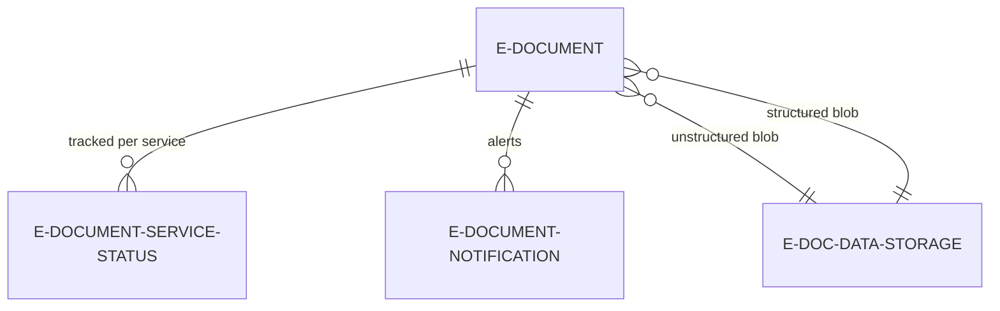
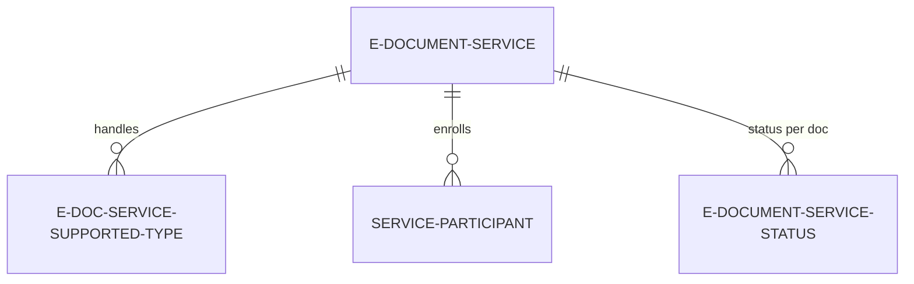
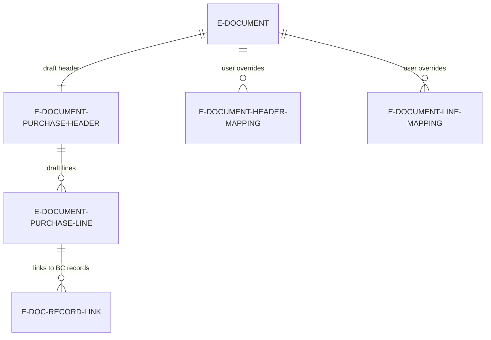
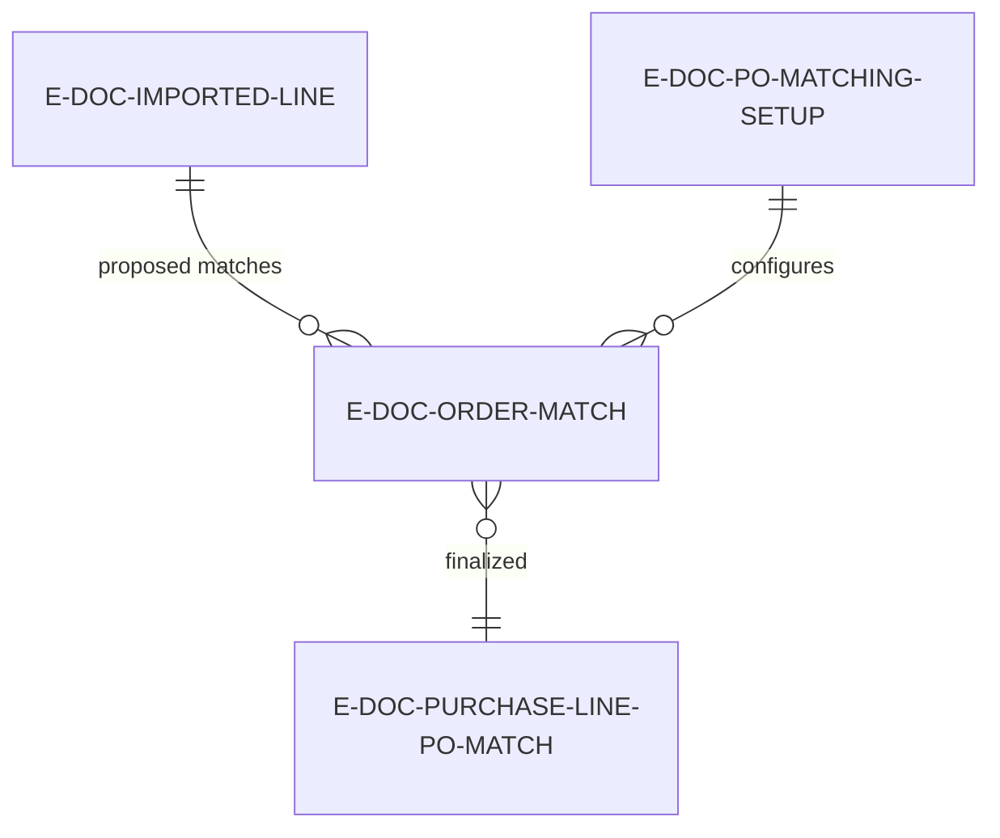
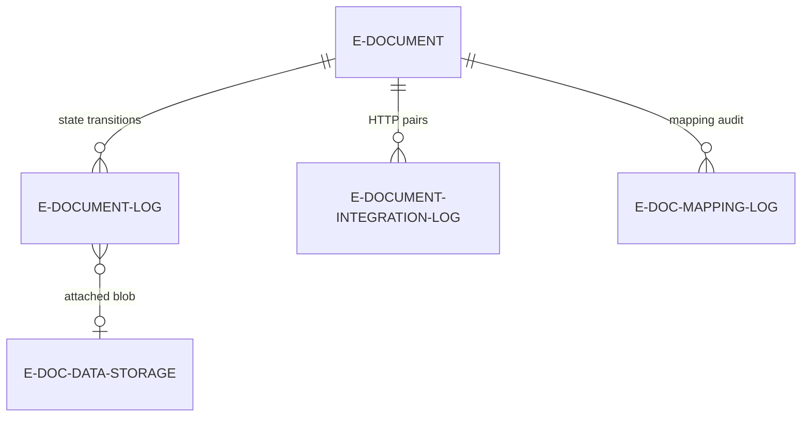
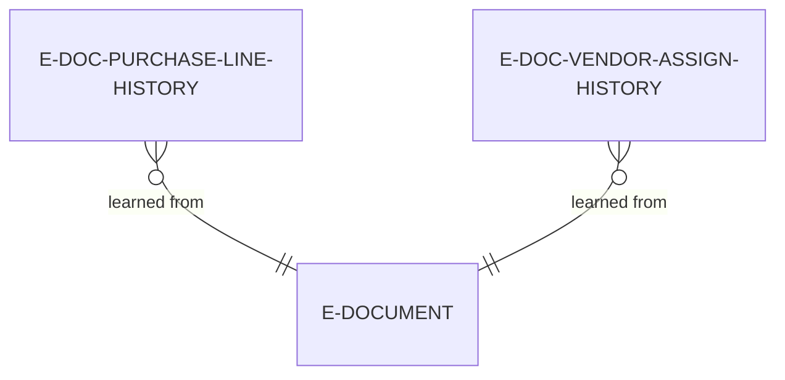

# Data model

## Document lifecycle core

The `E-Document` table is the central entity. Every electronic document -- incoming or outgoing -- gets exactly one record here. It links to the originating or resulting BC document via `Document Record ID` (a RecordId pointing to e.g. a posted sales invoice or a purchase header). It also links to its data through two blob pointers: `Unstructured Data Entry No.` (the raw PDF or binary) and `Structured Data Entry No.` (the XML or JSON), both foreign keys to `E-Doc. Data Storage`.

Each e-document has one `E-Document Service Status` record per service it has been sent to or received from. This is the per-service state tracker with a composite key of Entry No + Service Code. The service status has its own import-specific sub-status (`Import Processing Status`) that auto-cascades to the parent service status via OnValidate -- so setting the import status to Processed automatically flips the service status to "Imported Document Created".

Notifications are tracked per document in `E-Document Notification`, used to surface user-facing alerts.

The key gotcha here is the dual status pattern. `E-Document.Status` is a rollup -- it is recomputed from all `E-Document Service Status` records. If any service is in error, the document is in error. If all services are processed, the document is processed. If some are still in progress, the document is in progress. The rollup logic lives in `EDocumentProcessing.ModifyEDocumentStatus` and delegates to `IEDocumentStatus` interface implementations per service status enum value. This means adding new service status values requires implementing that interface.

## Service configuration

Each `E-Document Service` defines an integration endpoint: which format to use (PEPPOL BIS 3 code-based or Data Exchange Definition), which transport connector (Service Integration V2 enum), and behavioral flags for import (validate receiving company, resolve UOM, lookup item references, etc.). The old `Service Integration` enum field is obsolete -- always use `Service Integration V2`.

`E-Doc. Service Supported Type` is a many-to-many join between Service and Document Type, controlling which document types a service handles.

`Service Participant` enrolls specific customers or vendors in a service with their external identifiers (PEPPOL ID, GLN, etc.). When exporting, the framework checks if the customer is a participant of the service to determine whether to send.

Note that `E-Document Service` also has an `Import Process` field that determines V1 vs V2 import path. This is a critical routing decision -- V1 and V2 use completely different code paths and interfaces.

## Import draft (V2)

When the V2 import pipeline runs the "Read into Draft" stage, it populates ephemeral staging tables. `E-Document Purchase Header` holds header-level data with a deliberate split: external fields (vendor name, VAT registration, addresses as received from the sender) and BC-resolved fields (prefixed `[BC]` -- the actual vendor no, currency code, etc. resolved during Prepare Draft). `E-Document Purchase Line` follows the same pattern at line level.

`E-Document Header Mapping` and `E-Document Line Mapping` store user overrides -- when a user manually corrects a vendor or item resolution on the draft page, these mappings record the correction so it can be learned from.

`E-Doc. Record Link` connects draft entities to real BC records using SystemIds. This is ephemeral -- all these records are cleaned up after Finish Draft creates the BC document.

The important thing about draft tables is that they are designed to be thrown away. The Finish Draft step reads from them, creates a real Purchase Invoice or Purchase Order in BC, and then the cleanup deletes the draft records. If you need to undo the finish, `IEDocumentFinishDraft.RevertDraftActions` reverses the BC document creation but the draft data must still exist.

## Order matching

When an incoming e-document needs to be matched against an existing purchase order, a parallel set of tables handles the matching process. `E-Doc. Imported Line` is a normalized view of the incoming lines, supporting partial matching through `Matched Quantity` vs `Quantity` fields.

`E-Doc. Order Match` holds proposed matches between imported lines and PO lines. Each match proposal tracks price discrepancies and has a `Learn Matching Rule` flag that, when set, records the match in history for future auto-matching.

`E-Doc. Purchase Line PO Match` is the finalized three-way match linking a PO line, a receipt line, and an invoice line. This is what Finish Draft uses to create the actual purchase invoice lines against receipts.

`E-Doc. PO Matching Setup` configures matching behavior per vendor or globally -- tolerances, auto-match thresholds, and receipt matching requirements.

## Logging

The logging model separates three concerns: state transitions, HTTP communication, and blob storage.

`E-Document Log` records every state transition for an e-document within a service. Not every log entry has attached data -- only entries where content was created or modified link to a data storage record. The `Step Undone` flag marks entries where the user has reversed a processing step (supported in V2 import).

`E-Document Integration Log` stores HTTP request/response pairs as blobs. Every call to a service connector that uses the context object's HTTP message state gets logged here automatically.

`E-Doc. Data Storage` is the blob store (PDF, XML, JSON). It is deliberately separate from logs so that blob lifecycle can be managed independently. Multiple log entries can reference the same data storage entry (e.g., batch imports where one blob contains multiple documents).

`E-Doc. Mapping Log` records which mapping rules fired during export, providing an audit trail of field transformations.

## Historical learning

Two tables support the learning system that improves import accuracy over time.

`E-Doc. Purchase Line History` records immutable history of how incoming lines were resolved to BC items, G/L accounts, or charge items. It has multiple indices to support fuzzy matching by vendor, description, item reference, and more. When a new incoming line arrives, the Prepare Draft step queries this history to propose matches.

`E-Doc. Vendor Assign. History` records how external vendor identifiers (VAT registration numbers, PEPPOL IDs, names) were resolved to BC vendor numbers. This allows automatic vendor resolution for repeat senders.

Both tables are append-only. They accumulate knowledge from every successfully processed import, and the AI matching tools (Copilot) query them alongside the fuzzy matching logic.

## Cross-cutting concerns

**SystemId linking.** The `E-Doc. Record Link` table and several foreign key relationships use SystemId (Guid) rather than primary key values. This is intentional -- it survives record renaming and works across table boundaries. But it means you cannot rely on simple Get() calls; you need GetBySystemId().

**Dual status machines.** The three-level status (E-Document.Status, Service Status.Status, Service Status."Import Processing Status") is the most confusing part of the data model. E-Document.Status is always a rollup. Service Status.Status covers the full lifecycle. Import Processing Status tracks only the V2 import pipeline progress and auto-cascades upward. When writing code that checks status, be explicit about which level you are querying.

**Blob storage indirection.** Never assume a log entry has blob data. Always check `E-Doc. Data Storage Entry No.` before trying to read. The data storage table has a `File Format` enum that tells you what kind of content is inside (XML, JSON, PDF, etc.) -- use this rather than guessing from file extensions.

**V1 vs V2 coexistence.** Tables like `E-Document Service` have fields relevant to both V1 and V2 import. The `Import Process` field (Version 1.0 vs Version 2.0) is the routing switch. V1 tables and flows are being obsoleted but still exist in the schema behind `CLEAN` compiler directives. New development should always target V2.
