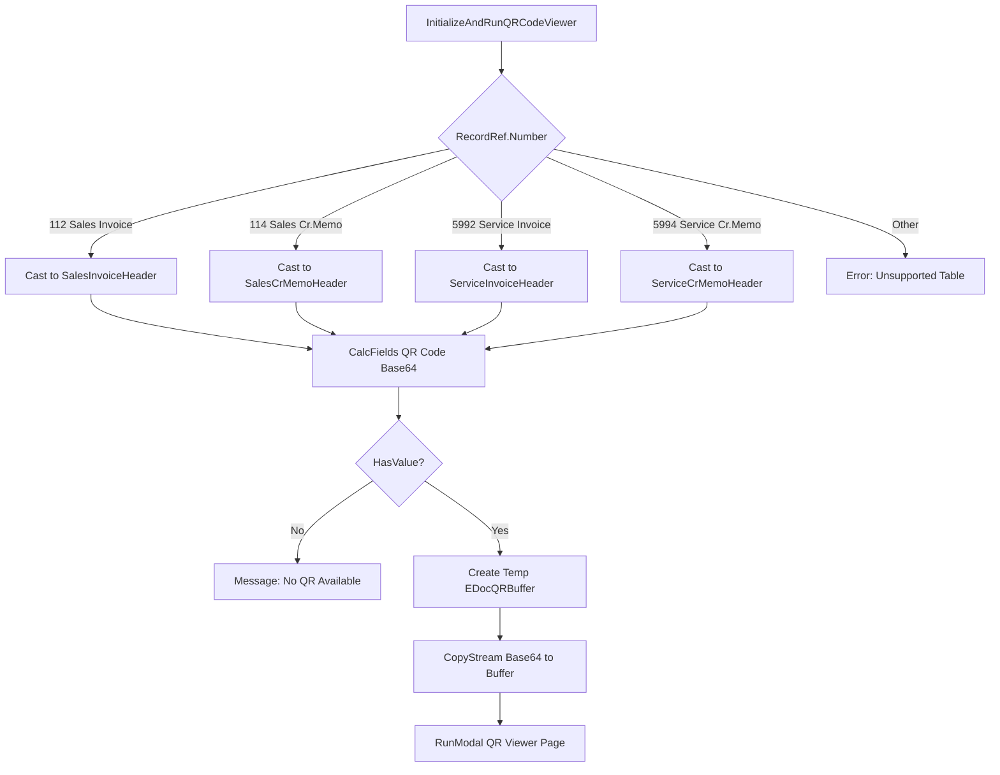
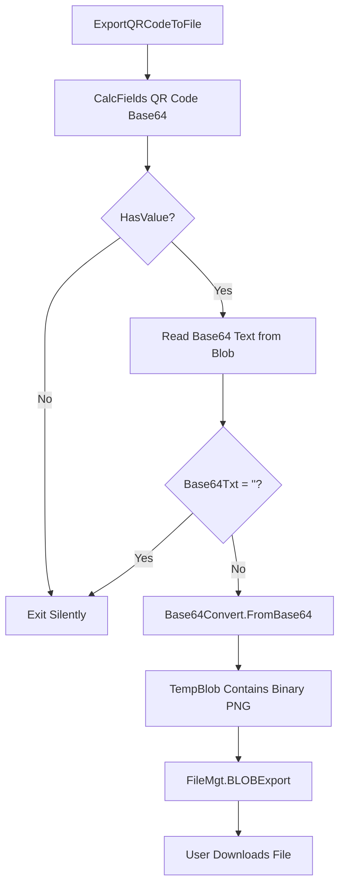
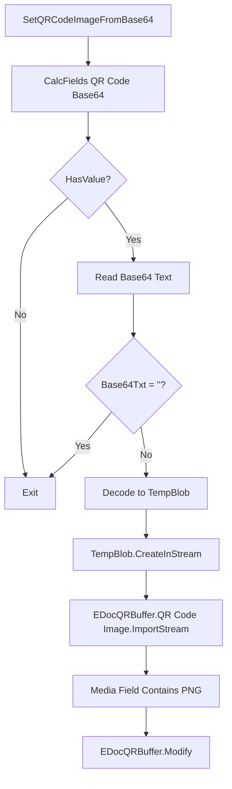

# Business logic

The ClearanceModel implements QR code display and export for tax authority-cleared invoices. It uses RecordRef-based type detection, Base64 conversion, and temporary buffer transfer.

## QR code viewer initialization

The **InitializeAndRunQRCodeViewer** procedure orchestrates QR code display from any supported document type:



**RecordRef pattern:** Accepts any record type via RecordRef parameter, enabling polymorphic handling across document types.

**Type-safe casting:** After detecting table number, uses `SourceTable.SetTable(SalesInvoiceHeader)` to extract strongly-typed record for field access.

**CalcFields lazy loading:** Blob fields are not loaded by default; `CalcFields("QR Code Base64")` fetches blob content from database.

**HasValue check:** Tests if blob field contains data before attempting stream operations, preventing errors on documents without QR codes.

**Buffer initialization:**
```al
TempQRBuf.Init();
TempQRBuf."Document Type" := DocumentType;  // 'Sales Invoice', 'Sales Credit Memo', etc.
TempQRBuf."Document No." := SalesInvoiceHeader."No.";

SalesInvoiceHeader."QR Code Base64".CreateInStream(SrcInStr);
TempQRBuf."QR Code Base64".CreateOutStream(DstOutStr);
CopyStream(DstOutStr, SrcInStr);  // Transfer blob content
TempQRBuf.Insert();
```

**Why temp buffer?** Decouples viewer page from source document types. Viewer always works with EDocQRBuffer regardless of origin.

## Export to file

The **ExportQRCodeToFile** procedure converts Base64 QR code to downloadable PNG:



**Base64 → binary conversion:**
```al
EDocQRBuffer."QR Code Base64".CreateInStream(InStream, TextEncoding::UTF8);
InStream.ReadText(Base64Txt);  // Read entire blob as text

TempBlob.CreateOutStream(OutStream);
Base64Convert.FromBase64(Base64Txt, OutStream);  // Decode to binary
```

**File naming convention:** `{DocumentType}_{DocumentNo}_QRCode.png` (e.g., "Sales Invoice_SI-001_QRCode.png").

**FileMgt.BLOBExport:** System codeunit that triggers browser download dialog with suggested filename.

## Image conversion for UI

The **SetQRCodeImageFromBase64** procedure prepares QR code for display in page controls:



**Why convert to Media field?** Page controls cannot render Base64 text. The `Media` field type displays images directly.

**ImportStream parameters:**
```al
EDocQRBuffer."QR Code Image".ImportStream(InStream, 'image/png');
```

**MIME type:** Specifies PNG format; BC validates and stores as Media BLOB.

**Usage in page:**
```al
field("QR Code Image"; Rec."QR Code Image")
{
    ApplicationArea = All;
    Caption = 'QR Code';
}
```

The field automatically renders the imported image.

## Table extension pattern

Each supported document type gets a table extension:

```al
tableextension 50100 "Posted Sales Invoice with QR" extends "Sales Invoice Header"
{
    fields
    {
        field(50100; "QR Code Base64"; Blob)
        {
            Caption = 'QR Code Base64';
            DataClassification = CustomerContent;
        }
    }
}
```

**Field number range:** Uses 50000+ for partner extensions to avoid conflicts with Microsoft fields.

**DataClassification:** CustomerContent ensures proper GDPR handling (QR codes contain document data).

## Page extension pattern

Page extensions add a "View QR Code" action:

```al
pageextension 50100 "Posted Sales Invoice with QR" extends "Posted Sales Invoice"
{
    actions
    {
        addlast(Processing)
        {
            action(ViewQRCode)
            {
                Caption = 'View QR Code';
                Image = BarCode;
                ToolTip = 'View the QR code for this document';

                trigger OnAction()
                var
                    RecRef: RecordRef;
                begin
                    RecRef.GetTable(Rec);
                    EDocumentQRCodeManagement.InitializeAndRunQRCodeViewer(RecRef);
                end;
            }
        }
    }
}
```

**RecRef conversion:** Page records are strongly typed; convert to RecordRef for polymorphic handling.

**Image = BarCode:** Uses barcode icon (closest visual match to QR code).

## Report extension pattern

Report extensions add QR code to document layouts:

```al
reportextension 50100 "Posted Sales Invoice with QR" extends "Standard Sales - Invoice"
{
    dataset
    {
        add(Header)
        {
            column(QRCodeBase64; Header."QR Code Base64")
            {
            }
        }
    }

    rendering
    {
        layout("StandardSalesInvoiceWithQR.rdlc")
        {
            Type = RDLC;
            LayoutFile = './Layouts/StandardSalesInvoiceWithQR.rdlc';
        }
    }
}
```

**Column addition:** Exposes QR Code Base64 field to report dataset.

**Layout file:** RDLC/Word layout includes an Image control bound to QRCodeBase64 column.

**Rendering:** At report generation, BC converts Base64 to binary and injects into image placeholder.

## Clearance integration workflow

The clearance model integrates with E-Document processing:

1. **Document export:** E-Document Core exports invoice to service API
2. **Service sends to authority:** API forwards invoice XML to tax authority
3. **Authority validates:** Checks VAT calculations, participant IDs, document structure
4. **Authority returns clearance:** Response includes clearance ID + timestamp + hash
5. **Service generates QR:** Encodes clearance data into QR code (Base64 PNG)
6. **Service updates BC:** API callback writes QR code to Posted Sales Invoice."QR Code Base64"
7. **E-Document status updated:** Sets "Clearance Date" and Status = "Cleared"

**QR code contents (typical):**
- Seller VAT ID
- Invoice number
- Invoice date
- Total amount including VAT
- VAT amount
- Clearance ID
- Cryptographic hash

**Offline verification:** Users can scan QR code with mobile app that calls authority's validation API to confirm legitimacy.

## Error handling

**No QR code available:**
```al
if not SalesInvoiceHeader."QR Code Base64".HasValue then begin
    Message(NoQRDCodeAvailableLbl, DocumentType, SalesInvoiceHeader."No.");
    exit;
end;
```

**Unsupported table:**
```al
else
    Error(UnsupportedTableSourceLbl, SourceTable.Caption);
```

**Silent failures on export:** If Base64 text is empty or invalid, exits without error (user simply doesn't get file download).
