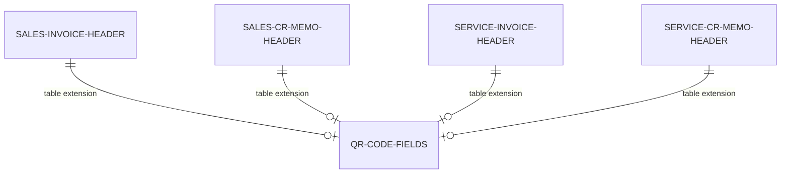

# Clearance model data model

## QR code storage

QR code data is stored directly on the posted document headers via table extensions. The temporary buffer table exists only for viewer page interaction.

Each table extension adds the same two fields: `QR Code Image` (MediaSet for inline display) and `QR Code Base64` (Blob holding the Base64-encoded PNG). These fields are populated externally by country-specific connector apps after government clearance is obtained.

The `EDoc QR Buffer` temporary table holds `Document Type`, `Document No.`, `QR Code Base64`, and `QR Code Image`. It is populated by `EDocumentQRCodeManagement` when a user clicks "View QR Code" -- the codeunit reads the Base64 from the source table, copies it into the buffer, optionally decodes it to a MediaSet, and passes the buffer to the viewer page.
