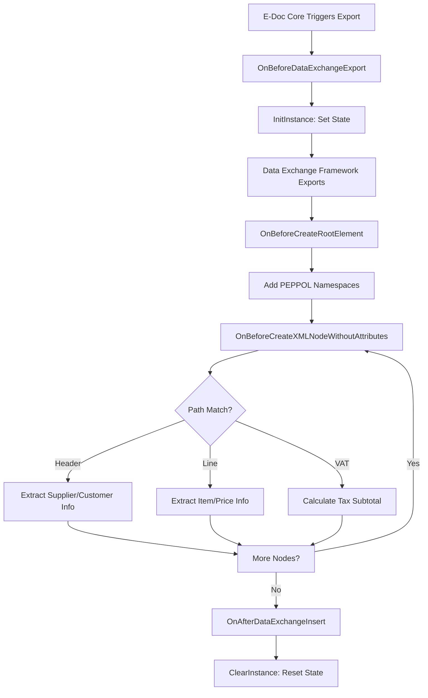
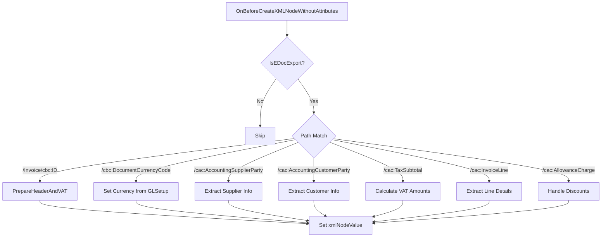
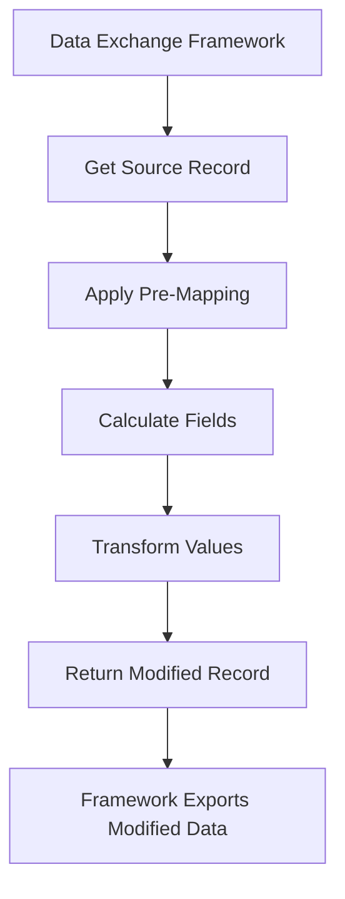

# Business logic

The PEPPOL Data Exchange Definition folder implements event-driven export logic that bridges Business Central's Data Exchange Framework with PEPPOL BIS 3.0 XML requirements. It uses a combination of state management, event subscribers, and pre-mapping transformations.

## Event subscriber architecture

The **EDocDEDPEPPOLSubscribers** codeunit is marked SingleInstance, meaning one instance exists per session and maintains state across multiple event calls:



**Key state variables:**
- `TaxSubtotalLoopNumber`: Counter for VAT line XML elements
- `AllowanceChargeLoopNumber`: Counter for charge line XML elements
- `DataExchEntryNo`: Links to Data Exch. record for logging
- `ProcessedDocType`: E-Document Type enum (Sales Invoice, Credit Memo, etc.)
- `SalesHeader`, `SalesCrMemoHeader`: Cached headers for repeated lookups
- `TempVATAmtLine`, `TempVATProductPostingGroup`: Temp tables for VAT calculations

**State lifecycle:**

1. **Initialization:** OnBeforeDataExchangeExport fires when Data Exchange Framework starts export. Calls InitInstance to set state variables.

2. **Processing:** Multiple OnBeforeCreateXMLNodeWithoutAttributes calls occur (one per XML element). Each call checks the `Path` parameter to determine which data to extract.

3. **Cleanup:** OnAfterDataExchangeInsert fires when export completes. Calls ClearInstance to reset all state.

**Why SingleInstance?** Without it, each event subscriber call would create a new codeunit instance, losing state between calls. With it, the same instance persists and can accumulate data (like VAT totals) across multiple event calls.

## XML namespace injection

The **OnBeforeCreateRootElement** subscriber adds PEPPOL-required namespaces to the root Invoice/CreditNote element:

```al
local procedure OnBeforeCreateRootElement(DataExchDef: Record "Data Exch. Def"; var xmlElem: XmlElement; var nName: Text; var nVal: Text; DefaultNameSpace: Text; var xmlNamespaceManager: XmlNamespaceManager; var IsHandled: Boolean)
begin
    if IsEDocExport(DataExchDef.Code) then begin
        xmlElem := xmlElement.Create(nName, DefaultNameSpace, nVal);
        xmlElem.Add(XmlAttribute.CreateNamespaceDeclaration('cac', CacNamespaceURILbl));
        xmlElem.Add(XmlAttribute.CreateNamespaceDeclaration('cbc', CbcNamespaceURILbl));
        xmlElem.Add(XmlAttribute.CreateNamespaceDeclaration('ccts', CctsNamespaceURILbl));
        xmlElem.Add(XmlAttribute.CreateNamespaceDeclaration('qdt', QdtNamespaceURILbl));
        xmlElem.Add(XmlAttribute.CreateNamespaceDeclaration('udt', UdtNamespaceURILbl));
        xmlNamespaceManager.AddNamespace(...);  // Add to namespace manager for XPath queries
        IsHandled := true;  // Prevent default framework logic
    end;
end;
```

**Why manual namespace handling?** Data Exchange Framework generates generic XML without schema knowledge. PEPPOL BIS 3.0 requires specific namespaces for UBL elements:
- `cac` (Common Aggregate Components): Complex elements like Party, Address, TaxSubtotal
- `cbc` (Common Basic Components): Simple elements like ID, Name, Amount
- `ccts`, `qdt`, `udt`: UN/CEFACT core components for metadata

Setting `IsHandled = true` tells the framework to skip default element creation and use the custom element we created.

## Path-based value extraction

The **OnBeforeCreateXMLNodeWithoutAttributes** subscriber intercepts each XML element creation and provides data based on the element's XPath:



**Example path handling for supplier party:**

```al
case DataExchColumnDef.Path of
    '/cac:AccountingSupplierParty':
        begin
            PEPPOLMgt.GetAccountingSupplierPartyInfoBIS(
                SupplierEndpointID,
                SupplierSchemeID,
                SupplierName);

            PEPPOLMgt.GetAccountingSupplierPartyPostalAddr(
                SalesHeader,
                StreetName,
                AdditionalStreetName,
                CityName,
                PostalZone,
                CountrySubentity,
                IdentificationCode,
                DummyVar);

            PEPPOLMgt.GetAccountingSupplierPartyTaxSchemeBIS(
                TempVATAmtLine,
                CompanyID,
                CompanyIDSchemeID,
                TaxSchemeID);

            // ... cache values in module variables
        end;
    '/cac:AccountingSupplierParty/cac:Party/cbc:EndpointID':
        xmlNodeValue := SupplierEndpointID;  // Use cached value
    '/cac:AccountingSupplierParty/cac:Party/cac:PostalAddress/cbc:StreetName':
        xmlNodeValue := StreetName;  // Use cached value
end;
```

**Pattern:** Parent element path triggers data extraction and caching. Child element paths retrieve cached values and assign to `xmlNodeValue` (output parameter).

**Why this pattern?** The Data Exchange Framework processes elements in document order. Parent elements appear before children, so extracting all child data at the parent level ensures values are ready when child elements are processed.

## VAT calculation and caching

The **PrepareHeaderAndVAT** procedure calculates VAT lines once per document and caches them for repeated access:

```al
local procedure PrepareHeaderAndVAT(DocumentNo: Code[20])
var
    SalesInvoiceHeader: Record "Sales Invoice Header";
    SalesCrMemoHeader: Record "Sales Cr.Memo Header";
begin
    case ProcessedDocType of
        ProcessedDocType::"Sales Invoice", ProcessedDocType::"Service Invoice":
            begin
                SalesInvoiceHeader.Get(DocumentNo);
                SalesInvoiceHeader.CalcFields(Amount, "Amount Including VAT");
                SalesHeader.TransferFields(SalesInvoiceHeader);
                TempVATAmtLine.DeleteAll();
                SalesInvoiceHeader.CalcVATAmountLines(TempVATAmtLine);
                CollectVATPostingGroups(TempVATAmtLine);
            end;
        ProcessedDocType::"Sales Credit Memo", ProcessedDocType::"Service Credit Memo":
            begin
                SalesCrMemoHeader.Get(DocumentNo);
                SalesCrMemoHeader.CalcFields(Amount, "Amount Including VAT");
                // ... similar logic
            end;
    end;
end;
```

**TempVATAmtLine structure:** Contains one record per VAT % with aggregated amounts:
- VAT %
- VAT Base (amount excluding VAT)
- VAT Amount
- Amount Including VAT
- VAT Identifier (links to VAT Posting Setup)

**CollectVATPostingGroups:** Populates TempVATProductPostingGroup with unique VAT Product Posting Group codes used in the document, enabling VAT scheme ID lookup.

**Usage:** When processing `/cac:TaxSubtotal/cbc:TaxableAmount` path, the subscriber retrieves the cached TempVATAmtLine record for the current TaxSubtotalLoopNumber and returns the VAT Base value.

## Pre-mapping transformations

Pre-mapping codeunits (**PreMapSalesInvLine**, etc.) transform line records before Data Exchange Framework processes them:



**Example: PreMapSalesInvLine**

```al
codeunit 6163 "PreMap Sales Inv Line"
{
    TableNo = "Sales Invoice Line";

    trigger OnRun()
    begin
        // Calculate unit price excluding VAT
        if Rec."VAT %" <> 0 then
            Rec."Unit Price" := Rec."Unit Price" / (1 + Rec."VAT %" / 100);

        // Calculate line extension amount
        Rec.Amount := Rec.Quantity * Rec."Unit Price";

        // Calculate allowance amount
        if Rec."Line Discount Amount" <> 0 then
            Rec."Line Discount Amount" := Rec."Line Discount Amount" / (1 + Rec."VAT %" / 100);

        Rec.Modify();
    end;
}
```

**TableNo = "Sales Invoice Line"** makes this a table-triggered codeunit. Data Exchange Framework calls Rec.Run() for each line before exporting.

**Why pre-mapping?** PEPPOL BIS 3.0 requires amounts excluding VAT, but BC stores amounts including VAT in some scenarios. Pre-mapping adjusts the source record to match PEPPOL expectations without modifying the database (Rec is passed as a copy).

## Rounding line detection

The **IsRoundingLine** function identifies invoice rounding lines that should be excluded from PEPPOL export:

```al
procedure IsRoundingLine(SalesLine2: Record "Sales Line"): Boolean
var
    Customer: Record Customer;
    CustomerPostingGroup: Record "Customer Posting Group";
begin
    if SalesLine2.Type = SalesLine2.Type::"G/L Account" then begin
        Customer.Get(SalesLine2."Bill-to Customer No.");
        CustomerPostingGroup.SetFilter(Code, Customer."Customer Posting Group");
        if CustomerPostingGroup.FindFirst() then
            if SalesLine2."No." = CustomerPostingGroup."Invoice Rounding Account" then
                exit(true);
    end;
    exit(false);
end;
```

**Usage:** Data Exch. Column Def. can reference this function to filter out rounding lines before export:

```al
// In Data Exch. Column Def setup:
IF EVALUATE(Rec."Omit") THEN
    IF Codeunit::"EDoc DED PEPPOL Subscribers".IsRoundingLine(Rec) THEN
        Rec."Omit" := TRUE;
```

**Why exclude?** PEPPOL BIS 3.0 doesn't have a concept of rounding lines. Rounding is implied in the total amounts.

## Document attachment handling

The subscriber handles embedded PDF attachments via `/cac:AdditionalDocumentReference` paths:

```al
case Path of
    '/cac:AdditionalDocumentReference':
        begin
            DocumentAttachmentNumber += 1;
            // Prepare for new attachment
        end;
    '/cac:AdditionalDocumentReference/cbc:ID':
        xmlNodeValue := Format(DocumentAttachmentNumber);  // Unique ID
    '/cac:AdditionalDocumentReference/cac:Attachment/cbc:EmbeddedDocumentBinaryObject':
        begin
            // Generate PDF report for document
            TempBlob := GenerateDocumentPDF(SalesHeader);
            // Convert to Base64
            xmlNodeValue := ConvertBlobToBase64(TempBlob);
        end;
    '/cac:AdditionalDocumentReference/cac:Attachment/cbc:EmbeddedDocumentBinaryObject/@mimeCode':
        xmlNodeValue := 'application/pdf';
    '/cac:AdditionalDocumentReference/cac:Attachment/cbc:EmbeddedDocumentBinaryObject/@filename':
        xmlNodeValue := StrSubstNo('%1_%2.pdf', SalesHeader."Document Type", SalesHeader."No.");
end;
```

**PDF generation logic:** Calls the appropriate report object (e.g., Report "Standard Sales - Invoice") with the document as filter, saves output to TempBlob, converts to Base64 text.

## Allowance/Charge handling

Document-level allowances (e.g., early payment discount) and charges (e.g., freight) are exported as `/cac:AllowanceCharge` elements:

```al
case Path of
    '/cac:AllowanceCharge':
        begin
            AllowanceChargeLoopNumber += 1;
            // Detect if this is allowance or charge from source data
        end;
    '/cac:AllowanceCharge/cbc:ChargeIndicator':
        xmlNodeValue := Format(IsCharge);  // 'true' or 'false'
    '/cac:AllowanceCharge/cbc:Amount':
        xmlNodeValue := Format(AllowanceAmount, 0, 9);  // Decimal with . separator
    '/cac:AllowanceCharge/cbc:AllowanceChargeReason':
        xmlNodeValue := AllowanceReason;  // Text description
end;
```

**Loop number pattern:** AllowanceChargeLoopNumber increments for each allowance/charge, enabling the framework to generate multiple elements with unique paths (e.g., `/cac:AllowanceCharge[1]`, `/cac:AllowanceCharge[2]`).

## External extension hook

The **EDocDEDPEPPOLExternal** codeunit is intentionally empty:

```al
codeunit 6160 "EDoc DED PEPPOL External"
{
    Access = Internal;
}
```

**Purpose:** Partners can extend this codeunit without modifying sealed PEPPOL logic:

```al
codeunit 50100 "My PEPPOL Extension"
{
    [EventSubscriber(ObjectType::Codeunit, Codeunit::"Export Generic XML", 'OnBeforeCreateXMLNodeWithoutAttributes', '', false, false)]
    local procedure CustomPEPPOLLogic(var xmlNodeValue: Text; DataExchColumnDef: Record "Data Exch. Column Def")
    begin
        case DataExchColumnDef.Path of
            '/Invoice/cac:CustomElement/cbc:CustomField':
                xmlNodeValue := GetCustomValue();
        end;
    end;
}
```

This allows extending PEPPOL export without forking Microsoft code.
