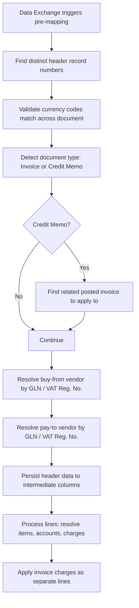

# PEPPOL Data Exchange Definition business logic

## Pre-mapping flow

The pre-mapping codeunit runs after the Data Exchange framework has parsed PEPPOL XML into staging tables but before the values are written to Purchase Header/Line records.

## Vendor resolution

Vendor lookup follows a priority chain. For each vendor role (buy-from, pay-to), the codeunit searches by GLN, then by VAT Registration Number, then by Company Establishment No. The first match wins. If no vendor is found, the codeunit raises a detailed error message that includes the vendor name, GLN, and VAT number from the electronic document so the user knows which vendor card to create.

## Line processing

For each document line, the pre-mapping resolves the line type (Item, G/L Account, or Charge). Item resolution uses the `E-Document Import Helper` codeunit. For lines that cannot be matched to an item, the codeunit falls back to text-to-account mapping. Invoice charge lines (AllowanceCharge elements in PEPPOL) are converted to separate purchase lines with a charge reason code.

The four `PreMap*Line` codeunits work in the opposite direction -- they read from BC document lines and populate Data Exchange columns for export. Each handles its specific document type's line structure (sales invoice lines have different fields from service credit memo lines).
