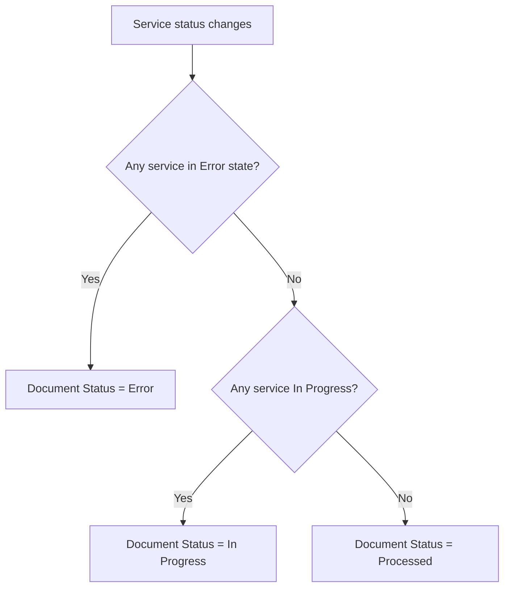
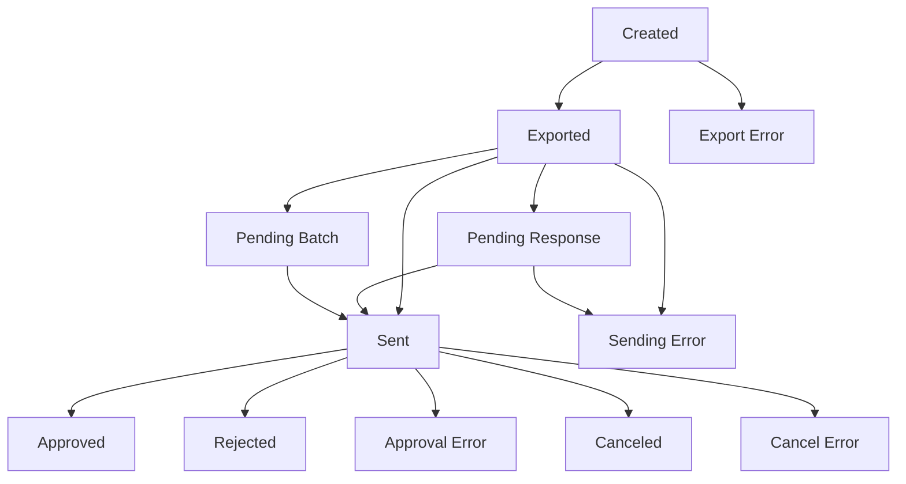
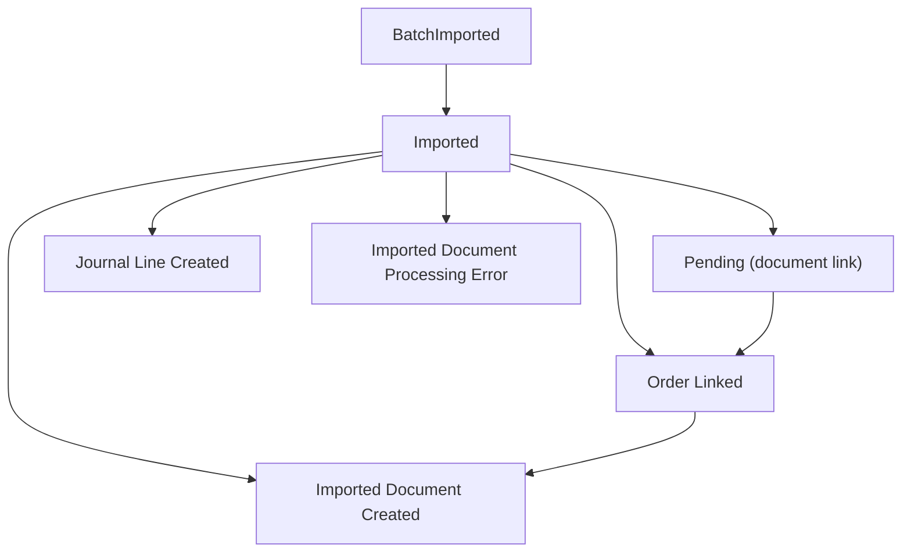

# Status business logic

## Status aggregation

The document-level status is derived from per-service statuses. The processing layer queries each `E-Document Service Status` record for a given E-Document, calls `IEDocumentStatus.GetEDocumentStatus()` on each, and applies pessimistic aggregation.

## Service status to document status mapping

Each `E-Document Service Status` enum value maps to exactly one of three document-level states via the `IEDocumentStatus` interface. The mapping is declared on the enum value itself, not in procedural code.

The default implementation is `E-Doc In Progress Status`, so any service status without an explicit `Implementation` line is treated as in-progress. This is intentional -- new statuses are safe by default because they keep the document in a non-terminal state until the developer explicitly categorizes them.

## Outbound status flow

## Inbound status flow

## Error recovery

Error statuses are non-terminal in practice -- the UI allows reprocessing from error states. For outbound, `Sending Error` and `Export Error` allow resending. For inbound, `Imported Document Processing Error` allows reprocessing. The status codeunits themselves do not enforce transitions; they only provide the mapping. Actual transition guards live in `E-Doc. Integration Management` (e.g., `IsEDocumentInStateToSend` checks that service status is Exported or Sending Error before allowing a send).
