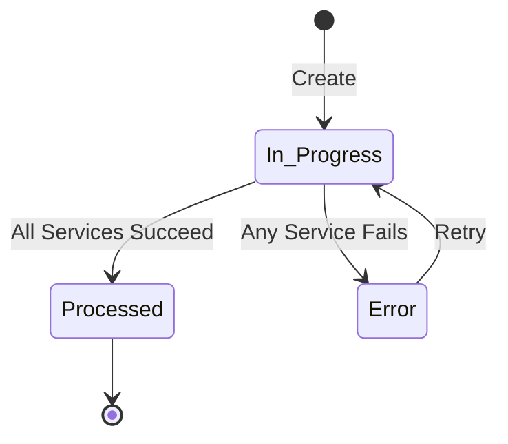

# Business logic

The E-Document entity implements lifecycle management, status calculation, and cleanup orchestration for electronic documents. It serves as the aggregate root for all e-document processing.

## Document lifecycle



**Create:** E-Document record is inserted with Status = In Progress when a source document triggers creation (post, import, manual).

**Service processing:** For each configured service, an E-Document Service Status record is created. The header status aggregates all service statuses.

**Status calculation:** The Status field uses IEDocumentStatus interface to determine overall state:
- If all services = Processed → E-Document.Status = Processed
- If any service = Error → E-Document.Status = Error
- Otherwise → E-Document.Status = In Progress

**Finalization:** Once Status = Processed, the record is locked (cannot be deleted if linked to source document).

## Deletion and cleanup

The **CleanupDocument** procedure implements cascading delete:

```al
procedure CleanupDocument()
begin
    // Delete child records
    DeleteAll EDocumentLog where "E-Doc. Entry No" = Rec."Entry No";
    DeleteAll EDocumentIntegrationLog where "E-Doc. Entry No" = Rec."Entry No";
    DeleteAll EDocumentServiceStatus where "E-Document Entry No" = Rec."Entry No";
    DeleteAll DocumentAttachment where "E-Document Entry No." = Rec."Entry No";
    DeleteAll EDocMappingLog where "E-Doc Entry No." = Rec."Entry No";
    DeleteAll EDocImportedLine where "E-Document Entry No." = Rec."Entry No";

    // Call interface cleanup
    IProcessStructuredData := Rec."Process Draft Impl.";
    IProcessStructuredData.CleanUpDraft(Rec);
end;
```

**OnDelete trigger** enforces deletion rules:
- Cannot delete if Status = Processed
- Cannot delete if Document Record ID is populated (linked document)
- Duplicate check: Only duplicates can be deleted without confirmation
- User confirmation required for non-duplicate unique documents

**Orphaned records:** Records with no linked source document and no service status can be safely deleted.

## Duplicate detection

**IsDuplicate** checks for existing records to prevent re-import:

```al
procedure IsDuplicate(ShowMessage: Boolean): Boolean
var
    EDocument: Record "E-Document";
begin
    EDocument.SetRange("Incoming E-Document No.", Rec."Incoming E-Document No.");
    EDocument.SetRange("Bill-to/Pay-to No.", Rec."Bill-to/Pay-to No.");
    EDocument.SetRange("Document Date", Rec."Document Date");
    EDocument.SetFilter("Entry No", '<>%1', Rec."Entry No");
    if not EDocument.FindFirst() then
        exit(false);

    if ShowMessage then
        Message(EDocumentExistsMsg, EDocument."Entry No");
    exit(true);
end;
```

**Why these three fields?** Incoming E-Document No. (vendor invoice number) + Vendor No. + Document Date uniquely identifies an invoice across multiple imports. Same invoice submitted twice will be detected.

**Use cases:**
- Import validation: Before creating draft purchase document, check if already imported
- Duplicate marking: Flag records as duplicates in UI for user review
- Auto-skip: Background jobs can skip duplicate imports automatically

## Status calculation interface

The E-Document Service Status enum implements **IEDocumentStatus** interface with three implementations:

```al
enum 6106 "E-Document Service Status" implements IEDocumentStatus
{
    value(1; "Exported")
    {
        Implementation = IEDocumentStatus = "E-Doc Processed Status";
    }
    value(2; "Sending Error")
    {
        Implementation = IEDocumentStatus = "E-Doc Error Status";
    }
    // ... more values
}
```

Each enum value specifies which status codeunit to use:
- **E-Doc Processed Status:** Returns "Processed"
- **E-Doc Error Status:** Returns "Error"
- **E-Doc In Progress Status:** Returns "In Progress" (default)

**Status aggregation logic:** E-Document Core queries all Service Status records for the E-Document, calls GetEDocumentStatus() on each enum value's implementation, and applies this precedence:
1. If any = Error → E-Document.Status = Error
2. Else if all = Processed → E-Document.Status = Processed
3. Else → E-Document.Status = In Progress

## Source document linking

**Document Record ID** field stores the RecordId of the source document:

```al
field(2; "Document Record ID"; RecordId)
{
    trigger OnValidate()
    var
        EDocAttachmentProcessor: Codeunit "E-Doc. Attachment Processor";
    begin
        EDocAttachmentProcessor.MoveAttachmentsAndDelete(Rec, Rec."Document Record ID");
    end;
}
```

**OnValidate logic:** When linking to a source document (e.g., newly created Purchase Invoice), the system moves temporary E-Document attachments to the source document's attachment table.

**Navigation:** ShowRecord procedure uses PageManagement codeunit to open the appropriate page for the source document:

```al
procedure ShowRecord()
var
    PageManagement: Codeunit "Page Management";
    RecRef: RecordRef;
begin
    if EDocHelper.GetRecord(Rec, RelatedRecord) then begin
        RecRef.GetTable(RelatedRecord);
        PageManagement.PageRun(RecRef);  // Opens Posted Sales Invoice, Purchase Invoice, etc.
    end;
end;
```

## Export data storage

**ExportDataStorage** allows users to download the XML/PDF blob:

```al
procedure ExportDataStorage()
var
    EDocDataStorage: Record "E-Doc. Data Storage";
    EDocumentLog: Record "E-Document Log";
begin
    if Rec."Structured Data Entry No." <> 0 then
        EDocDataStorage.Get(Rec."Structured Data Entry No.");  // Get XML
    if Rec."Unstructured Data Entry No." <> 0 then
        EDocDataStorage.Get(Rec."Unstructured Data Entry No.");  // Get PDF

    // Find log entry linking E-Document to Data Storage
    EDocumentLog.SetRange("E-Doc. Entry No", Rec."Entry No");
    EDocumentLog.SetRange("E-Doc. Data Storage Entry No.", EDocDataStorage."Entry No.");
    EDocumentLog.FindFirst();

    EDocumentLog.ExportDataStorage();  // Triggers file download
end;
```

**Why through log?** E-Document → Data Storage is M:N (multiple storage entries per document for retries, versions). Log provides the link and tracks which storage entry corresponds to which processing step.

## Clearance model fields

Fields 60-61 support jurisdictions requiring real-time tax authority clearance:

```al
field(60; "Clearance Date"; DateTime)
{
    Caption = 'Clearance Date';
    ToolTip = 'Specifies date and time when document was cleared by authority';
}
field(61; "Last Clearance Request Time"; DateTime)
{
    Caption = 'Last Clearance Request Time';
}
```

**Workflow:**
1. After document export, system calls clearance API
2. Sets "Last Clearance Request Time" = Current DateTime
3. Polls clearance status (some authorities take seconds to hours)
4. When cleared, sets "Clearance Date" and updates Service Status = "Cleared"

See ClearanceModel folder for QR code generation and clearance validation logic.

## Amount calculation

**GetTotalAmountIncludingVAT** provides consistent amount retrieval across both directions:

```al
procedure GetTotalAmountIncludingVAT(): Decimal
var
    EDocumentPurchaseHeader: Record "E-Document Purchase Header";
begin
    if Rec."Amount Incl. VAT" <> 0 then
        exit(Rec."Amount Incl. VAT");  // Use cached value
    if Rec.Direction = Rec.Direction::Outgoing then
        exit(-Rec."Amount Incl. VAT");  // Negative for refunds
    if GetEDocumentService()."Import Process" = "E-Document Import Process"::"Version 1.0" then
        exit(Rec."Amount Incl. VAT");  // Legacy logic
    EDocumentPurchaseHeader.GetFromEDocument(Rec);
    exit(EDocumentPurchaseHeader.Total);  // Version 2: Calculate from draft
end;
```

**Why complex logic?** Different import process versions store amounts differently. Version 1 caches on E-Document, Version 2 calculates from draft records.
