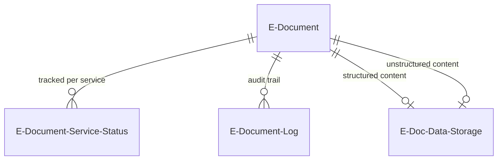
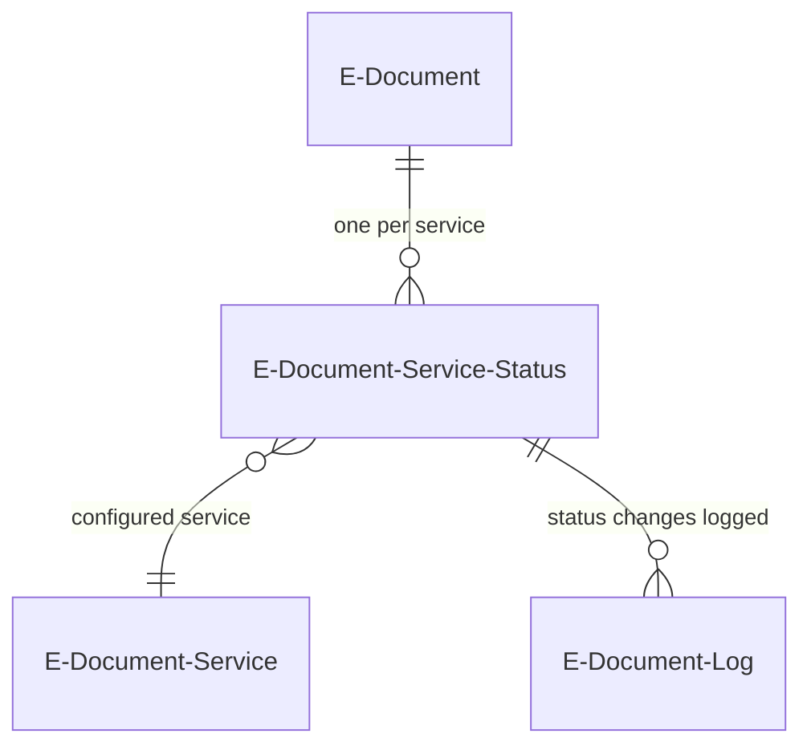
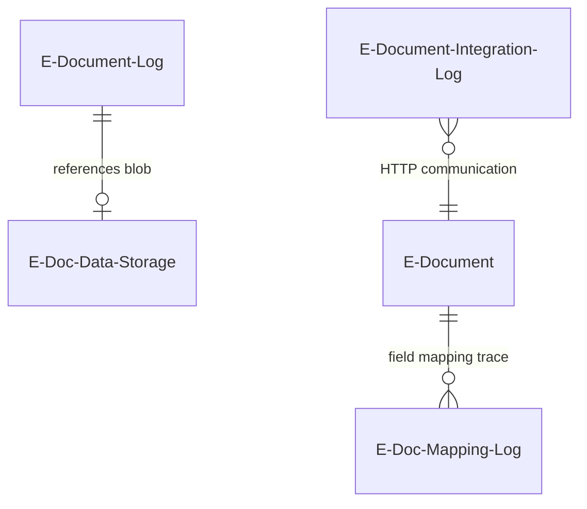
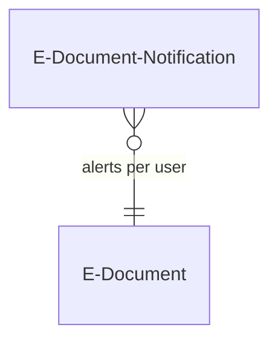

# Document data model

## Core entity relationships

The E-Document table sits at the center of the data model. It links outward to BC source documents via a polymorphic `RecordId` field, to external service state via the E-Document Service Status table, to audit trails via logs, and to binary content via data storage.

The E-Document table uses `Document Record ID` (a `RecordId` field) to link to any BC table -- Sales Invoice Header, Purchase Header, Gen. Journal Line, etc. This is a polymorphic pointer: the `Table ID` field stores the target table number, and the `Table Name` FlowField resolves its caption via `AllObjWithCaption`. There is no foreign key constraint enforced by the platform on `RecordId` fields; the link can become stale if the source document is deleted without updating the E-Document.

## Service status tracking

The E-Document Service Status table (keyed by `E-Document Entry No` + `E-Document Service Code`) holds the current per-service status. This is the fine-grained layer -- values include Created, Exported, Sent, Pending Response, Approved, Rejected, Canceled, various error states, and clearance model states (Not Cleared, Cleared).

Document-level status is derived, not stored independently. Each value in the `E-Document Service Status` enum implements `IEDocumentStatus`, which returns one of three document-level statuses:

| Service status values | Document status |
|---|---|
| Created, Imported, Pending Batch, Pending Response, Batch Imported, Order Linked, Order Updated, Pending, Not Cleared | **In Progress** |
| Exported, Sent, Approved, Canceled, Imported Document Created, Journal Line Created, Rejected, Cleared | **Processed** |
| Sending Error, Cancel Error, Export Error, Imported Document Processing Error, Approval Error | **Error** |

The `In Progress` mapping is the default implementation (`E-Doc In Progress Status`). Only statuses that explicitly override via the enum's `Implementation` property map to Processed or Error. This means any new service status value added by an extension defaults to `In Progress` unless it provides its own `IEDocumentStatus` implementation.

## Data storage and logging

The `E-Doc. Data Storage` table stores binary content (XML, PDF, JSON) in a Blob field. Each E-Document can reference two data storage entries: `Structured Data Entry No.` (parseable content like XML) and `Unstructured Data Entry No.` (raw content like PDF). The E-Document Log table also references data storage, forming the historical record of what was exported or imported at each step.

Integration logs (`E-Document Integration Log`) capture HTTP request/response pairs for every service call, separate from the status-change logs.

## Notification model

The `E-Document Notification` table is keyed by `E-Document Entry No.` + notification `ID` (a fixed GUID per notification type) + `User Id`. This triple key means each notification type is stored once per user per document. The `Type` enum currently has one meaningful value (`Vendor Matched By Name Not Address`); the zero value is a blank placeholder.

## Key gotchas

- **Document Record ID validation trigger**: Assigning a new `Document Record ID` fires the `OnValidate` trigger, which calls `EDocAttachmentProcessor.MoveAttachmentsAndDelete`. This moves document attachments from the old record to the new one. If you update this field in code, the attachment move happens automatically -- be aware of this side effect during bulk operations.
- **Polymorphic RecordId is not constraint-enforced**: The `Document Record ID` field can point at a deleted record. The `OnDelete` trigger on E-Document checks whether `Document Record ID.TableNo <> 0` and blocks deletion if so, but nothing prevents the target record from being deleted first.
- **Status derivation is interface-based, not a lookup table**: You cannot simply read a mapping table to determine document status from service status. You must call `IEDocumentStatus.GetEDocumentStatus()` on the enum value, which dispatches to the appropriate codeunit. The framework does this in `ModifyEDocumentStatus`.
- **Import Processing Status is a FlowField**: The `Import Processing Status` on the E-Document table is a `CalcFormula` lookup into the Service Status table's `Import Processing Status` field. Modifying it requires updating the Service Status record, not the E-Document directly.
