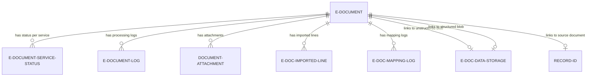

# Data model

The E-Document table is the central aggregate root with 41 fields spanning identification, participant data, amounts, workflow state, and clearance tracking.

## Entity schema

```al
table 6121 "E-Document"
{
    field(1; "Entry No"; Integer) { AutoIncrement = true; }
    field(2; "Document Record ID"; RecordId) { DataClassification = SystemMetadata; }
    field(3; "Bill-to/Pay-to No."; Code[20]) { }
    field(4; "Bill-to/Pay-to Name"; Text[100]) { Editable = false; }
    field(5; "Document No."; Code[20]) { Editable = false; }
    field(6; "Document Type"; Enum "E-Document Type") { }
    field(7; "Document Date"; Date) { }
    field(8; "Due Date"; Date) { }
    field(9; "Amount Incl. VAT"; Decimal) { AutoFormatExpression = Rec."Currency Code"; }
    field(10; "Amount Excl. VAT"; Decimal) { }
    field(16; Direction; Enum "E-Document Direction") { }
    field(18; Status; Enum "E-Document Status") { }  // Calculated from Service Status
    field(21; "Data Exch. Def. Code"; Code[20]) { TableRelation = "Data Exch. Def"; }
    field(32; "Unstructured Data Entry No."; Integer) { TableRelation = "E-Doc. Data Storage"; }
    field(33; "Structured Data Entry No."; Integer) { TableRelation = "E-Doc. Data Storage"; }
    field(60; "Clearance Date"; DateTime) { }
    field(61; "Last Clearance Request Time"; DateTime) { }
    // ... 20 more fields
}
```

## Key indexes

```al
keys
{
    key(Key1; "Entry No") { Clustered = true; }
    key(Key2; "Document Record ID") { }  // Fast lookup by source document
    key(Key3; "Incoming E-Document No.", "Bill-to/Pay-to No.", "Document Date", "Entry No") { }  // Duplicate detection
    key(Key4; SystemCreatedAt) { }  // Chronological queries
    key(DueDate; "Due Date") { }  // Payment reminder queries
}
```

**Key3 composite:** Enables duplicate detection queries (SetRange on first 3 fields, filter out current Entry No).

**Key4 SystemCreatedAt:** Audit trail and "recent documents" queries.

## Participant fields (3-5, 22-26)

Snapshot data copied from Customer/Vendor at creation time:

| Field | Purpose |
|-------|---------|
| Bill-to/Pay-to No. | Customer/Vendor primary key |
| Bill-to/Pay-to Name | Participant name (preserved even if master data changes) |
| Receiving Company Name | Buyer name (for inbound validation) |
| Receiving Company VAT Reg. No. | Buyer VAT ID |
| Receiving Company GLN | Buyer GLN (GS1 identifier) |
| Receiving Company Id | Service participant ID (e.g., PEPPOL endpoint) |

**Why snapshot?** If vendor renames after invoice import, historical documents still show original name.

## Amount fields (9-10, 174)

```al
field(9; "Amount Incl. VAT"; Decimal)
{
    AutoFormatExpression = Rec."Currency Code";
    AutoFormatType = 1;
}
field(10; "Amount Excl. VAT"; Decimal)
{
    AutoFormatExpression = Rec."Currency Code";
    AutoFormatType = 1;
}
field(174; "Currency Code"; Code[10])
{
    TableRelation = Currency;
}
```

**AutoFormatExpression:** Links to Currency Code for decimal display (e.g., 2 decimals for USD, 0 for JPY).

**Blank currency = LCY:** If Currency Code is blank, amounts are in local currency (BC convention).

## Workflow fields (27-30, 188-189)

```al
field(27; "Workflow Code"; Code[20])
{
    TableRelation = Workflow where(Template = const(false), Category = const('EDOC'));
}
field(28; "Workflow Step Instance ID"; Guid) { DataClassification = SystemMetadata; }
field(29; "Job Queue Entry ID"; Guid)
{
    TableRelation = "Job Queue Entry";
    DataClassification = SystemMetadata;
}
```

**Workflow integration:** Links to Workflow Management for approval flows (e.g., "Vendor invoice requires approval before import").

**Job Queue:** Async processing via Job Queue Entry (background import, batch export).

## Data storage fields (32-33)

```al
field(32; "Unstructured Data Entry No."; Integer)
{
    Caption = 'Unstructured Content';
    ToolTip = 'Specifies the content that is not structured, such as PDF';
    TableRelation = "E-Doc. Data Storage";
}
field(33; "Structured Data Entry No."; Integer)
{
    Caption = 'Structured Content';
    ToolTip = 'Specifies the content that is structured, such as XML';
    TableRelation = "E-Doc. Data Storage";
}
```

**Unstructured:** PDF, image scans (requires OCR or MLLM)
**Structured:** XML, JSON (parseable via Data Exchange Framework or AOAI Function)

**Version 2 pattern:** Import receives PDF, stores in Unstructured Entry No., then structures to XML (stored in Structured Entry No.).

## Import process implementation fields (42-44)

```al
field(42; "Structure Data Impl."; Enum "Structure Received E-Doc.")
{
    Caption = 'Structure Data Implementation';
}
field(43; "Read into Draft Impl."; Enum "E-Doc. Read into Draft")
{
    Caption = 'Read into Draft Implementation';
}
field(44; "Process Draft Impl."; Enum "E-Doc. Process Draft")
{
    Caption = 'Structured Data Process';
}
```

**Pluggable implementations:** Each import step uses an enum-selected implementation, allowing custom logic per service without modifying core code.

## Clearance fields (60-61)

```al
field(60; "Clearance Date"; DateTime)
{
    Caption = 'Clearance Date';
    ToolTip = 'Specifies date and time when document was cleared by authority';
}
field(61; "Last Clearance Request Time"; DateTime)
{
    Caption = 'Last Clearance Request Time';
}
```

**Real-time validation:** Some jurisdictions (e.g., Saudi Arabia ZATCA) require tax authority approval before document is legally valid. These fields track clearance status.

## Calculated status field

```al
field(18; Status; Enum "E-Document Status")
{
    Caption = 'Electronic Document Status';
}
```

**Not stored:** This field is not persisted; it's calculated on-the-fly from E-Document Service Status records.

**Calculation logic:** Query all Service Status records for this E-Document, apply IEDocumentStatus interface implementations, aggregate using precedence (Error > In Progress > Processed).

## FlowField for import status

```al
field(41; "Import Processing Status"; Enum "Import E-Doc. Proc. Status")
{
    Caption = 'Import Processing Status';
    FieldClass = FlowField;
    CalcFormula = lookup("E-Document Service Status"."Import Processing Status" where("E-Document Entry No" = field("Entry No")));
}
```

**FlowField:** Calculated field that queries E-Document Service Status table. Shows progress through 4-step import state machine (Structure Done, Read Done, Prepare Done, Finish Done).

## Relationships



All child records cascade delete when E-Document is deleted (via CleanupDocument procedure).
