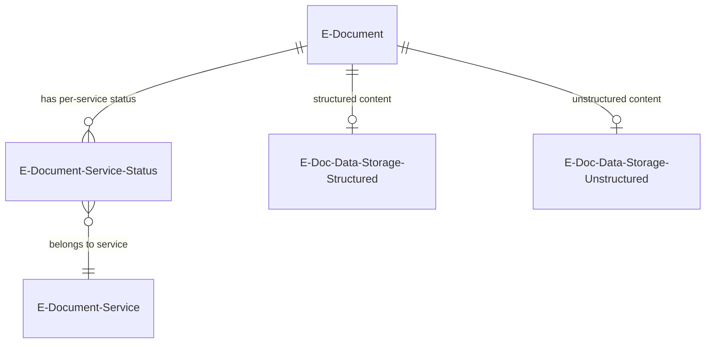
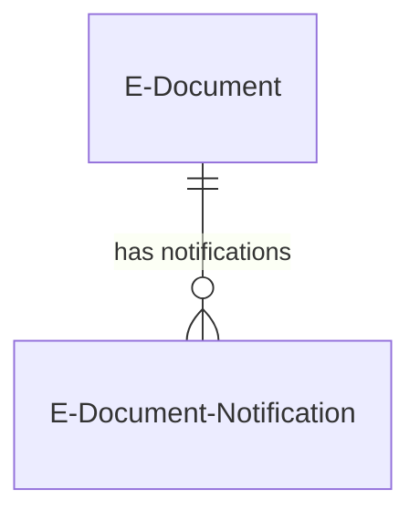

# Document data model

This describes the data model for the E-Document aggregate root and its immediate relationships. For the full cross-module data model, see [../../docs/data-model.md](../../docs/data-model.md).

## Core entity and status tracking

The `E-Document` table (6121) is the central record. Each E-Document points to its originating BC document via `Document Record ID` (a RecordId field) and to its content via `Structured Data Entry No.` and `Unstructured Data Entry No.`, both foreign keys to `E-Doc. Data Storage`. The `E-Document Service Status` table (6138) tracks per-service processing state for each document, creating a one-to-many relationship between documents and services.

The `E-Document Service Status` table uses a composite primary key of `(E-Document Entry No, E-Document Service Code)`. Its `Import Processing Status` field has a validate trigger that automatically synchronizes the `Status` field -- when import processing reaches Processed, the service status flips to "Imported Document Created"; otherwise it stays at "Imported". This coupling means you cannot set import processing status without side-effecting the service status.

## Three status dimensions

The status model is the most important design decision in this module. Rather than a single linear state machine, the framework uses three orthogonal dimensions.

**E-Document Status** (enum 6108) is the top-level rollup with only three values: In Progress, Processed, Error. It is never set directly -- it is derived from the service status via the `IEDocumentStatus` interface. Each `E-Document Service Status` enum value declares which `IEDocumentStatus` implementation it uses. For example, "Exported", "Sent", "Canceled", "Approved", "Rejected", "Cleared", and "Imported Document Created" all map to Processed; "Sending Error", "Cancel Error", "Export Error", "Imported Document Processing Error", and "Approval Error" map to Error; everything else defaults to In Progress.

**E-Document Service Status** (enum 6106) is the fine-grained operational status with 20+ values spanning the full lifecycle: Created, Exported, Sent, Imported, Canceled, Pending Batch, Pending Response, Order Linked, Cleared, and various error states. The clearance model values (30-31: Not Cleared, Cleared) are reserved in a separate range for tax authority clearance workflows.

**Import Processing Status** (enum 6100) is a five-step inbound pipeline: Unprocessed, Readable, Ready for draft, Draft Ready, Processed. Each step corresponds to a processing action (structure received data, read into intermediate representation, prepare draft, finish draft). This enum is not extensible.

## Notification model

The `E-Document Notification` table (6126) uses a composite key of `(E-Document Entry No., ID, User Id)` where ID is a well-known Guid identifying the notification type. This design allows multiple notification types per document per user. Currently only one type exists ("Vendor Matched By Name Not Address"), but the structure supports adding more notification scenarios without schema changes. Notifications integrate with BC's `My Notifications` framework for user-level opt-out.

## Design decisions and gotchas

- The `Document Record ID` field stores a RecordId, which is a BC-specific composite reference encoding table number and primary key. This means the E-Document can point to any source document table without a fixed foreign key, but it also means the reference breaks if the source record is renumbered or the table ID changes.

- Key3 on the E-Document table `(Incoming E-Document No., Bill-to/Pay-to No., Document Date, Entry No)` exists specifically for the `IsDuplicate()` check. The inclusion of `Entry No` in the key allows efficient exclusion of the current record during the duplicate scan.

- The `E-Documents Setup` table is obsolete (pending removal in v28). Its feature gating logic checks three sources in priority order: explicit table flag, AAD tenant ID allowlist, environment setting, then country code list. The country list is hardcoded to 14 specific localizations plus W1.
