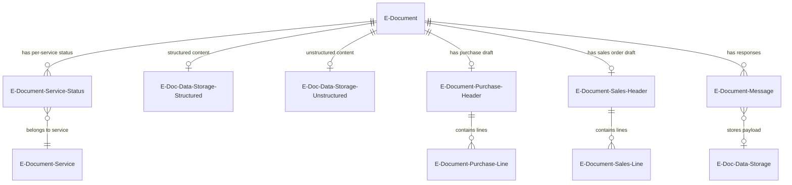
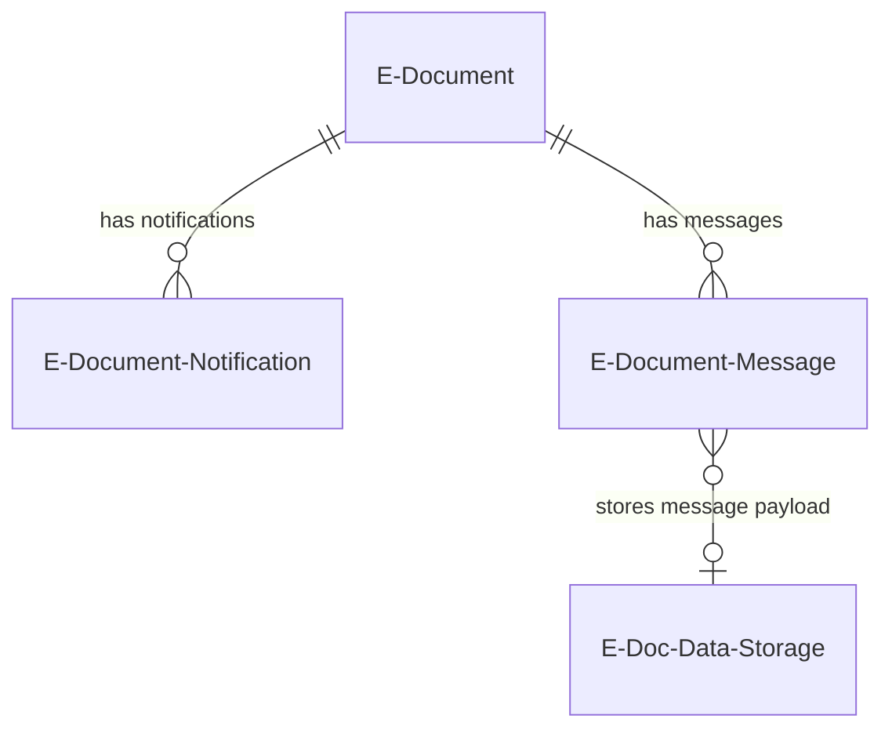

# Document data model

This describes the data model for the E-Document aggregate root and its immediate relationships. For the full cross-module data model, see [../../docs/data-model.md](../../docs/data-model.md).

## Core entity and status tracking

*Updated: 2026-07-29 -- Added draft staging, response messages, and current date semantics.*

The `E-Document` table (6121) is the central record. Each E-Document points to its originating BC document via `Document Record ID` (a RecordId field) and to its content via `Structured Data Entry No.` and `Unstructured Data Entry No.`, both foreign keys to `E-Doc. Data Storage`. The `E-Document Service Status` table (6138) tracks per-service processing state for each document, creating a one-to-many relationship between documents and services.

```mermaid
erDiagram
    E-Document ||--o{ E-Document-Service-Status : "has per-service status"
    E-Document ||--o| E-Doc-Data-Storage-Structured : "structured content"
    E-Document ||--o| E-Doc-Data-Storage-Unstructured : "unstructured content"
    E-Document ||--o| E-Document-Purchase-Header : "has purchase draft"
    E-Document-Purchase-Header ||--o{ E-Document-Purchase-Line : "contains lines"
    E-Document ||--o| E-Document-Sales-Header : "has sales order draft"
    E-Document-Sales-Header ||--o{ E-Document-Sales-Line : "contains lines"
    E-Document ||--o{ E-Document-Message : "has responses"
    E-Document-Message }o--o| E-Doc-Data-Storage : "stores payload"
    E-Document-Service-Status }o--|| E-Document-Service : "belongs to service"
```

The `E-Document Service Status` table uses a composite primary key of `(E-Document Entry No, E-Document Service Code)`. Its `Import Processing Status` field has a validate trigger that automatically synchronizes the `Status` field -- when import processing reaches Processed, the service status flips to "Imported Document Created"; otherwise it stays at "Imported". This coupling means you cannot set import processing status without side-effecting the service status.

`Document Date` and `Due Date` on E-Document are now part of the inbound V2 draft contract. During `PrepareDraft`, the purchase draft header's dates are copied back to the E-Document when present. `Document Date` is also part of Key3 and the `IsDuplicate()` filter, so duplicate purchase invoice detection is date-sensitive.

## Inbound draft staging

*Updated: 2026-07-29 -- Documented purchase table exposure and sales draft classification.*

Inbound purchase drafts are staged in `E-Document Purchase Header` and `E-Document Purchase Line`, keyed by the E-Document entry number. These tables are no longer `Access = Internal`, while their inherent permissions stay RIMDX. That is the intended consumption surface for country apps that need to inspect or enrich incoming purchase drafts without depending on the final BC purchase document.

The purchase header stores external document identity and accounting context, including `Document Date`, `Due Date`, order references, and apply-to references for credit memos. The purchase line stores extracted line data and the validated BC match. VAT product posting group is now a validated field on the draft line, and the header can calculate a bounded VAT amount difference from draft lines when the Purchases & Payables setup allows it.

Sales order import uses its own staging pair, `E-Document Sales Header` and `E-Document Sales Line`. The sales staging tables do not replicate data and classify external buyer, seller, address, amount, item, and date fields as customer content; only technical linkage fields such as E-Document entry and line number are system metadata. This keeps imported customer order payloads treated as business data while still linking them back to the aggregate root.

## Three status dimensions

*Updated: 2026-07-29 -- Added the Canceled top-level status.*

The status model is the most important design decision in this module. Rather than a single linear state machine, the framework uses three orthogonal dimensions.

**E-Document Status** (enum 6108) is the top-level rollup with In Progress, Processed, Error, and an explicit Canceled value used by linked-record checks. The usual rollup is derived from the service status via the `IEDocumentStatus` interface. Each `E-Document Service Status` enum value declares which `IEDocumentStatus` implementation it uses. For example, service statuses "Exported", "Sent", "Canceled", "Approved", "Rejected", "Cleared", and "Imported Document Created" all map to Processed; "Sending Error", "Cancel Error", "Export Error", "Imported Document Processing Error", and "Approval Error" map to Error; everything else defaults to In Progress.

**E-Document Service Status** (enum 6106) is the fine-grained operational status with 20+ values spanning the full lifecycle: Created, Exported, Sent, Imported, Canceled, Pending Batch, Pending Response, Order Linked, Cleared, and various error states. The clearance model values (30-31: Not Cleared, Cleared) are reserved in a separate range for tax authority clearance workflows.

**Import Processing Status** (enum 6100) is a five-step inbound pipeline: Unprocessed, Readable, Ready for draft, Draft Ready, Processed. Each step corresponds to a processing action (structure received data, read into intermediate representation, prepare draft, finish draft). This enum is not extensible.

## Notification and message model

*Updated: 2026-07-29 -- Added E-Document messages alongside user notifications.*

```mermaid
erDiagram
    E-Document ||--o{ E-Document-Notification : "has notifications"
    E-Document ||--o{ E-Document-Message : "has messages"
    E-Document-Message }o--o| E-Doc-Data-Storage : "stores message payload"
```

The `E-Document Notification` table (6126) uses a composite key of `(E-Document Entry No., ID, User Id)` where ID is a well-known Guid identifying the notification type. This design allows multiple notification types per document per user. Currently only one type exists ("Vendor Matched By Name Not Address"), but the structure supports adding more notification scenarios without schema changes. Notifications integrate with BC's `My Notifications` framework for user-level opt-out.

The `E-Document Message` table stores response-style traffic, for example a PEPPOL Order Response, against the E-Document it belongs to. It records message type, direction, status, response type, service, and an optional data storage payload. Messages are not notifications and do not create draft documents; they update the lifecycle context of an existing E-Document.

## Design decisions and gotchas

*Updated: 2026-07-29 -- Refreshed cleanup and reference gotchas.*

- The `Document Record ID` field stores a RecordId, which is a BC-specific composite reference encoding table number and primary key. This means the E-Document can point to any source document table without a fixed foreign key, but it also means the reference breaks if the source record is renumbered or the table ID changes.

- Key3 on the E-Document table `(Incoming E-Document No., Bill-to/Pay-to No., Document Date, Entry No)` exists specifically for the `IsDuplicate()` check. The inclusion of `Entry No` in the key allows efficient exclusion of the current record during the duplicate scan. Because `Document Date` is part of this key, incomplete date extraction can change duplicate behavior.

- Cleanup now includes error messages and E-Document messages, not only logs, service statuses, mapping logs, imported lines, attachments, and draft records. If a new child table is added to the aggregate, `CleanupDocument()` must be reviewed.

- The `E-Documents Setup` table is obsolete (pending removal in v28). Its feature gating logic checks three sources in priority order: explicit table flag, AAD tenant ID allowlist, environment setting, then country code list. The country list is hardcoded to 14 specific localizations plus W1.
