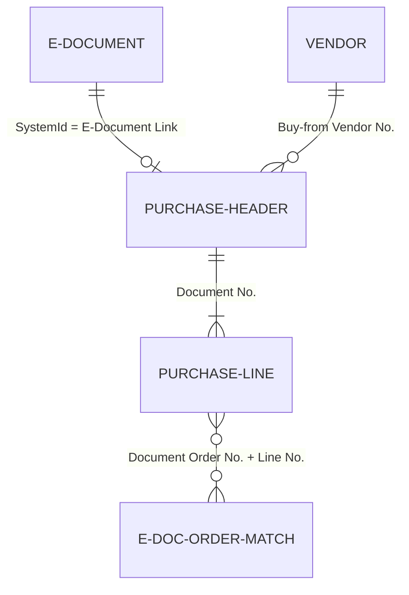

# Extensions data model

## Purchase document linking

The key relationship is between Purchase Header and E-Document. The `E-Document Link` Guid on Purchase Header joins to `E-Document.SystemId`, creating a soft reference that survives table renumbering.

Purchase Line's `Amount Incl. VAT To Inv.` is a data field (not FlowField) recomputed via OnValidate: `Round("Amount Including VAT" * "Qty. to Invoice" / Quantity)`. The Purchase Header has a matching FlowField that sums these across lines for display.

## Vendor configuration

Vendor and Vendor Template both carry `Receive E-Document To` (enum: Purchase Order, Purchase Invoice). This is read during inbound processing to decide the target document type. The Vendor Template version ensures new vendors created from templates inherit the preference.

## Document sending profile extension

The Sending Profile extension (`EDocumentSendingProfile.TableExt.al`) adds `Electronic Service Flow` (Code[20]) linking to a Workflow record filtered to category `EDOC`. The `Electronic Document` enum is extended with `Extended E-Document Service Flow` to enable the E-Document pipeline. These two fields together -- the enum value and the workflow code -- are what makes a sending profile "e-document aware."
