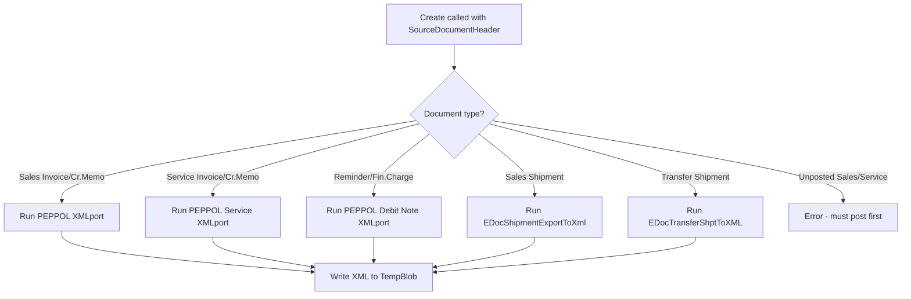
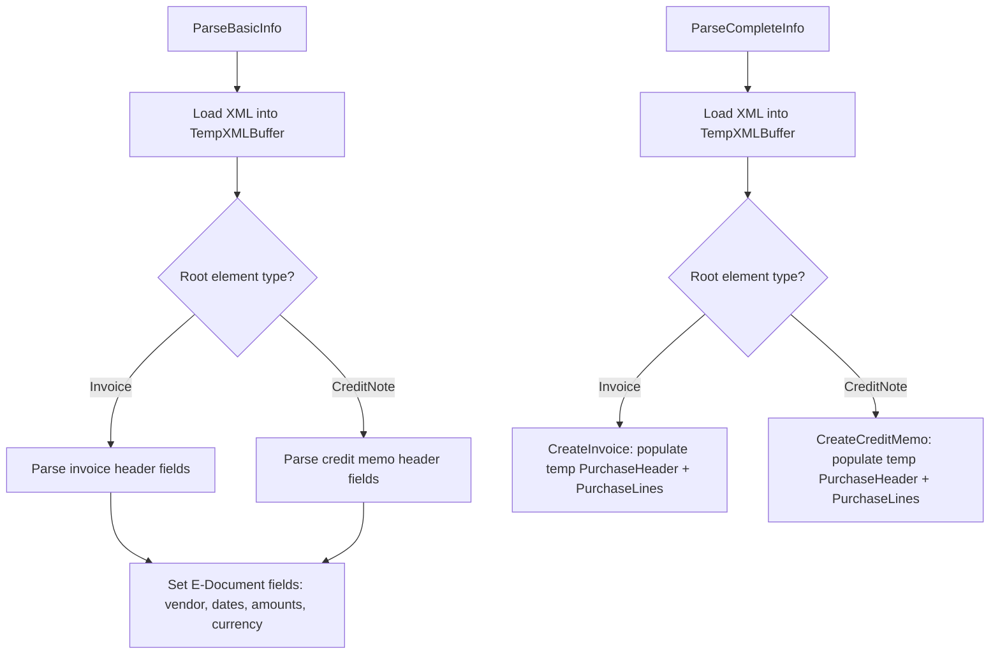

# Format business logic

## Export flow

When an E-Document is exported, the format interface's `Create` procedure is called with the source document RecordRef and an empty TempBlob. The flow depends on the document type.

For standard PEPPOL documents, the codeunit runs the `FinResultsPEPPOLBIS30` XMLport which produces UBL 2.1 compliant XML. Shipment documents use custom XML structures generated programmatically via `XML DOM Management`.

## Import flow

The import side has two entry points: `ParseBasicInfo` for initial document identification and `ParseCompleteInfo` for full document parsing into purchase structures.

`ParseBasicInfo` extracts vendor identification (VAT number, GLN, name), document reference numbers, dates, currency, and total amounts. `ParseCompleteInfo` fully populates temporary Purchase Header and Purchase Line records including line-level details (item descriptions, quantities, unit prices, tax amounts). The parsed output is consumed by the import pipeline to create actual BC purchase documents.

## Validation

The `Check` procedure runs before export. It delegates to three different validation codeunits depending on document type: `PEPPOL Validation` (from the base app, for sales documents), `PEPPOL Service Validation` (for service documents), and `E-Doc. PEPPOL Validation` (local to this module, for reminders and finance charge memos). Validation failures raise errors that block the export.
