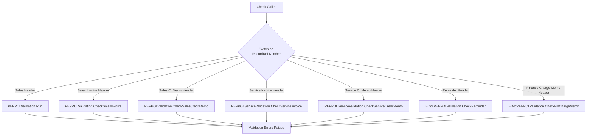
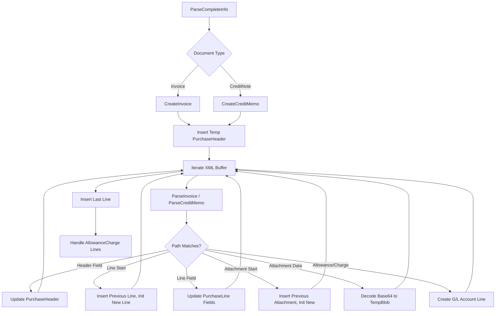

# Business logic

The Format folder implements PEPPOL BIS 3.0 export and import logic through interface implementations and specialized parsers. The export path validates documents, generates UBL XML, and embeds PDFs when requested. The import path parses XML, matches vendors, and creates purchase drafts.

## Export orchestration

The **EDoc PEPPOL BIS 3.0** codeunit implements the IEDocument interface, providing Check and Create methods called by E-Document Core during the outbound flow.

**Check method** validates export eligibility by delegating to existing PEPPOL validation codeunits from Microsoft.Sales.Peppol:



Validation enforces:
- GLN or endpoint ID present on customer
- VAT registration numbers valid
- Currency codes ISO-compliant
- Line amounts calculated correctly
- Document references valid for credit memos

**Create method** generates UBL XML based on document type:

1. **Sales/Service Invoices** -- Calls GenerateInvoiceXMLFile, which instantiates SalesInvoicePEPPOLBIS30 XMLport from Microsoft.Sales.Peppol. The XMLport uses data items to iterate header/lines and outputs UBL Invoice elements.

2. **Sales/Service Credit Memos** -- Calls GenerateCrMemoXMLFile with SalesCrMemoPEPPOLBIS30 XMLport. Includes BillingReference linking to original invoice.

3. **Issued Reminder/Finance Charge Memo** -- Calls GenerateFinancialResultsXMLFile with FinResultsPEPPOLBIS30 XMLport (defined locally). Outputs custom financial results format with installment lines.

4. **Sales Shipment** -- Calls EDocShipmentExportToXml codeunit to generate PEPPOL DespatchAdvice XML for goods delivery notifications.

5. **Transfer Shipment** -- Calls EDocTransferShptToXML codeunit for inter-location transfers (not standard PEPPOL, BC extension).

All generators accept a `GeneratePDF` boolean parameter. When true, they call report objects to render the document as PDF, convert to base64, and embed in AdditionalDocumentReference/Attachment/EmbeddedDocumentBinaryObject elements.

The OnAfterCreatePEPPOLXMLDocument event fires after XML generation, passing the TempBlob by reference so extensions can:
- Add custom elements (e.g., tax clearance codes)
- Transform amounts (e.g., apply exchange rates)
- Sign the document with digital signatures

## Import parsing

The **EDoc Import PEPPOL BIS 3.0** codeunit provides two entry points called by E-Document Core during inbound processing:

**ParseBasicInfo** extracts header-level data from UBL XML to populate E-Document fields before creating the full purchase document:

1. Load XML into temporary XML Buffer (DOM-like structure with Path/Value pairs)
2. Detect document type from root element name (Invoice vs CreditNote)
3. Extract document number from `/Invoice/cbc:ID` or `/CreditNote/cbc:ID`
4. Parse vendor identification via ParseAccountingSupplierParty (see Vendor Matching below)
5. Parse buyer identification via ParseAccountingCustomerParty
6. Extract dates: IssueDate → Document Date, DueDate → Due Date
7. Extract amounts from LegalMonetaryTotal (TaxExclusiveAmount, PayableAmount)
8. Extract currency code; set E-Document."Currency Code" only if ≠ LCY
9. Extract order reference from OrderReference/ID

**ParseCompleteInfo** creates temporary Purchase Header and Purchase Line records:



Key parsing logic:

**Line identification:** Each `/Invoice/cac:InvoiceLine` element triggers a new Purchase Line. The parser accumulates field values (Quantity, Amount, Description, Item No.) as it encounters child elements, then inserts when the next InvoiceLine starts.

**Item matching:** Maps UBL item identifiers to BC fields:
- `cac:Item/cac:StandardItemIdentification/cbc:ID` → Purchase Line."No."
- `cac:Item/cac:SellersItemIdentification/cbc:ID` → Purchase Line."Item Reference No."
- `cac:Item/cbc:Name` → Purchase Line.Description
- `cac:Item/cbc:Description` → Purchase Line."Description 2"

**Unit of measure:** Extracted from `cbc:InvoicedQuantity/@unitCode` attribute (e.g., "EA", "KGM"). BC validates against Unit of Measure table on purchase line insert.

**VAT handling:** Parses VAT % from `cac:Item/cac:ClassifiedTaxCategory/cbc:Percent`. Purchase line validation links to VAT Posting Setup.

**Attachment extraction:** AdditionalDocumentReference elements with embedded base64 content are decoded and inserted as Document Attachment records linked to E-Document via "E-Document Attachment" = true flag.

**Allowance/Charge handling:** Document-level `/Invoice/cac:AllowanceCharge` elements (discounts, surcharges not tied to specific lines) are converted to synthetic Purchase Lines with Type = "G/L Account". The parser calls E-Document Import Helper.FindGLAccountForLine to resolve the account number based on charge reason codes.

**OnAfterParseInvoice/OnAfterParseCreditMemo events** fire for each XML element, allowing extensions to handle custom fields (e.g., project codes, custom attributes).

## Vendor matching

ParseAccountingSupplierParty implements a 4-pass fallback to identify the vendor:

**Pass 1: GLN lookup**
- Check if `/cac:AccountingSupplierParty/cac:Party/cbc:EndpointID/@schemeID` = '0088' (GS1 GLN scheme)
- If yes, extract GLN and call EDocumentImportHelper.FindVendor(GLN, VAT)

**Pass 2: VAT registration lookup**
- Extract VAT from `/cac:Party/cac:PartyTaxScheme/cbc:CompanyID`
- Call EDocumentImportHelper.FindVendor('', '', VAT)

**Pass 3: Service participant ID lookup**
- Concatenate schemeID + ':' + EndpointID (e.g., "0088:1234567890123")
- Call EDocumentImportHelper.FindVendorByServiceParticipant(participantID, serviceCode)
- This checks the E-Document Service Participant table for registered mappings

**Pass 4: Name and address match**
- Extract name from `/cac:Party/cac:PartyName/cbc:Name`
- Extract address from `/cac:Party/cac:PostalAddress/cbc:StreetName`
- Call EDocumentImportHelper.FindVendorByNameAndAddress(name, address)
- This performs fuzzy text matching on Vendor.Name and Vendor.Address fields

If all passes fail, E-Document."Bill-to/Pay-to No." remains blank and E-Document."Bill-to/Pay-to Name" stores the XML-extracted name. Users must manually match the vendor before proceeding.

## Validation layer

**EDocPEPPOLValidation** codeunit extends standard PEPPOL validation for reminder and finance charge memo documents (not part of core PEPPOL spec):

- **CheckReminder:** Validates Reminder Header has customer with valid GLN or endpoint ID, currency is EUR or local currency, amounts calculated correctly
- **CheckFinChargeMemo:** Similar validations for Finance Charge Memo Header

These validations run during the Check phase before export. Validation errors are raised as blocking errors that prevent E-Document creation.

## Document type enum extension

The **E-Document Structured Format** enum defines available format implementations:

```al
enum 6100 "E-Document Structured Format"
{
    Extensible = true;

    value(0; "PEPPOL BIS 3.0") { }
}
```

Partners can extend this enum to add custom formats (e.g., "Germany XRechnung", "Italy FatturaPA") and implement corresponding IEDocument codeunits. The E-Document Service configuration uses this enum to select the format handler.

## Event subscriber pattern

**OnAfterValidateEvent subscriber** in EDoc PEPPOL BIS 3.0 automatically populates supported document types when a service selects "PEPPOL BIS 3.0" format:

```al
[EventSubscriber(ObjectType::Table, Database::"E-Document Service", 'OnAfterValidateEvent', 'Document Format', false, false)]
local procedure OnAfterValidateDocumentFormat(var Rec: Record "E-Document Service")
begin
    if Rec."Document Format" = Rec."Document Format"::"PEPPOL BIS 3.0" then begin
        // Insert default supported types: Sales Invoice, Sales Credit Memo, Service Invoice, Service Credit Memo
    end;
end;
```

This reduces manual configuration steps when setting up a PEPPOL service.

## XMLport structure

**FinResultsPEPPOLBIS30** XMLport exports Reminder/Finance Charge Memo as custom financial results format:

- Root element: FinancialResults (custom namespace)
- Data items: Header (Reminder/FinChargeMemo), Lines (installments)
- Field mappings via XmlText and XmlAttribute
- PDF embedding via procedure SetGeneratePDF(Boolean)
- Event OnBeforePassVariable allows field transformation

This XMLport pattern is reusable for other document types requiring custom XML schemas.
