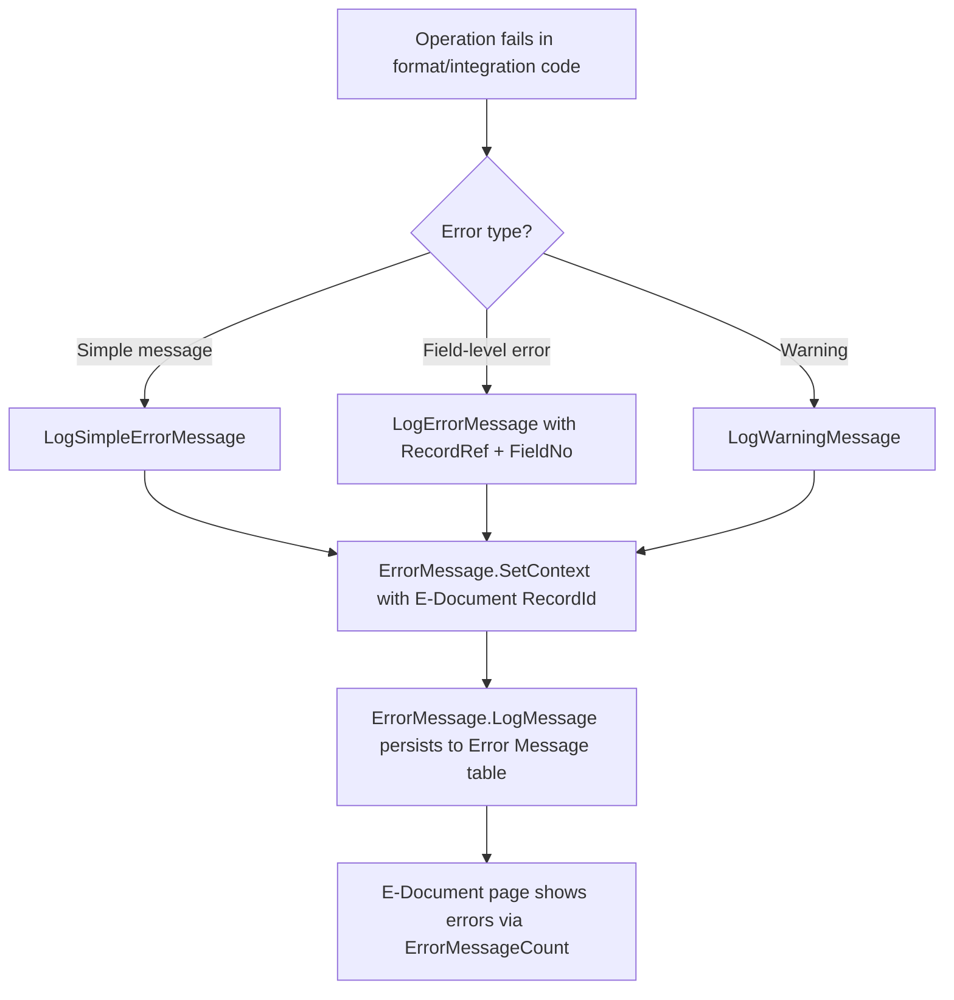
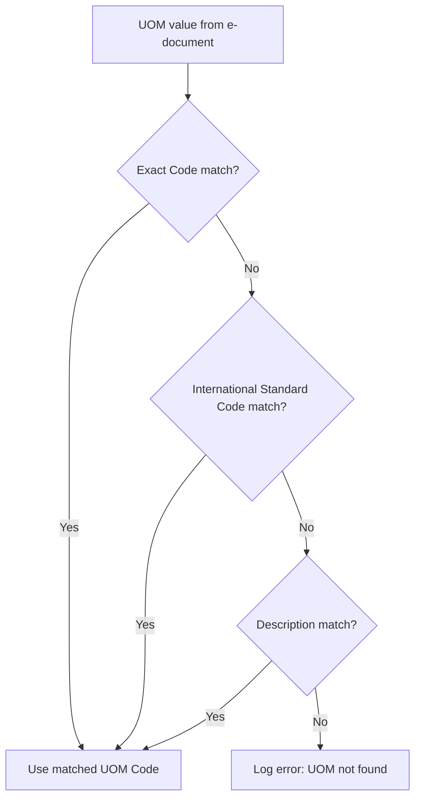

# Helpers business logic

## Error logging flow

All E-Document errors flow through the Error Helper to ensure consistent context association.

The pattern used in format and integration codeunits is: catch an error condition, call the appropriate Error Helper method, then either continue (for warnings) or exit (for errors). The E-Document page's error factbox reads from the Error Message table filtered to the E-Document's RecordId.

## Import resolution chain

When an inbound e-document contains a unit of measure code, the Import Helper resolves it through progressively fuzzier matching.

Item resolution in Import Helper follows a similar pattern: search by Item Reference, then by GTIN/Barcode, then by Vendor Item No., then by Item No. directly. Each step narrows or expands the search until a match is found or an error is logged.

## Integration logging via Log Helper

Connector developers call `InsertIntegrationLog` after each HTTP call to their external service. The Log Helper delegates to the internal `E-Document Log` codeunit, which creates an `E-Document Integration Log` record with the request/response blobs, URL, HTTP method, and status code. This enables full HTTP-level diagnostics without the connector needing direct table permissions.
