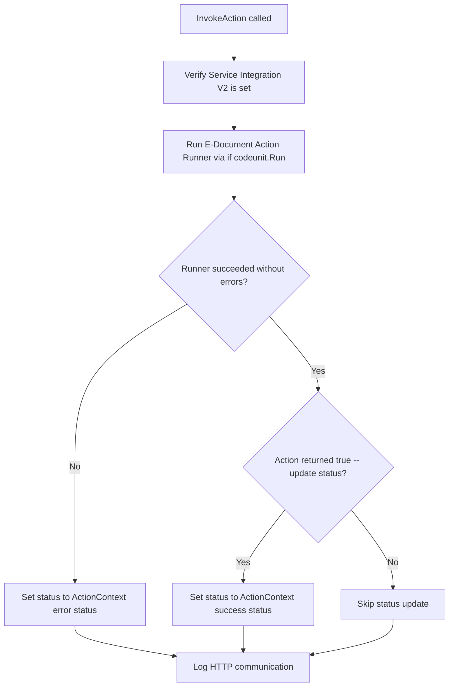
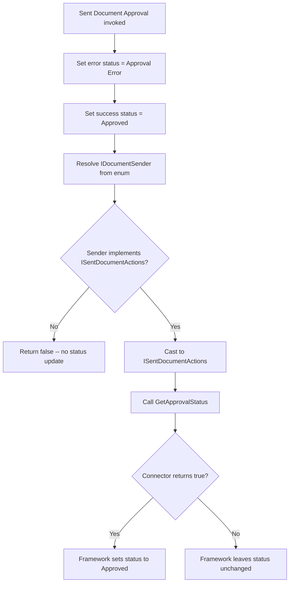

# Actions business logic

## Action dispatch flow

## Built-in approval action flow

The "Sent Document Approval" action follows a delegation pattern -- the framework sets default statuses, then hands off to the connector.

## Built-in cancellation action flow

Identical to approval, with Canceled/Cancel Error as the default statuses and `GetCancellationStatus` as the connector method.

## Action context status management

The `IntegrationActionStatus` codeunit holds two status values: a success status and an error status. This dual-status design exists because the framework needs to know which status to apply in both the success and error paths without requiring the action implementation to handle error-status logic.

The built-in actions pre-set both values before calling the connector:

- Approval: success = Approved, error = Approval Error
- Cancellation: success = Canceled, error = Cancel Error

Connectors can override the success status via `ActionContext.Status().SetStatus(...)` if their API returns a different terminal state. The error status is typically left at the default.
