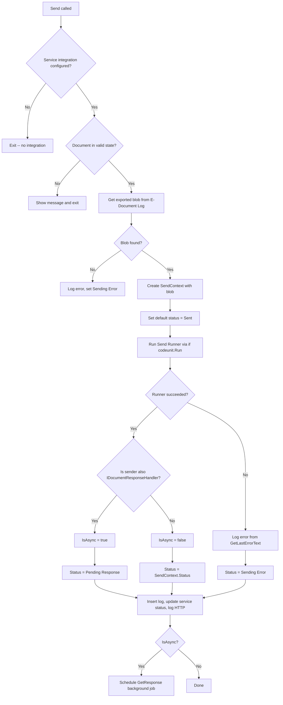
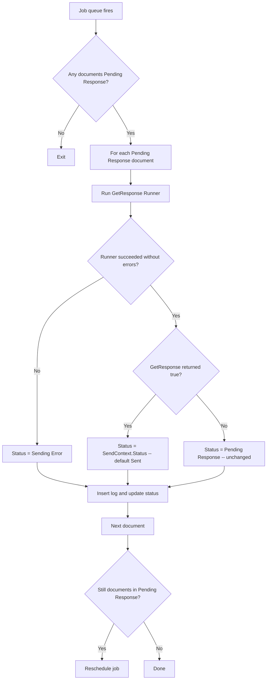
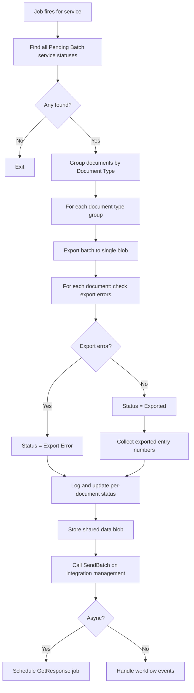

# Send business logic

## Single document send flow

## Async response polling flow

The `E-Document Get Response` codeunit runs as a job queue entry. It processes all documents in "Pending Response" state.

## Batch send flow

Recurrent batch send is triggered by a scheduled job queue entry tied to a specific E-Document Service.

## State guard for sending

`IsEDocumentInStateToSend` prevents sending from invalid states. Only documents with service status `Exported` or `Sending Error` are eligible. This enables retry-from-error without requiring manual status reset, while preventing duplicate sends from other states like "Sent" or "Pending Response".
