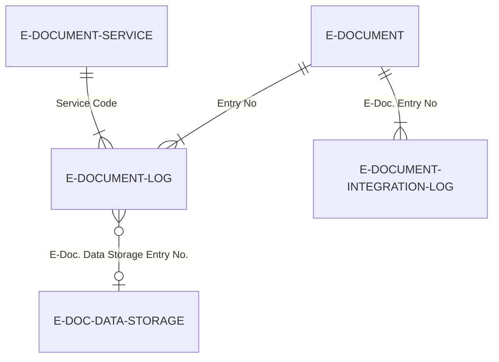

# Logging data model

## Log tables and blob storage

The three tables form a two-tier logging system with shared blob storage. Business logs and integration logs both link back to the same E-Document but track different concerns.

`E-Document Log` is the business-level record. It carries `Status` (the service status enum -- Exported, Imported, Sent, etc.), `Processing Status` (the import pipeline stage), and a reference to the blob in Data Storage. The composite key on `(Status, Service Code, Document Format, Service Integration V2)` supports efficient filtering when looking up the latest log for a specific operation type.

`E-Document Integration Log` is the HTTP-level record. Request and response bodies are stored as BLOBs directly on the record (not in Data Storage). The `Request URL` field was widened from Text[250] to Text[2048] in v28 to accommodate longer API endpoints.

`E-Doc. Data Storage` is a simple blob table with an auto-increment key. Each record holds one binary payload and its metadata (name, size, file format). It is intentionally dumb -- all logic for creating and linking storage entries lives in the `E-Document Log` codeunit.

## Deletion behavior

When an `E-Document Log` record is deleted, its `OnDelete` trigger deletes the associated `E-Doc. Data Storage` record. However, there is no reference counting -- if the E-Document table also references the same Data Storage entry number (via `Unstructured Data Entry No.` or `Structured Data Entry No.`), that reference becomes dangling. In practice this is not a problem because log deletion is rare and typically happens only during full E-Document cleanup.
