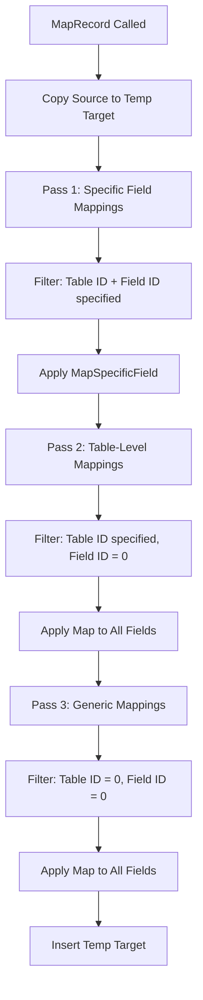
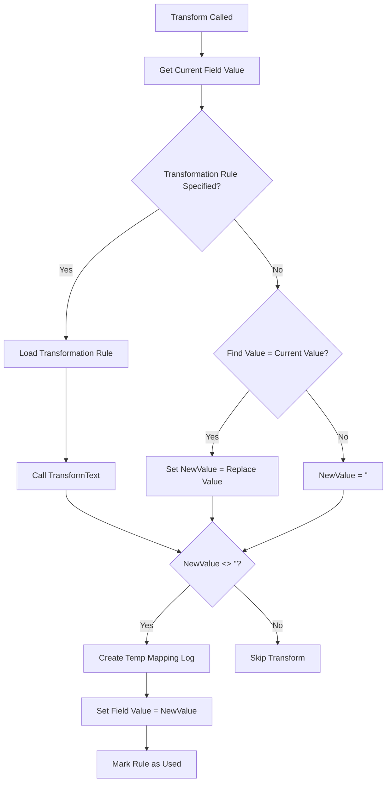
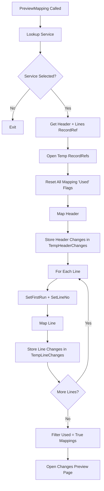

# Business logic

The Mapping engine provides RecordRef-based field transformation using a 3-pass algorithm with preview capabilities. It supports both simple find-replace and complex transformation rules for preparing documents before export or after import.

## 3-pass mapping algorithm

The **MapRecord** procedure applies transformations in three distinct passes to allow precise control over field modification priority:



**Pass 1: Specific field mappings**
- Filter: `EDocumentMapping.SetRange("Table ID", RecordSource.Number()); EDocumentMapping.SetFilter("Field ID", '<>0');`
- Purpose: Apply targeted transformations to known fields (e.g., Sales Header."Document Date" → format as "YYYY-MM-DD")
- Logic: For each mapping rule, validate the field exists and is transformable, then call Transform

**Pass 2: Table-level mappings**
- Filter: `EDocumentMapping.SetFilter("Field ID", '=0');` (Table ID still filtered from Pass 1)
- Purpose: Apply broad transformations to all eligible fields on a specific table (e.g., uppercase all text fields on Sales Line)
- Logic: Iterate RecordTarget.FieldIndex(1..FieldCount), validate each field, then call Transform

**Pass 3: Generic mappings**
- Filter: `EDocumentMapping.SetRange("Table ID", 0); EDocumentMapping.SetRange("Field ID", 0);`
- Purpose: Apply universal transformations across all tables (e.g., replace all "USD" with "US Dollar")
- Logic: Same as Pass 2 but no table restriction

**Why 3 passes?** This allows inheritance-like behavior where generic rules apply unless overridden by more specific rules. For example:
1. Generic rule: Replace all empty "Unit of Measure Code" with "PCS"
2. Sales Line rule: Replace all empty "Unit of Measure Code" with "EA"
3. Sales Line."No." rule: If Item No. = "1000", set "Unit of Measure Code" = "BOX"

All three rules are evaluated, with specific rules winning due to earlier execution.

## Transformation logic

The **Transform** procedure applies a single mapping rule to a field:



**Transformation Rule path:** If DocumentMapping."Transformation Rule" is populated, the system loads the Transformation Rule record and calls TransformText. Transformation Rules support complex operations:
- UPPERCASE, lowercase, TitleCase
- TRIM, TRIMSTART, TRIMEND
- REPLACE (regex-based)
- DATEFORMAT (e.g., "YYYY-MM-DD" → "DD/MM/YYYY")
- Custom codeunit-based transformations via OnTransformation event

**Find-replace path:** If Transformation Rule is blank, the system checks if current value matches "Find Value" exactly. If yes, it replaces with "Replace Value". If no match, NewValue remains empty and no transformation occurs.

**Logging:** When a transformation succeeds (NewValue <> ''), the system creates a temporary E-Doc. Mapping record with:
- Entry No. (auto-incremented sequence)
- Table ID, Field ID (identifies affected field)
- Find Value (original value), Replace Value (new value)
- Transformation Rule (name of applied rule)
- Line No. (for line-level tracking)
- Indent (0 for header, 1 for lines, used in preview UI)

**Used flag:** The original DocumentMapping record is marked Used = true to track which rules actually applied. This enables filtering in audit UIs.

## Field validation

The **ValidateFieldRef** procedure filters which fields can be transformed:

```al
local procedure ValidateFieldRef(FieldRef: FieldRef): Boolean
begin
    if FieldRef.Class <> FieldRef.Class::Normal then
        exit(false);  // Exclude FlowField, FlowFilter
    if (FieldRef.Type <> FieldRef.Type::Text) and (FieldRef.Type <> FieldRef.Type::Code) then
        exit(false);  // Only Text and Code fields
    exit(true);
end;
```

**Why Text/Code only?** Transformation Rules and find-replace logic operate on string values. Decimal, Integer, Boolean fields require structured transformations that are better handled via custom codeunits or events.

**Excluded field classes:**
- FlowField: Calculated fields, cannot be set directly
- FlowFilter: Filter fields, not stored data
- Media: Binary blobs, not text-transformable

## Preview mode

The **PreviewMapping** procedure provides a dry-run mode for testing mappings before configuring them on services:



**Key behaviors:**

**Service selection:** Opens E-Document Services page in lookup mode, allowing users to select which service configuration to test against.

**Temp RecordRef:** Opens temporary RecordRefs matching the source table types, ensuring preview doesn't modify real data.

**Used flag reset:** Calls `ModifyAll(Used, false)` to clear previous session state, ensuring only currently-applied rules show as used.

**FirstRun flag:** Controls visual indenting in the preview UI. Header changes get Indent = 0, line changes get Indent = 1.

**Line number tracking:** Calls SetLineNo with the line's key field value (e.g., Sales Line."Line No." from FieldRef) to group changes by line.

**Temp changes collection:** Stores applied transformations in temporary E-Doc. Mapping tables passed to the Changes Preview page.

**Changes preview page structure:** Displays two parts (EDocChangesPart pages):
- Part 1: Header changes (Indent = 0)
- Part 2: Line changes (Indent = 1), grouped by Line No.

Each part shows columns: Table Name, Field Name, Find Value (before), Replace Value (after), Transformation Rule (if used).

## Mapping configuration UI

**E-Doc. Mapping page** (list page) allows users to define transformation rules:

**Key fields:**
- **Code:** E-Document Service Code (filter to see service-specific rules)
- **Table ID:** Target table (0 = all tables)
- **Field ID:** Target field (0 = all fields on table)
- **Transformation Rule:** Dropdown linking to Transformation Rule table
- **Find Value / Replace Value:** Simple text replacement if Transformation Rule blank

**Validation logic:**
- Table ID validates against AllObjWithCaption (Table object type only)
- Field ID validates against Field table filtered by TableNo
- Transformation Rule validates against Transformation Rule table

**Usage patterns:**

**Scenario 1: Date format standardization**
- Table ID = 36 (Sales Header), Field ID = 0 (all fields)
- Transformation Rule = "ISO-DATE" (converts dates to YYYY-MM-DD)
- Result: All date fields on Sales Header are formatted consistently

**Scenario 2: Currency code normalization**
- Table ID = 0, Field ID = 0 (all tables/fields)
- Find Value = "USD", Replace Value = "US Dollar"
- Result: Any field containing "USD" gets expanded across all tables

**Scenario 3: Item number prefix removal**
- Table ID = 37 (Sales Line), Field ID = 6 (No.)
- Transformation Rule = "REMOVE-PREFIX" (custom codeunit removes "ITEM-" prefix)
- Result: Sales Line."No." values like "ITEM-1000" become "1000"

## Mapping log structure

**E-Doc. Mapping Log** table stores applied transformations for audit purposes:

```al
table 6119 "E-Doc. Mapping Log"
{
    fields
    {
        field(1; "E-Doc Entry No."; Integer) { }
        field(2; "Entry No."; Integer) { AutoIncrement = true; }
        field(3; "Table ID"; Integer) { }
        field(4; "Field ID"; Integer) { }
        field(5; "Find Value"; Text[250]) { }
        field(6; "Replace Value"; Text[250]) { }
        field(7; "Transformation Rule"; Code[20]) { }
        field(8; "Line No."; Integer) { }
    }
}
```

**Key index:** ("E-Doc Entry No.", "Entry No.") allows retrieving all transformations for a specific E-Document in application order.

**Filtering:** "Line No." key enables line-level filtering (e.g., show only transformations applied to Sales Line with Line No. = 10000).

**Audit workflow:**
1. E-Document Core calls MapRecord during export/import
2. Each applied transformation inserts a Mapping Log entry
3. Users view Mapping Logs page filtered by E-Doc Entry No.
4. Logs show exact before/after values for traceability

## Event extensibility

**OnAfterParseInvoice / OnAfterParseCreditMemo events** (in Format folder) can trigger custom mapping logic:

```al
[EventSubscriber(ObjectType::Codeunit, Codeunit::"EDoc Import PEPPOL BIS 3.0", 'OnAfterParseInvoice', '', false, false)]
local procedure CustomImportMapping(var PurchaseHeader: Record "Purchase Header"; Path: Text; Value: Text)
var
    EDocMapping: Codeunit "E-Doc. Mapping";
    RecRef: RecordRef;
begin
    RecRef.GetTable(PurchaseHeader);
    // Apply custom mappings during import
    EDocMapping.MapRecord(...);
end;
```

This allows injecting mapping logic at specific points in the import pipeline without modifying core codeunits.
