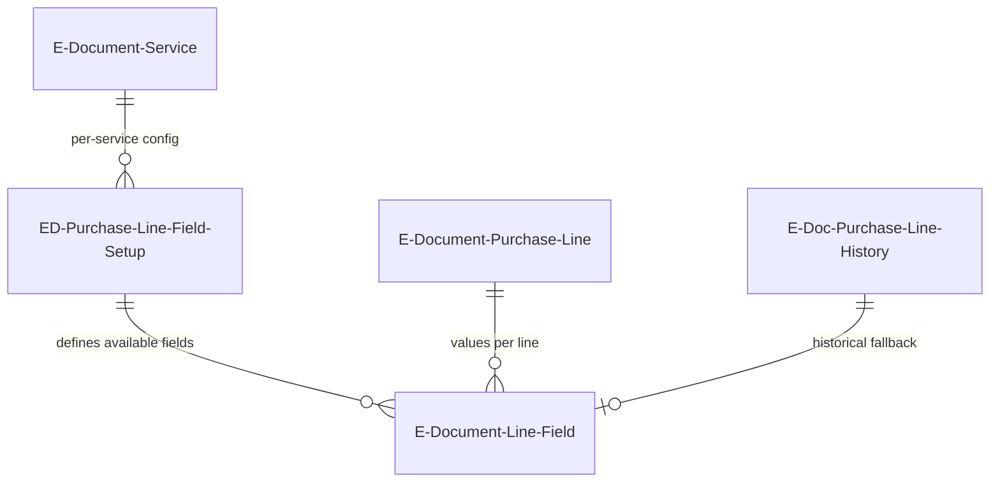

# Additional fields data model

## EAV structure

The additional fields system uses an Entity-Attribute-Value pattern to store arbitrary field values on e-document purchase lines without adding columns to the draft tables.

## Tables

**ED Purchase Line Field Setup** (6112) -- configuration table. Primary key is `(Field No., E-Document Service)`. Each record says "this Purch. Inv. Line field should be tracked for this service." The setup page lets admins toggle fields on/off, and `ApplySetup` persists or removes the record accordingly.

**E-Document Line - Field** (6110) -- value storage. Primary key is `(E-Document Entry No., Line No., Field No.)`. A physical record means the value was explicitly customized by the user. Absence of a record triggers historical lookup via the `Get` procedure. The return value is an option: `Customized`, `Historic`, or `Default`.

**EDoc. Purch. Line Field Setup** (6109) -- obsolete predecessor without per-service scoping. Removed in CLEAN26.

## Value resolution flow

When the draft page renders a line's additional field, the `Get` procedure on `E-Document Line - Field` executes:

1. Try `Rec.Get` with the composite key -- if found, it is a user customization
2. Look up `E-Doc. Purchase Line History` via the line's history ID
3. Open a RecordRef on `Purch. Inv. Line`, get by SystemId from history
4. Read the field value via FieldRef and store it in the appropriate typed column
5. If no history exists, return defaults (blank/zero)

This means the table is sparse -- only customized values are persisted. Historical and default values are computed on read.
