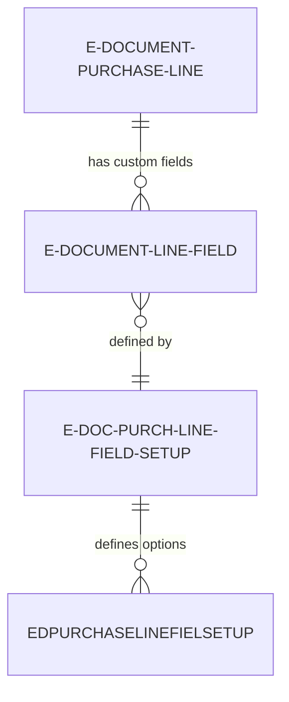
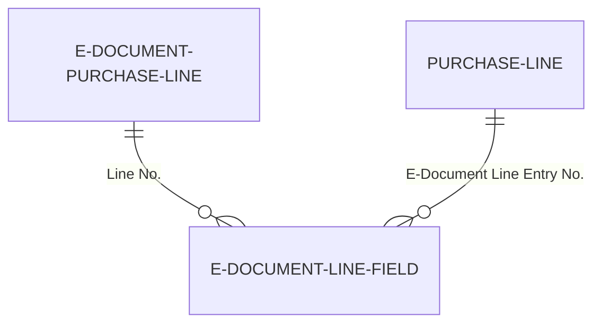

# Data model

Additional fields use EAV pattern to store custom field values extracted from e-documents.

## Storage tables

**E-Document Line - Field** -- Stores custom field values using Entity-Attribute-Value pattern. Primary key is (E-Document Entry No., Line No., Field No.). Contains value columns for each supported type: Text Value (2048 chars), Decimal Value, Date Value, Boolean Value, Code Value (2048 chars), Integer Value. Only one value column is populated per record based on field type. Includes "E-Document Service" field to filter by service-specific fields.

```al
table 6110 "E-Document Line - Field"
{
    fields
    {
        field(1; "E-Document Entry No."; Integer)
        field(2; "Line No."; Integer)
        field(3; "Field No."; Integer)
        field(4; "Text Value"; Text[2048])
        field(5; "Decimal Value"; Decimal)
        field(6; "Date Value"; Date)
        field(7; "Boolean Value"; Boolean)
        field(8; "Code Value"; Code[2048])
        field(9; "Integer Value"; Integer)
        field(10; "E-Document Service"; Code[20])
    }
}
```

## Configuration tables

**E-Doc. Purch. Line Field Setup** -- Defines custom field metadata per service. Fields include:
- Field No. (integer identifier, 50000+ range)
- Field Caption (display name)
- Field Type (enum: Text, Decimal, Date, Boolean, Code, Integer, Option)
- Default Value (text representation, converted to appropriate type)
- Mandatory (boolean, if true extraction fails if field missing)
- E-Document Service (filter for service-specific fields)

**EDPurchaseLineFieldSetup** -- Defines allowed option values for Option type fields. Fields include:
- Field No. (links to field definition)
- Option Value (code stored in E-Document Line - Field)
- Option Caption (display text shown in UI)
- Option Order (sort order in dropdowns)



## Type system

Custom fields support these data types:

**Text** -- General text values up to 2048 characters. Stored in "Text Value" column. Can be converted to Code or Integer during extraction.

**Decimal** -- Numeric values with decimal places. Stored in "Decimal Value" column. Formatted according to user's decimal separator settings.

**Date** -- Date values without time component. Stored in "Date Value" column. Extraction converts ISO date strings ("2024-03-15") to Date type.

**Boolean** -- True/false flags. Stored in "Boolean Value" column. Extraction accepts "true"/"false" strings, "1"/"0", "yes"/"no".

**Code** -- Fixed-length code values up to 2048 characters. Stored in "Code Value" column. Used for identifiers that should preserve leading zeros.

**Integer** -- Whole number values. Stored in "Integer Value" column. Extraction converts numeric strings to integers, failing if decimals present.

**Option** -- Enumerated values restricted to predefined list. Stored in "Code Value" column. Validated against EDPurchaseLineFieldSetup allowed values.

## Value retrieval

Reading custom field values uses type-specific logic:

```al
procedure GetTextValue(EDocEntryNo: Integer; LineNo: Integer; FieldNo: Integer): Text
var
    EDocLineField: Record "E-Document Line - Field";
begin
    if EDocLineField.Get(EDocEntryNo, LineNo, FieldNo) then
        exit(EDocLineField."Text Value");
end;

procedure GetDecimalValue(EDocEntryNo: Integer; LineNo: Integer; FieldNo: Integer): Decimal
var
    EDocLineField: Record "E-Document Line - Field";
begin
    if EDocLineField.Get(EDocEntryNo, LineNo, FieldNo) then
        exit(EDocLineField."Decimal Value");
end;
```

Generic retrieval requires field type lookup:

```al
procedure GetValue(EDocEntryNo: Integer; LineNo: Integer; FieldNo: Integer): Variant
var
    EDocLineField: Record "E-Document Line - Field";
    FieldSetup: Record "E-Doc. Purch. Line Field Setup";
begin
    if not EDocLineField.Get(EDocEntryNo, LineNo, FieldNo) then
        exit;
    FieldSetup.Get(FieldNo);
    case FieldSetup."Field Type" of
        FieldSetup."Field Type"::Text: exit(EDocLineField."Text Value");
        FieldSetup."Field Type"::Decimal: exit(EDocLineField."Decimal Value");
        // ... other types
    end;
end;
```

## Relationship to Purchase Line

Custom fields link to Purchase Line via E-Document Entry No. and Line No. references:

1. E-Document Purchase Line (temporary) has "Line No." field (primary key)
2. E-Document Line - Field has "Line No." field (foreign key)
3. During Finish step, Purchase Line gets "E-Document Line Entry No." field (extension)
4. After Finish, custom fields can be queried by Purchase Line's "E-Document Line Entry No."



## Cascade delete behavior

Custom field records are deleted when:

- E-Document is deleted (cascade from parent)
- Read step is undone (all extracted data removed)
- Individual line is deleted from imported data

Custom field records are preserved when:

- Prepare step is undone (only [BC] references cleared)
- Finish step is undone (Purchase Line deleted but imported data preserved)

This enables re-processing with different settings while preserving extracted custom field values.

## Performance considerations

E-Document Line - Field table can grow large with many custom fields per line. Optimization strategies:

- Index on (E-Document Entry No., Field No.) for field-specific queries
- Filter by "E-Document Service" when querying service-specific fields
- Archive old E-Document records periodically to reduce table size
- Use FlowFields to calculate field presence/value counts

For high-volume scenarios, consider batch-loading custom fields into temporary records during Finish step rather than individual Get calls per field per line.
