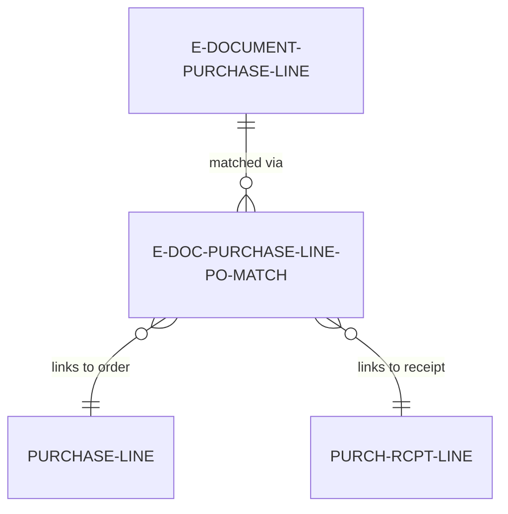
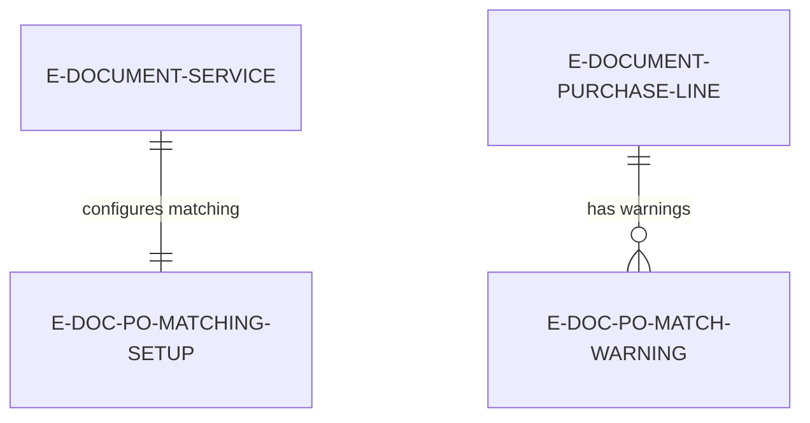

# Data model

Purchase order matching uses linking tables to connect imported lines to existing purchase orders with quantity and warning tracking.

## Match linkage table

**E-Doc. Purchase Line PO Match** -- Links imported invoice lines to purchase order lines. Primary key is SystemId (allows multiple matches per imported line for quantity splits). Fields:

- E-Doc. Purchase Line SystemId (Guid) -- References imported line
- Purchase Line SystemId (Guid) -- References PO line (blank if matching to receipt)
- Receipt Line SystemId (Guid) -- References receipt line (blank if matching to order)
- Matched Quantity (Decimal) -- Portion of imported line quantity matched to this PO/receipt line
- Matched Amount (Decimal) -- Portion of imported line amount matched (for split costing)
- Match Source (Enum: Manual, Copilot, Historical) -- How match was created
- Confidence (Decimal) -- Copilot confidence score (0.0-1.0, blank for manual)
- Match Date (DateTime) -- When match was created
- Confirmed (Boolean) -- User accepted Copilot suggestion (used for grounding)



## Configuration tables

**E-Doc. PO Matching Setup** -- Defines matching behavior per service. Fields:

- E-Document Service Code (Code[20]) -- Primary key
- Configuration (Enum) -- Match to order lines vs. receipt lines vs. disable matching
- Configuration Receipt (Enum) -- Receipt matching sub-options
- Match Scope Date Filter (DateFormula) -- How far back to look for candidate POs (e.g., -90D)
- Price Tolerance % (Decimal) -- Maximum allowed price variance before warning
- Quantity Tolerance % (Decimal) -- Maximum allowed quantity over-invoicing before warning
- Copilot Enabled (Boolean) -- Enable AI matching
- Copilot Confidence Threshold (Decimal) -- Minimum confidence for auto-accept (default 0.7)
- Auto-Match on Import (Boolean) -- Run Copilot during Prepare step (vs. manual trigger)

**E-Doc. PO Match Warning** -- Stores validation warnings for matched lines. Fields:

- E-Document Entry No. (Integer) -- Parent document
- E-Doc. Purchase Line No. (Integer) -- Imported line
- Purchase Document No. (Code[20]) -- Referenced PO number
- Purchase Line No. (Integer) -- Referenced PO line
- Warning Type (Enum: Price Variance, Quantity Exceeded, Item Mismatch, UOM Mismatch)
- Warning Message (Text[250]) -- Human-readable description
- Warning Severity (Enum: Info, Warning, Error) -- Impact level
- Variance Amount (Decimal) -- Calculated difference (price or quantity)
- Variance Percentage (Decimal) -- Calculated % difference
- Reviewed (Boolean) -- User acknowledged warning
- Reviewed By (Code[50]) -- User ID who reviewed
- Reviewed Date (DateTime) -- When reviewed



## Match query

**E-Doc. Line By Receipt** -- Query optimized for receipt line lookup. Joins:

- Purch. Rcpt. Line (posted receipt lines)
- Purchase Line (original order lines)
- Purchase Header (order headers for vendor filtering)

Columns:
- Receipt Line SystemId
- Receipt Document No. + Line No.
- Order Document No. + Order Line No.
- Item No. + Description
- Received Quantity
- Invoiced Quantity (via Posted Purchase Invoice Lines)
- Outstanding to Invoice (Received - Invoiced)
- Vendor No. (for filtering)

Used by E-Doc. Select Receipt Lines page to show candidate receipt lines for matching.

## Quantity split representation

Single imported line matched to multiple PO lines creates multiple match records:

```
Imported Line: Entry No. 123, Line No. 10000, Quantity = 100

Match Records:
1. PO #1 Line 10000, Matched Quantity = 60
2. PO #2 Line 10000, Matched Quantity = 40

Sum check: 60 + 40 = 100 (equals imported quantity)
```

During Finish step, system creates two Purchase Line records:

```
Purchase Invoice #INV-001:
  Line 10000: Order No. = PO #1, Order Line No. = 10000, Quantity = 60
  Line 20000: Order No. = PO #2, Order Line No. = 10000, Quantity = 40
```

Both lines link back to same imported line via "E-Document Line Entry No." = 10000.

## Warning table design

E-Doc. PO Match Warning uses separate records per warning type, enabling:

- Multiple warnings per line (price AND quantity issues)
- Independent review tracking per warning
- Historical analysis of common warning patterns

Example warnings:

```
Entry No. 123, Line 10000, PO #PO-001:
  Warning 1: Type = Price Variance, Message = "Invoice price $10.50 exceeds PO price $10.00 by 5%"
  Warning 2: Type = Quantity Exceeded, Message = "Invoice quantity 110 exceeds PO outstanding 100 by 10"
```

User can review and dismiss warnings individually. Dismissed warnings are marked Reviewed = true but remain in table for audit.

## Match persistence across steps

Match records persist through step transitions:

**After Prepare step:**
- Match records exist in E-Doc. Purchase Line PO Match table
- Status = "Prepare Done"
- User can review/modify matches before Finish

**After Finish step:**
- Match records preserved (not deleted)
- Purchase Lines created with Order No./Order Line No. from matches
- Match records enable audit trail: Invoice Line → Match Record → PO Line

**After undo Finish:**
- Purchase Lines deleted
- Match records preserved
- User can re-run Finish with same matches

**After undo Prepare:**
- Match records deleted (cascade)
- User must re-match after re-running Prepare

## Copilot suggestion buffer

**E-Doc. PO Match Prop. Buffer** -- Temporary table storing Copilot suggestions before user review. Fields:

- Imported Line No. (Integer)
- Imported Description (Text[250])
- Imported Quantity (Decimal)
- Imported Unit Price (Decimal)
- PO Document No. (Code[20])
- PO Line No. (Integer)
- PO Description (Text[250])
- PO Quantity Outstanding (Decimal)
- PO Unit Cost (Decimal)
- Confidence (Decimal) -- AI confidence score
- Match Reason (Text[500]) -- AI explanation
- Accepted (Boolean) -- User decision
- Status (Enum: Pending, Accepted, Rejected)

Temporary table is populated by Copilot, displayed in "Review Copilot Suggestions" page, then:
- Accepted suggestions → Create E-Doc. Purchase Line PO Match records
- Rejected suggestions → Log to Activity Log, discard buffer records

## Extension to Purchase Line

Purchase Line table is extended to store match information:

```al
tableextension "E-Doc. PO Match Ext" extends "Purchase Line"
{
    fields
    {
        field(6105; "E-Doc. Matched"; Boolean)
        {
            Caption = 'E-Doc. Matched';
            Editable = false;
        }
        field(6106; "E-Doc. Match Source"; Enum "E-Doc. Match Source")
        {
            Caption = 'E-Doc. Match Source';
            Editable = false;
        }
    }
}
```

These fields enable:
- Filtering purchase lines to show only e-document matched invoices
- Reporting on match source distribution (manual vs. Copilot vs. historical)
- Identifying which invoice lines were auto-matched for accuracy analysis
