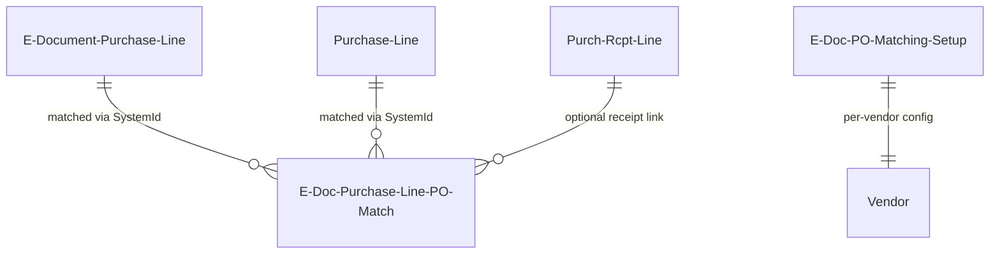

# Purchase order matching data model

## Matching relationships

The PO matching tables link e-document draft lines to purchase order lines and receipt lines for three-way verification.

## Tables

**E-Doc. Purchase Line PO Match** (6114) -- the core match record. Every field is a SystemId reference, making the table resilient to record renumbering. The composite primary key of three Guids means you can have many-to-many relationships: one e-doc line matched against multiple PO lines, or multiple e-doc lines against one PO line.

**E-Doc. PO Matching Setup** (6116) -- controls matching behavior. The `PO Matching Config. Receipt` enum determines whether receipt lines are auto-selected, always prompted, or skipped. The `Receive G/L Account Lines` boolean controls whether non-item lines go through the receipt flow. Vendor-specific overrides take priority over the global (blank vendor) setup.

## Query

**EDocLineByReceipt** -- a query object that joins `Purchase Line` with receipt data to compute available-to-match quantities. Used by the selection pages to show only lines with remaining receivable quantities.
