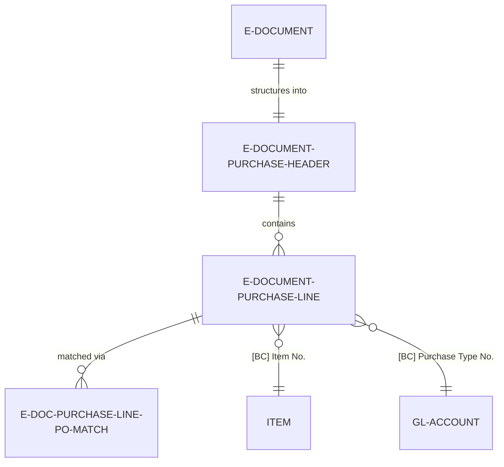
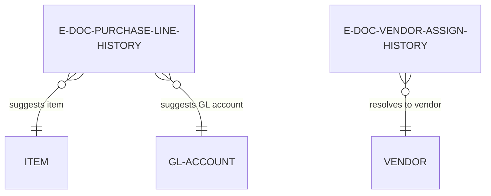

# Data model

The Purchase domain uses temporary staging tables with dual-field pattern for external-to-internal resolution.

## Staging tables

**E-Document Purchase Header** -- Temporary table storing extracted header data. Primary key is "E-Document Entry No." (unique per imported document). Contains 30+ fields organized into:

External identification fields (read-only after extraction):
- Customer Company Name (Text[250])
- Customer Company Id (Text[250])
- Vendor Company Name (Text[250])
- Vendor Address (Text[250])
- Vendor Tax ID (Text[50])
- Sales Invoice No. (Text[100])
- Purchase Order No. (Text[100])

Date fields:
- Invoice Date (Date)
- Due Date (Date)
- Document Date (Date)

Amount fields:
- Total Amount (Decimal)
- VAT Amount (Decimal)
- Subtotal Amount (Decimal)
- Currency Code (Text[10])

Business Central resolution fields (populated during Prepare):
- [BC] Vendor No. (Code[20])
- [BC] Currency Code (Code[10])
- [BC] Payment Terms Code (Code[10])
- [BC] Purchase Order No. (Code[20])

**E-Document Purchase Line** -- Temporary table storing extracted line data. Primary key is ("E-Document Entry No.", "Line No."). Contains 25+ fields:

External identification fields:
- Item No. (Text[100])
- Description (Text[250])
- GTIN (Code[50])
- Unit of Measure (Text[50])

Quantity and pricing fields:
- Quantity (Decimal)
- Quantity Received (Decimal)
- Unit Price (Decimal)
- Line Discount % (Decimal)
- Line Amount (Decimal)

Business Central resolution fields:
- [BC] Item No. (Code[20])
- [BC] Unit of Measure (Code[10])
- [BC] Purchase Type (Enum: Blank, Item, G/L Account, Charge (Item))
- [BC] Purchase Type No. (Code[20])



## History tables

**E-Doc. Purchase Line History** -- Tracks past purchase line patterns for AI matching. Fields:
- Description Hash (Code[50]) -- Hash of normalized description for fast lookup
- Description (Text[250]) -- Full line description
- Item No. (Code[20]) -- Most frequently used item for this description
- G/L Account No. (Code[20]) -- Most frequently used GL account
- Vendor No. (Code[20]) -- Vendor associated with this pattern
- Use Count (Integer) -- Frequency of this pattern
- Last Used Date (DateTime) -- Most recent occurrence

Rebuilt periodically via batch job that analyzes posted purchase invoice lines, grouping by description similarity and counting frequencies.

**E-Doc. Vendor Assign History** -- Tracks past vendor resolution patterns. Fields:
- External Vendor Name (Text[250]) -- Vendor name as appears in e-documents
- Vendor Name Variants (Text[500]) -- Comma-separated alternate names
- Vendor Tax ID (Text[50]) -- Tax identifier if available
- BC Vendor No. (Code[20]) -- Resolved Business Central vendor
- Assignment Count (Integer) -- Times this resolution was used
- Last Assignment Date (DateTime) -- Most recent use

Updated when user accepts vendor resolution or manually assigns vendor during review.



## Field mapping to Purchase Header/Line

During Finish step, temporary records transform to permanent records:

**Header mapping:**
```
E-Doc Purchase Header → Purchase Header
[BC] Vendor No. → Buy-from Vendor No.
Document Date → Document Date
Due Date → Due Date
Sales Invoice No. → Vendor Invoice No.
[BC] Currency Code → Currency Code
[BC] Payment Terms Code → Payment Terms Code
[BC] Purchase Order No. → (used to link PO if match-to-order)
```

**Line mapping:**
```
E-Doc Purchase Line → Purchase Line
[BC] Purchase Type → Type
[BC] Purchase Type No. → No.
Description → Description
Quantity → Quantity
Unit Price → Direct Unit Cost
Line Discount % → Line Discount %
[BC] Unit of Measure → Unit of Measure Code
(Line No. stored in "E-Document Line Entry No." extension field)
```

## Resolution field constraints

Business Central reference fields have validation rules:

**[BC] Vendor No.:**
- Must exist in Vendor table
- Vendor must not be blocked
- Mandatory for Finish step

**[BC] Item No.:**
- Must exist in Item table
- Item must not be blocked
- Item must be purchasable (Purchasing Blocked = false)
- Optional if [BC] Purchase Type = G/L Account

**[BC] Purchase Type No.:**
- If Type = Item: Must be valid Item No.
- If Type = G/L Account: Must be valid G/L Account No. with Direct Posting = true
- If Type = Charge (Item): Must be valid Item Charge No.
- Mandatory for Finish step

**[BC] Unit of Measure:**
- Must exist in Unit of Measure table
- If item assigned, must exist in Item Unit of Measure for that item
- Defaults to item's base UOM if not specified

**[BC] Currency Code:**
- Must exist in Currency table or be blank (LCY)
- Exchange rate must exist for document date if not LCY

Validation errors prevent Finish step from proceeding, requiring user to correct [BC] fields.

## Temporary record lifecycle

E-Document Purchase Header/Line records are temporary (in-memory) during import:

1. **Created**: Read step inserts temporary records with external values populated
2. **Enriched**: Prepare step populates [BC] fields via provider interfaces
3. **Reviewed**: User views/edits in E-Document Purchase Draft page
4. **Transformed**: Finish step reads temporary records, creates permanent Purchase Header/Line
5. **Deleted**: After Finish completes, temporary records are removed from memory

If import is cancelled or fails, temporary records are lost (no persistence). If Finish is undone, permanent Purchase Header/Line are deleted but temporary records are NOT recreated (user must undo to earlier step to recreate).

## Extension points

Purchase Header/Line tables are extended to link back to E-Document:

```al
tableextension 6100 "E-Doc. Purchase Header Ext" extends "Purchase Header"
{
    fields
    {
        field(6100; "E-Document Entry No."; Integer)
        {
            TableRelation = "E-Document"."Entry No";
        }
    }
}

tableextension 6101 "E-Doc. Purchase Line Ext" extends "Purchase Line"
{
    fields
    {
        field(6100; "E-Document Line Entry No."; Integer)
        {
            // Stores E-Document Purchase Line."Line No." for drill-back
        }
    }
}
```

These extensions enable:
- Drill-down from Purchase Invoice to source E-Document
- Audit trail linking posted documents to imported data
- Re-processing if needed (undo Finish, modify, re-finish)
