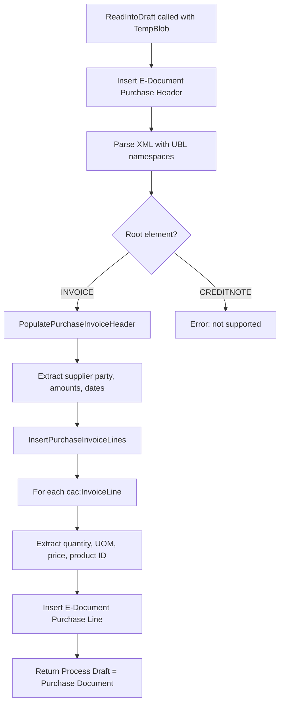

# Structure received E-Document business logic

## PEPPOL XML parsing

The `EDocumentPEPPOLHandler.ReadIntoDraft` procedure parses a UBL 2.1 Invoice XML document into draft tables. The flow is straightforward but has important ordering dependencies.

The header parsing extracts values in a specific priority order for vendor identification:

1. `AccountingSupplierParty/Party/PartyTaxScheme/CompanyID` for VAT ID
2. `AccountingSupplierParty/Party/EndpointID` with `schemeID="0088"` for GLN
3. `PayeeParty` fields as fallback when payee differs from seller

For invoice lines, product identification cascades: `SellersItemIdentification/ID` is tried first, then `StandardItemIdentification/ID`. Description is taken from `Item/Name`, with fallback to `Item/Description` and then the line `Note`.

## Structuring step logic

The structuring step in `ImportEDocumentProcess.StructureReceivedData` handles the transition from raw blob to structured data:

1. If no structuring implementation is specified on the E-Document, the file format's `PreferredStructureDataImplementation` is used
2. The structuring implementation runs and returns an `IStructuredDataType`
3. If the data was not "already structured", the original blob is saved as an attachment and the new structured content is logged
4. The `IStructuredDataType.GetReadIntoDraftImpl()` can override the reader implementation -- this is how ADI processing routes to its own JSON reader

The "Read into Draft" implementation follows a similar fallback chain: if the structuring step did not set one, and the E-Document does not have one, the service default is used.
