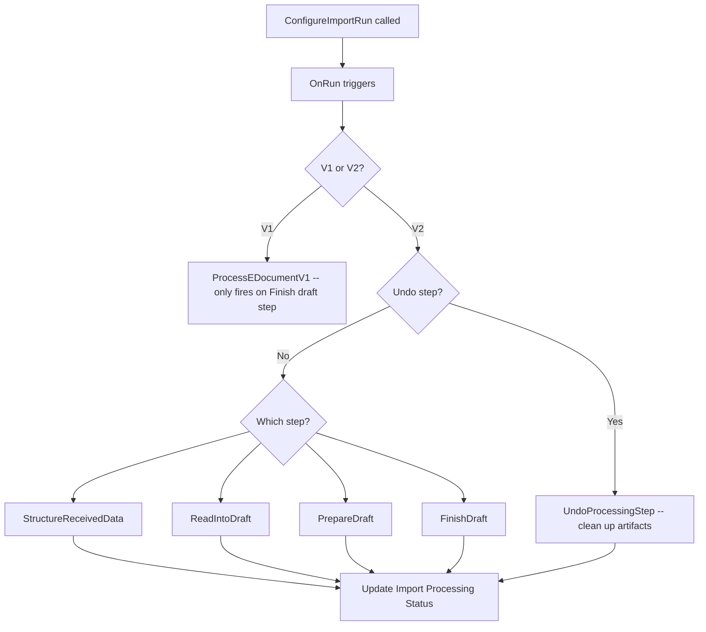

# Import business logic

## Pipeline step execution

Each step runs inside `Codeunit.Run` with a preceding `Commit()`. This means interface implementation failures are caught without rolling back the E-Document record. On failure, the error is logged and the import processing status is not advanced.

## Structure received data step

This step is where PDF-to-XML conversion happens. The file format's `PreferredStructureDataImplementation` determines the structuring strategy (ADI, MLLM, or "Already Structured" for XML/JSON).

When conversion produces structured output, the original unstructured blob is saved as an attachment on the E-Document, and the new structured content is stored as a new log entry. The `Structured Data Entry No.` on the E-Document points to this new entry. If the document was already structured (e.g., PEPPOL XML), the structured entry just points to the same blob as the unstructured entry.

The structuring step can also override the "Read into Draft" implementation. For example, ADI processing returns a JSON schema that requires the ADI-specific reader, overriding whatever the service default was.

## Prepare draft step

This is the most complex step. `PreparePurchaseEDocDraft` (the default `IProcessStructuredData` for purchase documents) performs:

1. Vendor resolution via `IVendorProvider` -- matches by GLN, VAT ID, service participant, or name+address
2. Purchase order lookup via `IPurchaseOrderProvider` -- matches against `Purchase Order No.` from the source
3. Historical mapping via `EDocPurchaseHistMapping` -- finds previous invoices for this vendor and copies header-level settings
4. Line-by-line resolution: UOM mapping, then item reference lookup, then text-to-account mapping
5. Copilot-powered matching in three passes: historical pattern matching, GL account matching, deferral matching

The Copilot matching is executed via `Codeunit.Run` on separate codeunits with `Commit()` barriers, so AI failures do not block the rest of the draft preparation.

## Finish draft step

Dispatched by `E-Document Type` enum. The purchase invoice finish draft creates a real `Purchase Header` and `Purchase Line` records, copies values from the draft tables (including additional fields from the EAV store), links the E-Document to the new document, and optionally links to an existing document if `Existing Doc. RecordId` was set in the import parameters.

Undo of this step deletes the created purchase document and clears the `Document Record ID` on the E-Document.
