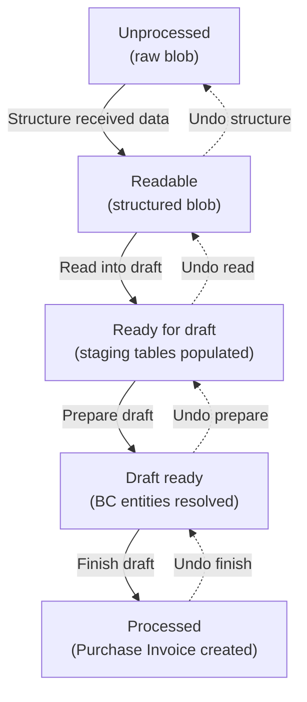

# Import pipeline business logic

## Pipeline overview

The pipeline is driven by `ImportEDocumentProcess.Codeunit.al`. Its `OnRun()` trigger checks the service's import process version. V1 services skip straight to a legacy code path. V2 services dispatch to one of four local procedures based on the configured step. After each step, the processing status is advanced (or rolled back for undo) and the E-Document status is recalculated.

## Stage 1 -- Structure received data

**Transition:** Unprocessed --> Readable

The E-Document arrives with an `Unstructured Data Entry No.` pointing to a raw blob in `E-Doc. Data Storage`. The Structure step loads that blob, resolves the file format via `IEDocFileFormat` (the enum value stored on the data storage record), and asks it for a `PreferredStructureDataImplementation()`.

For XML, the preferred implementation is `"Already Structured"` -- the blob is already parseable, so the unstructured and structured data entry numbers are set to the same value and nothing is converted. For PDF, the preferred implementation is `"ADI"` -- Azure Document Intelligence converts the binary into a JSON blob. The ADI handler (`EDocumentADIHandler.Codeunit.al`) base64-encodes the blob, calls `AzureDocumentIntelligence.AnalyzeInvoice()`, and stores the JSON result. If ADI fails (returns empty), it falls back to `"Blank Draft"` so the user can populate fields manually.

When the data is actually converted (i.e. not "Already Structured"), the original unstructured blob is saved as a document attachment on the E-Document for reference. The structured result is stored as a new `E-Doc. Data Storage` entry via the log, and its entry number goes into `E-Document."Structured Data Entry No."`.

The `IStructuredDataType` returned by the structure implementation also specifies which `IStructuredFormatReader` should be used in the next stage. If the structure step says ADI, the reader will be ADI. If it says nothing (`Unspecified`), the service's default reader is used. This chaining means a single PDF upload can auto-select the entire downstream pipeline.

## Stage 2 -- Read into draft

**Transition:** Readable --> Ready for draft

The structured blob is loaded and passed to the `IStructuredFormatReader` determined in Stage 1. Two readers ship in the core:

- **PEPPOL** (`EDocumentPEPPOLHandler.Codeunit.al`): Parses UBL 2.1 XML. Extracts vendor party info, invoice totals, currency, dates, and iterates `cac:InvoiceLine` nodes to create `E-Document Purchase Line` records. Uses XPath with UBL namespace prefixes.
- **ADI** (`EDocumentADIHandler.Codeunit.al`): Parses the ADI JSON schema. Maps ADI field names like `vendorName`, `invoiceId`, `productCode` to the staging table columns. Sets quantity to 1 when ADI returns zero or negative.

Both readers insert an `E-Document Purchase Header` and one `E-Document Purchase Line` per invoice line. These staging tables use **dual nomenclature**: fields 2-100 hold the raw external data exactly as extracted (e.g. `"Vendor Company Name"`, `"Product Code"`), while fields 101-200 hold validated BC references (e.g. `"[BC] Vendor No."`, `"[BC] Purchase Type No."`). At this stage, only the external-data columns are populated.

The reader returns an `E-Doc. Process Draft` enum value (currently only `"Purchase Document"`) that determines which `IProcessStructuredData` implementation runs in Stage 3.

## Stage 3 -- Prepare draft

**Transition:** Ready for draft --> Draft ready

This is where the system resolves external data into BC entities. `PreparePurchaseEDocDraft.Codeunit.al` implements `IProcessStructuredData` and orchestrates the resolution.

### Vendor resolution

`GetVendor()` delegates to `IVendorProvider`. The default provider (`EDocProviders.Codeunit.al`) tries a four-step waterfall:

1. **VAT ID + GLN** -- calls `EDocumentImportHelper.FindVendor()` with the extracted VAT ID and GLN
2. **Service Participant** -- looks up the vendor's external ID in the `Service Participant` table, first scoped to the specific service, then across all services
3. **Name + Address** -- calls `FindVendorByNameAndAddress()` as a last resort
4. **Historical** -- if the direct provider returns nothing, `EDocPurchaseHistMapping.FindRelatedPurchaseHeaderInHistory()` searches `E-Doc. Vendor Assign. History` by GLN, then VAT ID, then company name, then address (most specific first, most recent first). If a match is found, the vendor number is copied from the linked posted purchase invoice header.

### Line enrichment

For each `E-Document Purchase Line`, the pipeline resolves:

- **Unit of Measure** via `IUnitOfMeasureProvider` -- tries Code, then International Standard Code, then Description
- **Purchase line type and number** via `IPurchaseLineProvider` -- the default implementation tries Item Reference first (filtering by vendor, product code, UOM, and date validity), then falls back to Text-to-Account Mapping. Each successful match writes an Activity Log entry explaining the reasoning.

### Purchase order matching

`IPurchaseOrderProvider.GetPurchaseOrder()` checks if the `"Purchase Order No."` extracted from the document matches an existing PO. If found, the PO number is stored on the purchase header's `[BC] Purchase Order No.` field for use during Finish Draft.

### Copilot-assisted matching

After the direct resolution pass, three Copilot codeunits run sequentially on lines that still lack a `[BC] Purchase Type No.`:

1. **Historical matching** (`E-Doc. Historical Matching`) -- searches `E-Doc. Purchase Line History` for past invoices with the same product code or similar description from the same vendor. Applies the posted line's type, number, deferral code, dimensions, and UOM to the draft.
2. **GL account matching** (`E-Doc. GL Account Matching`) -- uses AI to suggest a G/L account for lines with no item match.
3. **Deferral matching** (`E-Doc. Deferral Matching`) -- for lines that have a type but no deferral code, suggests a deferral template.

Each step commits before invoking the next to isolate failures. Deferral matching swallows errors silently to avoid blocking the pipeline.

## Stage 4 -- Finish draft

**Transition:** Draft ready --> Processed

`IEDocumentFinishDraft.ApplyDraftToBC()` creates the actual BC document. The default implementation (`EDocCreatePurchaseInvoice.Codeunit.al`) performs:

1. **Validation**: Checks that all draft lines have a type and number. Verifies PO match validity -- matched lines must be receivable and have UOM info.
2. **Receipt suggestion**: For lines matched to PO lines, `SuggestReceiptsForMatchedOrderLines()` proposes receipt lines.
3. **Invoice creation**: Creates a `Purchase Header` (type Invoice), sets vendor, dates, currency, and vendor invoice number. Checks for duplicate external document numbers. Inserts lines without PO matches first, then lines grouped by receipt number with comment-line separators.
4. **PO match transfer**: `TransferPOMatchesFromEDocumentToInvoice()` moves match records from the E-Document to the purchase invoice.
5. **Traceability**: `EDocRecordLink.InsertEDocumentHeaderLink()` and `InsertEDocumentLineLink()` create `E-Doc. Record Link` entries linking draft records to their BC counterparts via SystemId.
6. **Post-creation**: Copies document attachments from the E-Document to the purchase header, applies invoice discount, sets `E-Document Link` GUID on the purchase header, and validates document totals.

Alternatively, if `EDocImportParameters."Existing Doc. RecordId"` is set, no new invoice is created -- the E-Document is linked to an existing purchase document instead.

### Undo finish

`RevertDraftActions()` finds the purchase invoice via the `E-Document Link` GUID, transfers PO matches back to the E-Document, moves attachments back, clears the link, and clears `Document Record ID`. The purchase invoice itself is not deleted -- it must be handled separately.

## The learning loop

When a purchase invoice created by this pipeline is posted, event subscribers on `Purch.-Post` fire:

- `OnAfterPurchInvLineInsert` writes to `E-Doc. Purchase Line History` -- recording the vendor, product code, description, and the posted invoice line's SystemId. The link is found by traversing `E-Doc. Record Link` from the purchase line back to the draft line.
- `OnAfterPostPurchaseDoc` writes to `E-Doc. Vendor Assign. History` -- recording the vendor identifiers from the original E-Document draft header and the posted invoice header's SystemId.

Both event subscribers then delete the `E-Doc. Record Link` entries since the link has been "graduated" to permanent history. This means the history tables grow monotonically and future imports get progressively better at vendor and line resolution.
