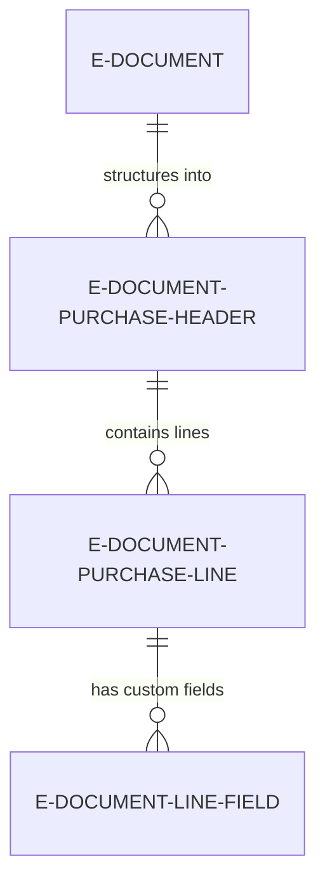
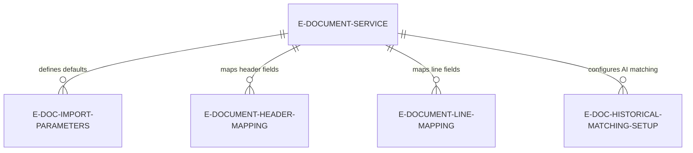

# Data model

The Import subsystem uses staging tables to transform external data into Business Central purchase documents across 4 processing steps.

## Core staging tables

**E-Document Purchase Header** -- Temporary table storing extracted header data before transformation to Purchase Header. Fields include external identifiers (Vendor Company Name, Sales Invoice No., Purchase Order No.), dates (Invoice Date, Due Date, Document Date), amounts (Total Amount, VAT Amount), and Business Central references ([BC] Vendor No., [BC] Currency Code). Records are temporary during Structure/Read/Prepare steps, deleted after Finish creates real Purchase Header.

**E-Document Purchase Line** -- Temporary table storing extracted line data before transformation to Purchase Line. Fields include external identifiers (Item No., Description), quantities (Quantity, Quantity Received), pricing (Unit Price, Line Discount %), and Business Central references ([BC] Item No., [BC] Unit of Measure, [BC] Purchase Type, [BC] Purchase Type No.). Records are temporary during Structure/Read/Prepare steps, deleted after Finish creates real Purchase Line.

**E-Document Line - Field** -- Stores additional custom field values extracted from e-documents that don't map to standard Purchase Line fields. Supports Text, Decimal, Date, Boolean, Code, Integer value types. Used for format-specific extensions (custom tax fields, delivery instructions, compliance data) that need to be preserved but aren't part of standard Business Central purchase documents.



## Configuration tables

**E-Doc. Import Parameters** -- Defines default processing settings per service. Fields include "Step to Run / Desired Status" (single step or target status), "Desired E-Document Status" (stop point for automatic processing), "MLLM Enabled" (AI extraction toggle), "Line Matching Scope" (filter for PO line candidates), "Vendor Matching Scope" (historical vendor matching constraints). Parameters can be overridden per-document when calling ProcessIncomingEDocument.

**E-Document Header Mapping** -- RecordRef-based mapping rules for header fields. Defines source path (XPath/JSONPath), target field (Purchase Header field no.), and transformation rule (external code to internal code conversion). Used by ADI extraction to populate E-Document Purchase Header from structured XML/JSON.

**E-Document Line Mapping** -- RecordRef-based mapping rules for line fields. Same structure as header mapping but targets Purchase Line fields. Supports formula evaluation (Quantity * Unit Price) and transformation rules.

**E-Doc. Historical Matching Setup** -- Configuration for AI-powered historical matching. Specifies date range for analyzing past purchases (last 90 days default), minimum confidence threshold (0.7 default), and enabled matching types (vendor assignment, GL account assignment).



## Status tracking

**Import E-Doc. Proc. Status** enum tracks processing progress:
- Unprocessured -- Document imported but not processed
- Structure Done -- Structured data created
- Read Done -- Header/line data extracted
- Prepare Done -- Master data resolved
- Finish Done -- Purchase draft created

**Import E-Document Steps** enum defines individual operations:
- Structure received data
- Read into Draft
- Prepare draft
- Finish draft

E-Document Service Status table stores "Import Processing Status" (calculated from step completion flags) and individual Boolean flags for each step. The status is recalculated after each step or undo operation.

## Mapping and transformation

Mapping tables use RecordRef pattern to avoid hardcoded field references:

```al
HeaderMapping.SetRange("E-Document Service Code", EDocumentService.Code);
if HeaderMapping.FindSet() then
    repeat
        SourceValue := StructuredDataReader.GetValue(HeaderMapping."Source Path");
        TargetRecordRef.GetTable(TempPurchaseHeader);
        TargetFieldRef := TargetRecordRef.Field(HeaderMapping."Target Field No.");
        if HeaderMapping."Transformation Rule" <> '' then
            SourceValue := TransformationRule.TransformText(SourceValue, HeaderMapping."Transformation Rule");
        TargetFieldRef.Value := SourceValue;
    until HeaderMapping.Next() = 0;
```

This enables mapping configuration via UI without code changes. Transformation Rules reference System.Transformations table for complex conversions (unit code mappings, date format conversions, text replacements).

## Purchase draft lifecycle

Temporary E-Document Purchase Header/Line records exist only during import processing. They are:

1. Created during Read step with external values populated
2. Enriched during Prepare step with [BC] reference fields populated
3. Transformed during Finish step into real Purchase Header/Line records
4. Deleted after Finish completes successfully

Real Purchase Header/Line records link back to E-Document via "E-Document Entry No." and "E-Document Line Entry No." fields (extensions to standard tables). This enables:

- Audit trail from purchase document to source e-document
- Drill-down from purchase line to original imported line data
- Undo Finish to delete purchase drafts and re-generate with different settings

## Additional field handling

E-Document Line - Field table uses EAV (Entity-Attribute-Value) pattern to store arbitrary custom fields:

```al
EDocLineField."E-Document Entry No." := 12345;
EDocLineField."Line No." := 10000;
EDocLineField."Field No." := 50100; // Custom field identifier
EDocLineField."Text Value" := 'Custom value';
EDocLineField.Insert();
```

Fields are identified by integer "Field No." which maps to service-specific field definitions in E-Doc. Purch. Line Field Setup table. This enables partners to extend imported data with format-specific fields without modifying base tables.

## Historical data for AI matching

**E-Doc. Purchase Line History** -- Snapshot of past purchase invoice lines used by AI matching. Stores description, item no., GL account no., vendor no., and frequency counts. Rebuilt periodically to reflect recent purchasing patterns.

**E-Doc. Vendor Assign History** -- Tracks past vendor assignments made during import, enabling AI to suggest vendors based on invoice patterns (company name variations, tax ID changes).

Historical matching queries these tables to find similar past purchases, using AOAI Function to score similarity and suggest assignments.
