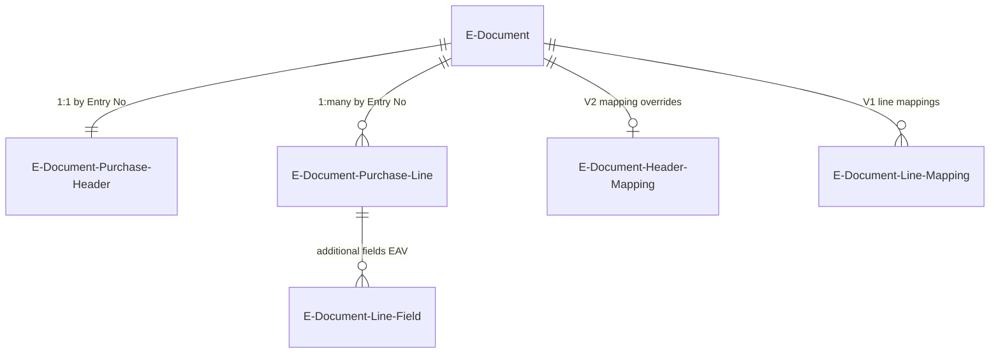

# Import data model

## Draft tables

The V2 import pipeline stages external data into draft tables before creating real BC documents. The `E-Document Purchase Header` and `E-Document Purchase Line` tables hold two categories of fields: raw external data (vendor name, product codes, amounts as received) and `[BC]` prefixed fields (resolved vendor no., item no., UOM code). This separation makes it obvious which values came from the source document vs which were resolved by the system.

## Mapping tables

`E-Document Header Mapping` (6102) stores V2 per-document overrides for vendor and purchase order number. It is keyed by E-Document Entry No and is created/deleted during the prepare draft step.

`E-Document Line Mapping` (6105) is the V1 equivalent for lines. It stores user-chosen purchase line type, type number, UOM, deferral code, dimensions, and item reference. In V2, this role is filled by the `[BC]` fields directly on `E-Document Purchase Line`.

## Import parameters

`E-Doc. Import Parameters` (6106) is a temporary table -- it exists only for the duration of a processing call. It carries:

- Whether to target a specific step or a desired status
- V1-specific options (create journal line vs purchase document)
- An `Existing Doc. RecordId` for linking to pre-existing documents instead of creating new ones

The service provides default import parameters via `GetDefaultImportParameters`, which the automatic import job uses. Manual processing can override these.

## Status progression

Import Processing Status lives on `E-Document Service Status`, not on the draft tables. It flows through five values:

- **Unprocessed** -- blob received, nothing parsed
- **Readable** -- structured data exists (XML/JSON from PDF conversion or already-structured source)
- **Ready for draft** -- draft tables populated with raw + resolved values
- **Draft ready** -- vendor assigned, items matched, ready for document creation
- **Processed** -- real BC document created and linked
