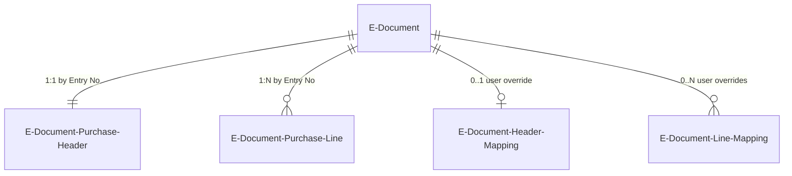
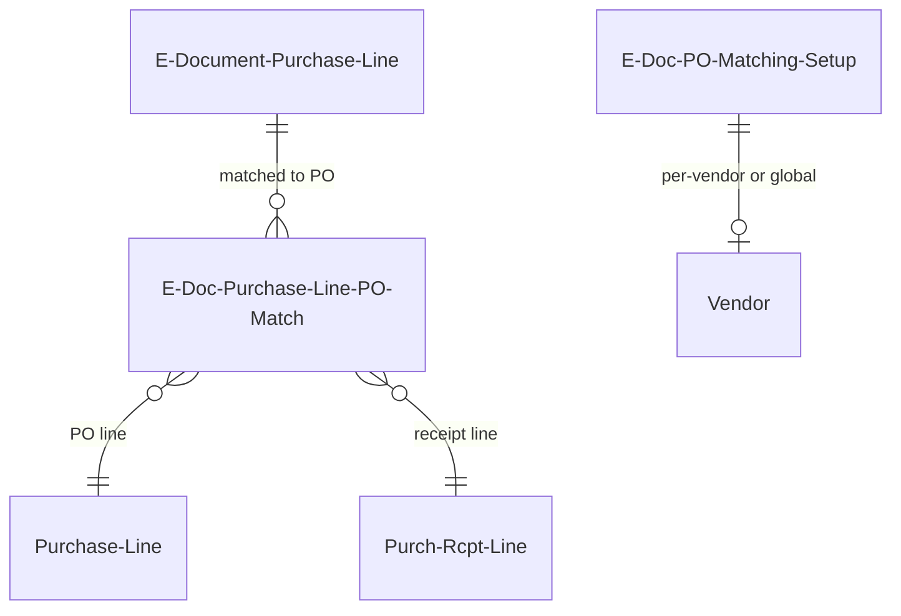
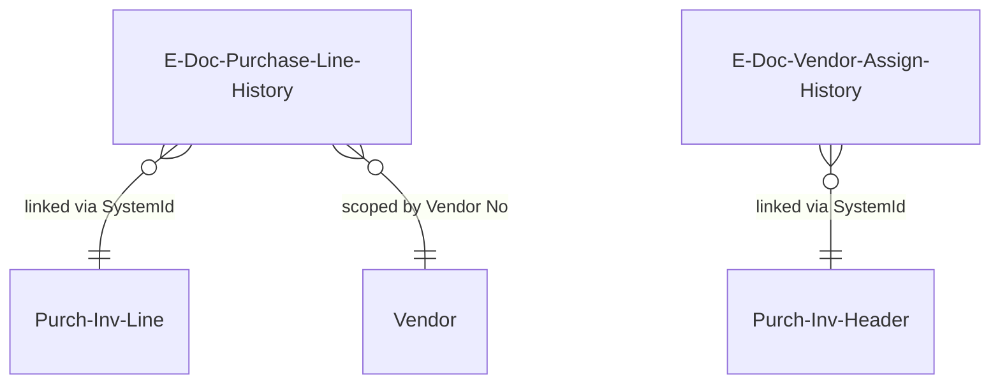
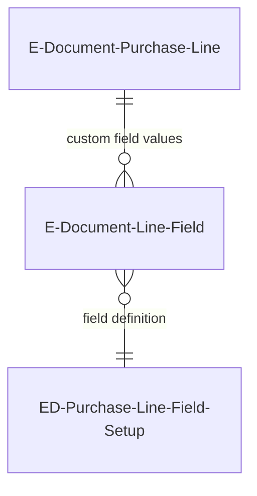

# Import data model

## Draft purchase documents

The core staging area for incoming e-documents. The `E-Document` record is the
parent; the purchase header and line tables hold the parsed data; mapping tables
capture user overrides.

`E-Document Purchase Header` (`EDocumentPurchaseHeader.Table.al`) and `E-Document
Purchase Line` (`EDocumentPurchaseLine.Table.al`) use a deliberate split-field design.
Fields 2-100 hold external data extracted from the incoming file (vendor name, product
code, amounts) -- these are read-only once populated. Fields 101+ hold BC-resolved
values (prefixed `[BC]` in the caption: `[BC] Vendor No.`, `[BC] Purchase Line Type`,
`[BC] Purchase Type No.`). The BC fields are editable by the user on the draft page
and are what the Finish draft step uses to create the real purchase document.

`E-Document Header Mapping` (`EDocumentHeaderMapping.Table.al`) captures user
overrides at the header level -- primarily vendor number and purchase order number.
`E-Document Line Mapping` (`EDocumentLineMapping.Table.al`) captures line-level
overrides: purchase line type, item/GL account number, UOM, deferral code, dimensions,
item reference, and variant code. These mapping records persist across re-processing
so the user does not lose manual corrections.

Both purchase draft tables are ephemeral -- they are created during Read into Draft
and deleted when the e-document reaches Processed status or is deleted.

## Purchase order matching

For the three-way match scenario (invoice against PO and receipt), a separate set
of tables tracks the matching configuration and results.

`E-Doc. Purchase Line PO Match` (`EDocPurchaseLinePOMatch.Table.al`) records the
finalized three-way match. Its composite key is (E-Doc Purchase Line SystemId,
Purchase Line SystemId, Receipt Line SystemId) -- one draft line can match to
multiple PO line + receipt line combinations.

`E-Doc. PO Matching Setup` (`EDocPOMatchingSetup.Table.al`) controls matching
behavior. It can be scoped to a specific vendor via `"Vendor No."` or left blank
for a global default. The `GetSetup` procedure tries vendor-specific first, then
falls back to global. Key settings include receipt matching configuration and whether
to receive G/L account lines.

## Historical learning

After a purchase invoice is posted, the system captures the mapping decisions as
immutable history records. These are used to auto-resolve future e-documents from the
same vendor.

`E-Doc. Purchase Line History` (`EDocPurchaseLineHistory.Table.al`) stores the
product code and description from the draft line alongside the SystemId of the posted
`Purch. Inv. Line` it was mapped to. The table has multiple secondary keys optimized
for lookup: (Vendor No., Product Code, Description), (Vendor No., Product Code), and
(Vendor No., Description). This is what enables historical matching during the Prepare
draft step -- the system finds prior confirmed mappings for the same vendor and
product code.

`E-Doc. Vendor Assign. History` (`EDocVendorAssignHistory.Table.al`) stores the
vendor identification fields from the e-document header (company name, address, VAT
ID, GLN) alongside the SystemId of the posted `Purch. Inv. Header`. The `"Vendor No
From Purch. Header"` FlowField resolves the actual vendor number. This enables
automatic vendor assignment for future e-documents with matching identification data.

Both history tables are append-only. They grow over time as more invoices are
processed and provide progressively better auto-matching.

## Additional fields

The additional fields mechanism provides extensibility for service-specific data on
draft lines that does not fit into the standard purchase line fields.

`E-Document Line - Field` (`EDocumentLineField.Table.al`) is a key-value store keyed
by (E-Document Entry No., Line No., Field No.). It supports multiple typed value
columns (Text, Decimal, Date, Boolean, Code, Integer) so the caller picks the
appropriate one. The `"E-Document Service"` field scopes the custom field to a
specific service.

`ED Purchase Line Field Setup` (`EDocPurchLineFieldSetup.Table.al`) defines the
available custom fields -- their names, types, and which service they belong to. The
AdditionalFields/ subfolder includes pages for setup and editing.

## Cross-cutting patterns

**External vs BC-resolved field split**: The draft tables consistently use fields
2-100 for external data and 101+ for BC-resolved data. This is a deliberate design
decision -- it keeps the original document data immutable while allowing the BC
mapping to be independently corrected and re-run.

**SystemId linking**: The framework uses SystemId (Guid) rather than RecordId for
cross-table references, particularly in `E-Doc. Record Link`, `E-Doc. Purchase Line
PO Match`, and the history tables. SystemId survives record modifications and is
globally unique, which matters because draft records are frequently modified during
processing.

**Ephemeral lifecycle**: Draft tables (`E-Document Purchase Header`, `E-Document
Purchase Line`, `E-Doc. Record Link`) exist only during active processing. They are
created during Read into Draft and cleaned up during Finish draft. If the user deletes
the created purchase document, the framework undoes the Finish draft step and restores
the Draft ready state, recreating the ephemeral records.
