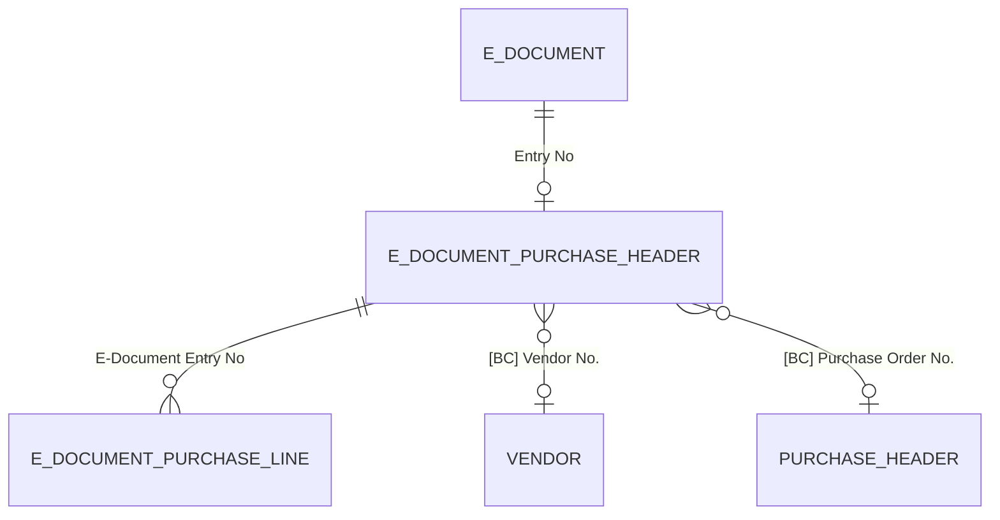
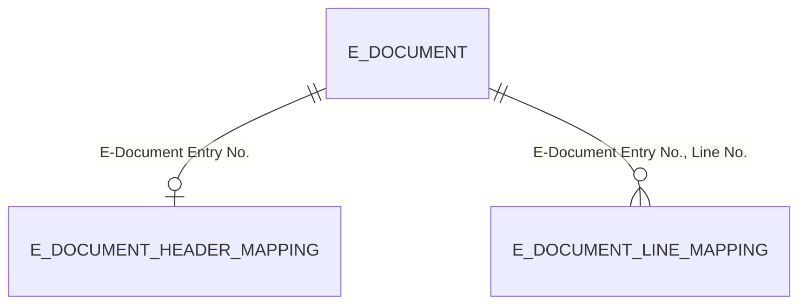
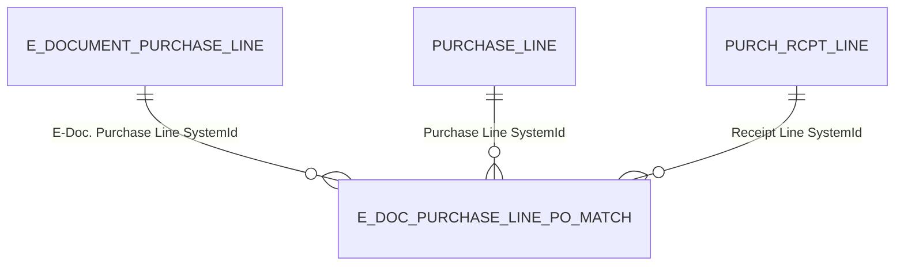
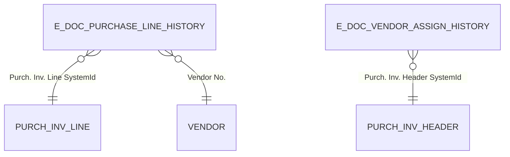
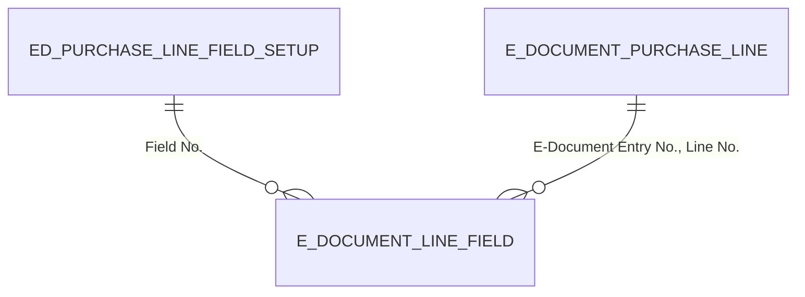

# Import pipeline data model

## Purchase staging tables

The staging tables hold the intermediate representation of an imported document between the Read and Finish stages. They use **dual nomenclature**: fields 2-100 store raw external data exactly as extracted from the source document, while fields 101-200 store validated BC entity references populated during Prepare Draft.

**E-Document Purchase Header** (`Purchase/EDocumentPurchaseHeader.Table.al`, table 6100) is keyed on `E-Document Entry No.` (one-to-one with E-Document). External fields include `Vendor Company Name`, `Vendor VAT Id`, `Vendor GLN`, `Purchase Order No.`, `Sales Invoice No.`, address blocks, and monetary totals. BC fields are `[BC] Vendor No.` and `[BC] Purchase Order No.`.

**E-Document Purchase Line** (`Purchase/EDocumentPurchaseLine.Table.al`, table 6101) is keyed on `(E-Document Entry No., Line No.)`. External fields include `Product Code`, `Description`, `Quantity`, `Unit Price`, `Unit of Measure`, and `Currency Code`. BC fields include `[BC] Purchase Line Type`, `[BC] Purchase Type No.`, `[BC] Unit of Measure`, `[BC] Deferral Code`, `[BC] Item Reference No.`, `[BC] Variant Code`, `[BC] Dimension Set ID`, and shortcut dimension codes. The `E-Doc. Purch. Line History Id` metadata field links to the historical match that populated the BC fields, if any.

The staging tables are writable by the user through the `E-Document Purchase Draft` page. When the user changes a `[BC]` field on a line that has PO matches, an `OnValidate` trigger confirms removal of those matches before proceeding.

## Header and line mappings

**E-Document Header Mapping** (table 6102) stores validated BC overrides for the header -- `Vendor No.` and `Purchase Order No.` -- applied during Finish Draft. Deleted when Prepare Draft is undone.

**E-Document Line Mapping** (table 6105) stores validated BC overrides per line -- purchase line type/number, UOM, deferral code, dimensions, item reference, variant code, and a history ID. These are the "confirmed" values that override what the provider chain suggested.

## Purchase order matching

**E-Doc. Purchase Line PO Match** (`Purchase/PurchaseOrderMatching/EDocPurchaseLinePOMatch.Table.al`, table 6114) is the N:M junction table linking e-document draft lines to purchase order lines and optionally to receipt lines. The composite key is `(E-Doc. Purchase Line SystemId, Purchase Line SystemId, Receipt Line SystemId)` -- all three are Guid fields using SystemId references.

`EDocPOMatching.Codeunit.al` manages this table: loading available PO lines for matching (filtering by vendor and optionally by order number), verifying match validity, suggesting receipts for matched lines, and transferring matches between E-Document and Purchase Invoice during Finish Draft / Undo Finish.

## Historical learning

**E-Doc. Purchase Line History** (`Purchase/History/EDocPurchaseLineHistory.Table.al`, table 6140) records what BC entities were assigned to past draft lines. Key fields: `Vendor No.`, `Product Code`, `Description`, and `Purch. Inv. Line SystemId`. Four secondary keys enable flexible lookup: by `(Vendor No., Product Code, Description)`, by `(Product Code, Description)`, by `(Vendor No., Product Code)`, and by `(Vendor No., Description)`. The history search in `EDocPurchaseHistMapping.FindRelatedPurchaseLineInHistory()` tries product code first, then exact description match, then prefix match, then substring match -- all scoped to the same vendor and sorted most-recent-first.

**E-Doc. Vendor Assign. History** (`Purchase/History/EDocVendorAssignHistory.Table.al`, table 6108) records past vendor identifier-to-vendor-number mappings. Key fields: `Vendor Company Name`, `Vendor Address`, `Vendor VAT Id`, `Vendor GLN`, and `Purch. Inv. Header SystemId`. The `Vendor No From Purch. Header` FlowField resolves the vendor number from the posted invoice. When the same identifier combination appears again, the existing record is updated rather than duplicated.

Both tables are populated by `EDocPurchaseHistMapping.Codeunit.al` via event subscribers on `Purch.-Post`. The `E-Doc. Record Link` entries that connect draft records to BC records are consumed during this process and then deleted -- they serve as temporary bridges that are "graduated" to permanent history on posting.

## Record links

**E-Doc. Record Link** (`../EDocRecordLink.Table.al`, table 6141) provides SystemId-based links between draft staging records and BC records created during Finish Draft. Each entry stores source table/SystemId and target table/SystemId. Two links are created per line (draft line --> purchase line) plus one per header (draft header --> purchase header). These links serve two purposes: they allow navigation from draft records to their BC counterparts, and they are the mechanism by which the posting event subscribers find the original draft data to populate the history tables.

## Additional fields

**ED Purchase Line Field Setup** (`AdditionalFields/EDPurchaseLineFieldSetup.Table.al`, table 6112) defines which `Purch. Inv. Line` fields should be tracked as additional columns on draft lines, scoped per E-Document Service. Fields that already exist on the staging tables (Type, No., UOM, etc.) are automatically omitted.

**E-Document Line - Field** (`AdditionalFields/EDocumentLineField.Table.al`, table 6110) is a polymorphic value store keyed on `(E-Document Entry No., Line No., Field No.)`. It has six typed value columns: `Text Value`, `Decimal Value`, `Date Value`, `Boolean Value`, `Code Value`, and `Integer Value`. The `Get()` procedure implements a three-tier resolution: if a physical record exists, it returns `Customized`. Otherwise, it looks up the `E-Doc. Purch. Line History Id` on the draft line to find the posted invoice line and reads the value from history, returning `Historic`. If neither exists, it returns `Default` with blank values. During Finish Draft, `ApplyAdditionalFieldsFromHistoryToPurchaseLine()` validates these values onto the actual purchase line via FieldRef.

## Import parameters

**E-Doc. Import Parameters** (table 6106) is a **temporary** table that configures a single pipeline execution. Key fields: `Processing Customizations` (which provider enum to use), `Step to Run` / `Desired E-Document Status` (forward to a step or target a status), `Existing Doc. RecordId` (link to existing document instead of creating), and V1 compatibility flags. Being temporary, it exists only in memory during the import call.
