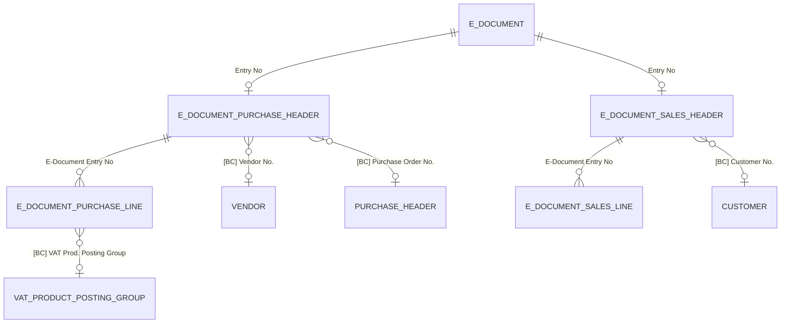
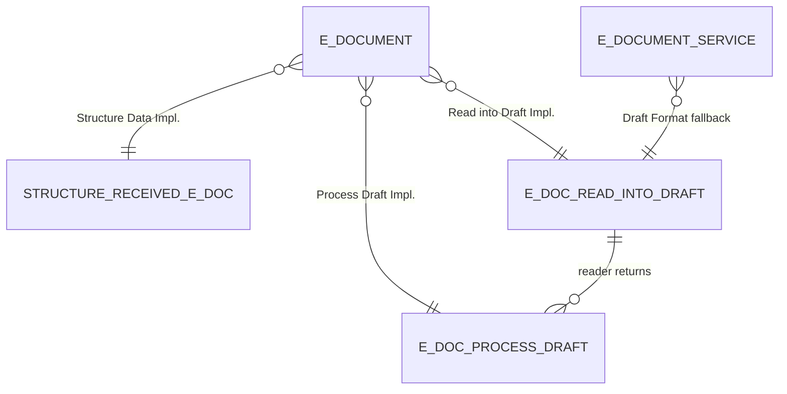
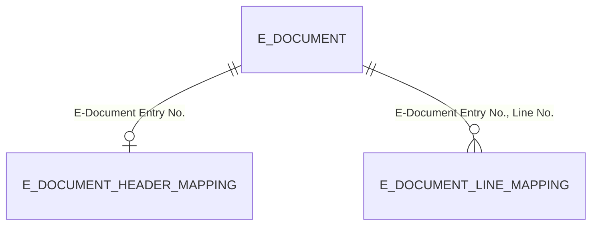
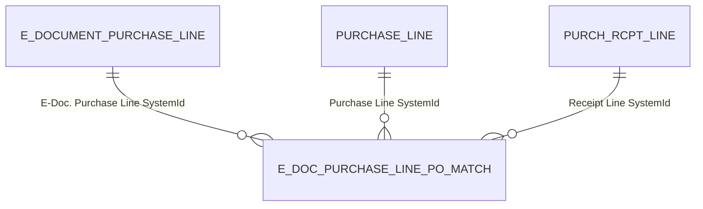
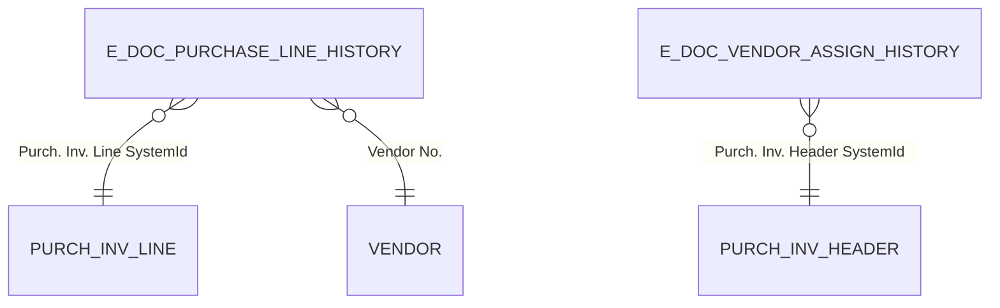
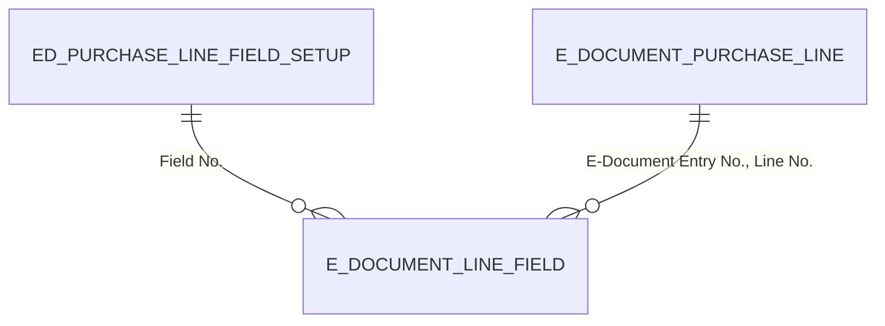

# Import pipeline data model

## Draft staging tables

*Updated: 2026-07-29 -- Staging now covers purchase invoices, purchase credit memos, and inbound sales orders.*

The staging tables hold the intermediate representation of an imported document between the Read and Finish stages. They use **dual nomenclature**: fields 2-100 store raw external data exactly as extracted from the source document, while fields 101-200 store validated BC entity references populated during Prepare Draft or by the user.

```mermaid
erDiagram
    E_DOCUMENT ||--o| E_DOCUMENT_PURCHASE_HEADER : "Entry No"
    E_DOCUMENT_PURCHASE_HEADER ||--o{ E_DOCUMENT_PURCHASE_LINE : "E-Document Entry No"
    E_DOCUMENT_PURCHASE_HEADER }o--o| VENDOR : "[BC] Vendor No."
    E_DOCUMENT_PURCHASE_HEADER }o--o| PURCHASE_HEADER : "[BC] Purchase Order No."
    E_DOCUMENT ||--o| E_DOCUMENT_SALES_HEADER : "Entry No"
    E_DOCUMENT_SALES_HEADER ||--o{ E_DOCUMENT_SALES_LINE : "E-Document Entry No"
    E_DOCUMENT_SALES_HEADER }o--o| CUSTOMER : "[BC] Customer No."
    E_DOCUMENT_PURCHASE_LINE }o--o| VAT_PRODUCT_POSTING_GROUP : "[BC] VAT Prod. Posting Group"
```

**E-Document Purchase Header** (`Purchase/EDocumentPurchaseHeader.Table.al`, table 6100) is keyed on `E-Document Entry No.`. It represents both purchase invoices and purchase credit memos. External fields include supplier and customer identity, purchase order number, supplier invoice number, document date, due date, posting description, applies-to references, address blocks, currency, and monetary totals. BC fields are `[BC] Vendor No.` and `[BC] Purchase Order No.`. The table also computes the usable VAT amount difference from setup and staged line VAT amounts.

**E-Document Purchase Line** (`Purchase/EDocumentPurchaseLine.Table.al`, table 6101) is keyed on `(E-Document Entry No., Line No.)`. External fields include product code, description, quantity, UOM, unit price, subtotal, discount, VAT rate, and currency. BC fields include purchase line type and number, UOM, deferral code, dimensions, item reference, variant, and `[BC] VAT Prod. Posting Group`. The `E-Doc. Purch. Line History Id` metadata field links to the historical match that populated the BC fields, if any.

**E-Document Sales Header** (`Sales/EDocumentSalesHeader.Table.al`, table 6153) is keyed on `E-Document Entry No.`. It stages inbound PEPPOL orders. External fields describe buyer, seller, originator, accounting customer, buyer order number, seller sales order number, document date, requested delivery date, note, customer reference, order type code, currency, and totals. The BC field is `[BC] Customer No.`.

**E-Document Sales Line** (`Sales/EDocumentSalesLine.Table.al`, table 6154) is keyed on `(E-Document Entry No., Line No.)`. It stages order lines with buyer, seller, and standard item identifiers plus quantities, UOM, unit price, line extension amount, discount, VAT rate, currency, requested delivery date, and validated BC sales line fields.

The purchase draft page and sales draft page let users adjust the `[BC]` fields before finishing. On purchase lines, changing a type or number that has PO matches confirms removal of those matches before proceeding.

## Pipeline selectors

*Updated: 2026-07-29 -- Added current enum values and service fallback behavior.*

```mermaid
erDiagram
    E_DOCUMENT }o--|| STRUCTURE_RECEIVED_E_DOC : "Structure Data Impl."
    E_DOCUMENT }o--|| E_DOC_READ_INTO_DRAFT : "Read into Draft Impl."
    E_DOCUMENT }o--|| E_DOC_PROCESS_DRAFT : "Process Draft Impl."
    E_DOCUMENT_SERVICE }o--|| E_DOC_READ_INTO_DRAFT : "Draft Format fallback"
    E_DOC_READ_INTO_DRAFT ||--o{ E_DOC_PROCESS_DRAFT : "reader returns"
```

`E-Document` stores the chosen structuring, reader, and process-draft enum values. `ImportEDocumentProcess` fills missing values as the pipeline advances. The service-level `Read into Draft Impl.` field is the fallback reader for V2 services when neither the receiver nor the structuring step has chosen one.

`E-Doc. Read into Draft` now includes `Blank Draft`, `ADI`, `PEPPOL`, `MLLM`, and `Data Exchange Purchase` in the core app. Country and format apps can extend it; XRechnung and OIOUBL do so by adding enum values with `IStructuredFormatReader` implementations. `E-Doc. Process Draft` now routes to `Purchase Invoice`, `Purchase Credit Memo`, and `Sales Order`; `Purchase Document` is pending obsolete.

## Header and line mappings

*Updated: 2026-07-29 -- Flagged mapping tables for review because current draft pages mostly work directly with staging records.*

```mermaid
erDiagram
    E_DOCUMENT ||--o| E_DOCUMENT_HEADER_MAPPING : "E-Document Entry No."
    E_DOCUMENT ||--o{ E_DOCUMENT_LINE_MAPPING : "E-Document Entry No., Line No."
```

**E-Document Header Mapping** (table 6102) stores validated BC overrides for the purchase header -- `Vendor No.` and `Purchase Order No.` -- applied during Finish Draft. Deleted when Prepare Draft is undone.

**E-Document Line Mapping** (table 6105) stores validated BC overrides per purchase line -- purchase line type and number, UOM, deferral code, dimensions, item reference, variant code, and a history ID. These are the confirmed values that override what the provider chain suggested.

Both mapping tables are `Access = Internal` and are effectively legacy. Outside their own definitions, the only remaining reference in the app is the data-classification registration in `EDocumentSubscribers`, so nothing in the V2 draft pipeline reads or writes them. They are retained for compatibility with existing data rather than being part of the current draft flow. Do not build new functionality on them.

*Updated: 2026-07-29 -- confirmed the mapping tables are retained for compatibility only*

## Purchase order matching

*Updated: 2026-07-29 -- Clarified that PO matching remains current while the old PO Matching Copilot is obsolete.*

```mermaid
erDiagram
    E_DOCUMENT_PURCHASE_LINE ||--o{ E_DOC_PURCHASE_LINE_PO_MATCH : "E-Doc. Purchase Line SystemId"
    PURCHASE_LINE ||--o{ E_DOC_PURCHASE_LINE_PO_MATCH : "Purchase Line SystemId"
    PURCH_RCPT_LINE ||--o{ E_DOC_PURCHASE_LINE_PO_MATCH : "Receipt Line SystemId"
```

**E-Doc. Purchase Line PO Match** (`Purchase/PurchaseOrderMatching/EDocPurchaseLinePOMatch.Table.al`, table 6114) is the N:M junction table linking e-document draft lines to purchase order lines and optionally receipt lines. The composite key is `(E-Doc. Purchase Line SystemId, Purchase Line SystemId, Receipt Line SystemId)` -- all three are Guid fields using SystemId references.

`EDocPOMatching.Codeunit.al` manages this table: loading available PO lines, verifying match validity, suggesting receipts, calculating warnings, and transferring matches between E-Document and Purchase Invoice during Finish Draft and Undo Finish. The older Purchase Order Matching Copilot objects outside this folder are obsolete; current import-time AI matching is line-account and history assistance, not PO line matching.

## Historical learning

*Updated: 2026-07-29 -- Clarified newest-first history matching and record-link graduation on posting.*

```mermaid
erDiagram
    E_DOC_PURCHASE_LINE_HISTORY }o--|| PURCH_INV_LINE : "Purch. Inv. Line SystemId"
    E_DOC_VENDOR_ASSIGN_HISTORY }o--|| PURCH_INV_HEADER : "Purch. Inv. Header SystemId"
    E_DOC_PURCHASE_LINE_HISTORY }o--|| VENDOR : "Vendor No."
```

**E-Doc. Purchase Line History** (`Purchase/History/EDocPurchaseLineHistory.Table.al`, table 6140) records what BC entities were assigned to past draft lines. Key fields are `Vendor No.`, `Product Code`, `Description`, and `Purch. Inv. Line SystemId`. The history search in `EDocPurchaseHistMapping.FindRelatedPurchaseLineInHistory()` tries product code first, then exact description match, then prefix match, then substring match -- all scoped to the same vendor and sorted most-recent-first.

**E-Doc. Vendor Assign. History** (`Purchase/History/EDocVendorAssignHistory.Table.al`, table 6108) records past vendor identifier-to-vendor-number mappings. Key fields are vendor company name, address, VAT ID, GLN, and posted purchase invoice header SystemId. When the same identifier combination appears again, the existing record is updated rather than duplicated.

Both tables are populated by `EDocPurchaseHistMapping.Codeunit.al` via event subscribers on `Purch.-Post`. `E-Doc. Record Link` entries connect draft records to the purchase header and lines during Finish Draft; posting consumes those links to create history and then deletes them.

## Record links

*Updated: 2026-07-29 -- Record links now cover purchase and sales line helpers, but purchase history still consumes only purchase links.*

**E-Doc. Record Link** (`../EDocRecordLink.Table.al`, table 6141) provides SystemId-based links between draft staging records and BC records created during Finish Draft. Purchase helpers insert links from purchase staging header and lines to purchase header and lines. Sales helpers insert sales line links and use `E-Document Link` on the sales header for the document-level relationship.

For purchase documents, the links serve two purposes: navigation from draft records to BC counterparts, and the bridge by which posting subscribers find original draft data to populate history. After posting, the relevant links are deleted because the relationship has graduated to permanent history.

## Additional fields

```mermaid
erDiagram
    ED_PURCHASE_LINE_FIELD_SETUP ||--o{ E_DOCUMENT_LINE_FIELD : "Field No."
    E_DOCUMENT_PURCHASE_LINE ||--o{ E_DOCUMENT_LINE_FIELD : "E-Document Entry No., Line No."
```

**ED Purchase Line Field Setup** (`AdditionalFields/EDPurchaseLineFieldSetup.Table.al`, table 6112) defines which `Purch. Inv. Line` fields should be tracked as additional columns on draft lines, scoped per E-Document Service. Fields that already exist on the staging tables, such as type, number, UOM, dimensions, and amounts, are automatically omitted.

**E-Document Line - Field** (`AdditionalFields/EDocumentLineField.Table.al`, table 6110) is a polymorphic value store keyed on `(E-Document Entry No., Line No., Field No.)`. It has six typed value columns. The `Get()` procedure resolves values from customized draft data, then from posted invoice history, then from defaults. During Finish Draft, `ApplyAdditionalFieldsFromHistoryToPurchaseLine()` validates these values onto the actual purchase line via FieldRef. `E-Doc. Import Error Context` adds the field name, field ID, and value to any validation error.

*Updated: 2026-07-29 -- Added validation context behavior for additional field failures.*

## Import parameters

*Updated: 2026-07-29 -- Added existing document linking and desired status behavior.*

**E-Doc. Import Parameters** (table 6106) is a **temporary** table that configures a single pipeline execution. It controls processing customizations, step selection, desired status, existing document linking, and V1 compatibility behavior. Being temporary, it exists only in memory during the import call.
