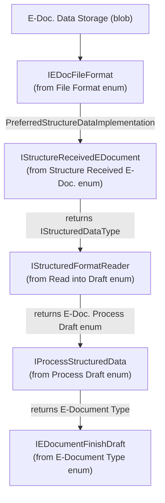

# Extensibility via interfaces

## Import pipeline dispatch chain

The V2 import pipeline uses a series of enum-dispatched interfaces, where each step's output determines the next step's implementation. Understanding this chain is essential for extending the import flow.

Each arrow represents a handoff. The enum value chosen at each stage determines the concrete implementation for the next. For example, the PEPPOL handler (an `IStructuredFormatReader`) returns `"Purchase Document"` as the process draft enum, which routes to `PreparePurchaseEDocDraft`.

## Provider interfaces

Provider interfaces are aggregated behind the `E-Doc. Proc. Customizations` enum. A single enum value implements all provider interfaces simultaneously:

- `IVendorProvider` -- resolves external vendor identifiers (VAT ID, GLN, name) to a BC Vendor record
- `IItemProvider` -- resolves external product codes to BC Item records
- `IUnitOfMeasureProvider` -- maps external UOM strings to BC Unit of Measure codes
- `IPurchaseLineProvider` -- populates `[BC]` fields on `E-Document Purchase Line` from item references and text-to-account mappings
- `IPurchaseLineAccountProvider` -- resolves G/L accounts for non-item lines
- `IPurchaseOrderProvider` -- finds an existing purchase order to link against

The default implementation (`EDocProviders` codeunit) handles all of these. Partners can create a new enum extension to swap in their own resolution logic.

## Export eligibility

`IExportEligibilityEvaluator` is dispatched via the `Export Eligibility Evaluator` enum on the E-Document Service. The `DefaultExportEligibility` codeunit always returns true. Localization apps can extend this to skip documents based on country-specific rules (for example, only export invoices above a threshold, or skip certain customer types).

## Key design decisions

- Interfaces return records and enums, never error. Errors during import are handled by the pipeline's `Codeunit.Run` wrapper and logged through the error helper. Interface implementations should surface issues through the E-Document error message framework rather than throwing runtime errors.

- The `IStructuredDataType` is intentionally a value object, not a persisted record. Its `GetContent()` return is stored as a log blob by the pipeline, so implementations do not need to persist anything themselves.

- `IStructuredFormatReader.View` is separate from `ReadIntoDraft` because viewing structured data (showing the user a parsed XML tree) should not modify draft tables or trigger processing side effects.
