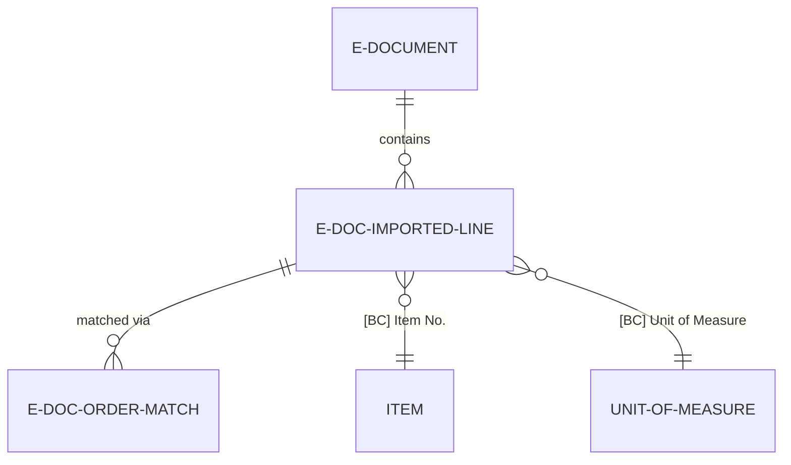
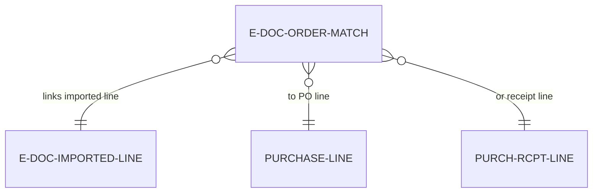

# Data model

The Order matching engine uses imported line staging and match linkage tables.

## Staging table

**E-Doc. Imported Line** -- Stores extracted line data from e-documents before resolution. Primary key is ("E-Document Entry No.", "Line No."). Fields:

External identification (populated during Read):
- "E-Document Entry No." (Integer) -- Parent document reference
- "Line No." (Integer) -- Sequential line number (10000, 20000, ...)
- Description (Text[250]) -- Item/service description from document
- Item No. (Text[100]) -- External item identifier
- GTIN (Code[50]) -- Global Trade Item Number
- Quantity (Decimal) -- Ordered quantity
- Unit of Measure (Text[50]) -- External UOM code
- Unit Price (Decimal) -- Price per unit
- Line Discount % (Decimal) -- Line-level discount
- Line Amount (Decimal) -- Extended amount

Business Central resolution (populated during Prepare):
- "[BC] Vendor No." (Code[20]) -- Resolved vendor reference
- "[BC] Item No." (Code[20]) -- Resolved item reference
- "[BC] Unit of Measure" (Code[10]) -- Resolved UOM code
- "[BC] Purchase Type" (Enum) -- Item, G/L Account, Charge (Item)
- "[BC] Purchase Type No." (Code[20]) -- Type-specific reference

Matching status (calculated):
- "Matched" (Boolean) -- FlowField, true if E-Doc. Order Match records exist
- "Match Source" (Enum) -- Manual, Copilot, Historical (from match records)
- "Match Confidence" (Decimal) -- Average confidence from match records



## Match linkage table

**E-Doc. Order Match** -- Links imported lines to purchase order lines. Primary key is SystemId. Fields:

- "E-Doc. Imported Line SystemId" (Guid) -- References imported line
- "Purchase Line SystemId" (Guid) -- References PO line (blank for receipt matching)
- "Receipt Line SystemId" (Guid) -- References receipt line (blank for PO matching)
- "Matched Quantity" (Decimal) -- Portion of line matched (blank = full quantity)
- "Matched Amount" (Decimal) -- Calculated amount (Quantity * Unit Price)
- "Match Source" (Enum) -- Manual, Copilot, Historical
- "Confidence" (Decimal 0.0-1.0) -- AI confidence score (blank for manual)
- "Match Reason" (Text[500]) -- AI explanation or user comment
- "Confirmed" (Boolean) -- User accepted suggestion (used for grounding)
- "Created Date" (DateTime) -- When match was created
- "Created By" (Code[50]) -- User ID who created match



## Quantity split representation

Multiple match records for same imported line represent quantity split:

```
E-Doc. Imported Line:
  Entry No. = 100, Line No. = 10000
  Quantity = 100

E-Doc. Order Match records:
  Match 1: PO #1 Line 10000, Matched Quantity = 60
  Match 2: PO #2 Line 10000, Matched Quantity = 40

Validation: 60 + 40 = 100 (equals imported quantity)
```

During Finish step, system queries all match records for the imported line and creates separate Purchase Invoice lines for each match.

## Calculated fields

E-Doc. Imported Line includes FlowFields for UI display:

**Matched (Boolean):**
```al
field(100; Matched; Boolean)
{
    FieldClass = FlowField;
    CalcFormula = exist("E-Doc. Order Match" where("E-Doc. Imported Line SystemId" = field(SystemId)));
    Editable = false;
}
```

**Match Count (Integer):**
```al
field(101; "Match Count"; Integer)
{
    FieldClass = FlowField;
    CalcFormula = count("E-Doc. Order Match" where("E-Doc. Imported Line SystemId" = field(SystemId)));
    Editable = false;
}
```

**Average Match Confidence (Decimal):**
```al
field(102; "Average Match Confidence"; Decimal)
{
    FieldClass = FlowField;
    CalcFormula = average("E-Doc. Order Match".Confidence where("E-Doc. Imported Line SystemId" = field(SystemId)));
    Editable = false;
}
```

These FlowFields provide quick status indicators in list pages without requiring explicit queries.

## Extension to Purchase Line

Purchase Line table is extended to track match origin:

```al
tableextension 6102 "E-Doc. Order Match Ext" extends "Purchase Line"
{
    fields
    {
        field(6102; "E-Doc. Imported Line No."; Integer)
        {
            Caption = 'E-Doc. Imported Line No.';
            Editable = false;
        }
        field(6103; "E-Doc. Match Source"; Enum "E-Doc. Match Source")
        {
            Caption = 'E-Doc. Match Source';
            Editable = false;
        }
    }
}
```

These fields enable:
- Drill-down from Purchase Invoice Line to E-Doc. Imported Line
- Filtering invoices by match source (show only Copilot-matched lines)
- Reporting on match source distribution

## Match source enum

**E-Doc. Match Source** enum defines how match was created:

- Blank -- Not matched (standalone invoice line)
- Manual -- User-selected match via UI
- Copilot -- AI-suggested match, user accepted
- Historical -- AI-suggested based on past purchase patterns

Used for analytics to compare accuracy across match sources and optimize Copilot suggestions.

## Cascade delete behavior

Match records are deleted when:
- E-Document is deleted (cascade from parent)
- Prepare step is undone (all matches cleared)
- User explicitly deletes match (un-match action)

Match records are preserved when:
- Finish step is undone (allows re-finish with same matches)
- E-Document status changes (matches persist across status transitions)

This enables undo/redo workflows without losing match work.

## Performance optimization

E-Doc. Imported Line table can grow large with many documents:

**Indexing strategy:**
- Primary key: ("E-Document Entry No.", "Line No.") -- Clustered index for parent-child queries
- Secondary key: ("[BC] Vendor No.", "[BC] Item No.") -- Non-clustered index for candidate filtering
- SystemId index -- Unique index for match linkage

**Query optimization:**
- Use SetLoadFields to load only required columns (avoid loading Description for quantity checks)
- Filter by E-Document Entry No. before accessing lines (leverage primary key)
- Cache FlowField calculations in temporary variables for repeated access

**Archival:**
- Consider moving imported lines older than 90 days to archive table
- Maintain active table at <100K records for optimal performance
- Archive preserves match audit trail for historical reporting
